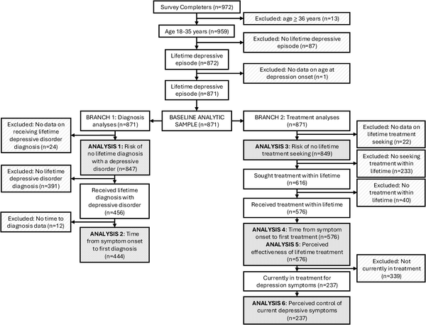
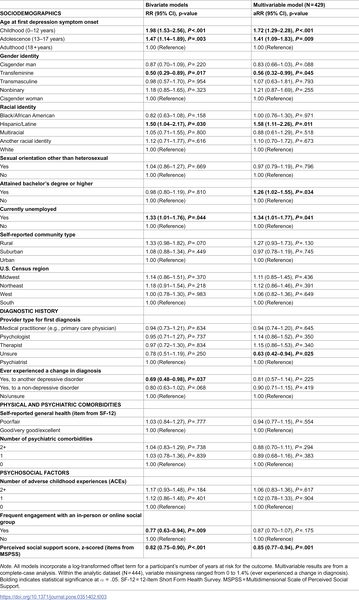

Depression is a common and serious mental health condition affecting many young adults in the United States. Yet, despite its prevalence, nearly half of young adults experiencing depressive episodes have never been formally diagnosed, often enduring years without treatment. What factors contribute to these delays, and how might social support influence the path to care? A recent national survey sheds light on these critical questions, offering insights that could help improve mental health outcomes for young people.

> **TL;DR**
> - Almost 50% of young adults with depression have never received a formal diagnosis, with a median delay of three years from symptom onset to diagnosis.
> - Early onset of depressive symptoms in childhood or adolescence is linked to longer delays and poorer treatment outcomes, while strong social support is associated with faster diagnosis and more effective treatment.

Depression among young adults is a growing concern in the U.S., with rates rising steadily over the past decades. Young people aged 18 to 35 experience some of the highest incidences of depression, yet many face significant barriers to timely diagnosis and treatment. Previous research has documented long delays in care among older adults, but less is known about these delays in younger populations. Additionally, social isolation and loneliness have become more common, potentially affecting mental health trajectories. Understanding how factors like age of symptom onset and social support influence delays in diagnosis and treatment can inform strategies to bridge the gap between experiencing symptoms and receiving care.

Researchers conducted a cross-sectional online survey in May 2025, recruiting 871 U.S. adults aged 18 to 35 who reported at least one depressive episode. Participants provided information on their demographics, clinical history, age when depressive symptoms first appeared, social support levels, and social group engagement. The study focused on four primary outcomes: whether participants had ever been diagnosed with depression, the time from symptom onset to diagnosis, whether they sought treatment, and the time from symptom onset to treatment. Secondary outcomes included participants’ perceptions of treatment effectiveness and current symptom control. Statistical analyses accounted for factors such as age, social support, and early symptom onset to identify predictors of delays.

The survey revealed that 46.2% of young adults with depressive symptoms had never received a formal diagnosis. Among those diagnosed, the median time from symptom onset to diagnosis was three years. Over a quarter of participants never sought treatment, and among those who did, many experienced delays: 31.4% waited one to four years, and 28.8% waited five or more years before starting treatment. Notably, individuals whose symptoms began in childhood or adolescence faced longer delays and reported lower perceived effectiveness of treatment. Conversely, greater social support was linked to shorter delays in diagnosis and treatment, a lower likelihood of never seeking care, and better perceived treatment outcomes. Frequent participation in social groups also correlated with higher treatment effectiveness ratings.

These findings highlight a significant public health challenge: young adults with depression often experience prolonged delays before diagnosis and treatment, which can worsen outcomes. Early symptom onset appears to be a critical factor in these delays, underscoring the need for targeted early intervention. Importantly, the study emphasizes the protective role of social support in facilitating quicker access to care and improving treatment success. This suggests that strengthening social networks and community engagement could be valuable components of mental health strategies aimed at young adults. By addressing these delays, healthcare providers and policymakers can better support young people in managing depression and reducing its long-term impacts.

While the study provides valuable insights, it relies on self-reported data collected through an online survey, which may be subject to recall bias or inaccuracies. The cross-sectional design captures associations but cannot establish causality between factors like social support and treatment delays. Additionally, the survey did not include minors, so findings may not apply to younger adolescents. The study also focused on a U.S. population, and results may differ in other cultural or healthcare contexts. Future research using longitudinal designs and clinical assessments could help clarify causal pathways and further refine intervention approaches.

## Figures

*Diagram showing how participants were selected and included in the study.*

*Table showing years from first symptoms to depression diagnosis for 444 people.*

## Sources

- [Delays in diagnosis and treatment of depressive disorder among young adults: A national online survey-based cross-sectional study](https://journals.plos.org/plosone/article?id=10.1371/journal.pone.0351402)
- DOI: [10.1371/journal.pone.0351402](https://doi.org/10.1371/journal.pone.0351402)
