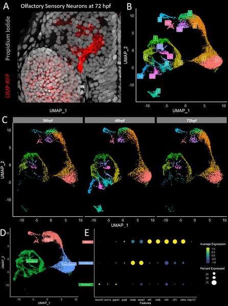

Imagine the complexity of the brain wiring that allows you to recognize a scent — from the nose to the brain, countless neurons must connect with pinpoint precision. But how do these neurons know exactly where to go? Recent research in zebrafish reveals that tiny molecules called delta-protocadherins act like molecular guides, helping smell-sensing neurons navigate to their correct destinations in the brain’s olfactory bulb.

> **TL;DR**
> - Zebrafish olfactory sensory neurons express specific delta-protocadherin adhesion molecules that guide their axons to distinct protoglomerular regions in the brain’s olfactory bulb.
> - Knocking down these delta-protocadherins disrupts the precise targeting of sensory axons, demonstrating their essential role in establishing early sensory maps.

The olfactory system is a model for understanding how neural circuits form precise connections. In zebrafish, each olfactory sensory neuron (OSN) expresses one or two closely related odorant receptors (ORs) and projects its axon to a specific region in the olfactory bulb called a protoglomerulus. These early protoglomerular targets are reproducible and linked to the OR type expressed. However, the molecular cues that guide OSN axons to these precise locations have remained elusive. This study focused on identifying such guidance molecules using zebrafish, a powerful system for genetic and developmental studies.

Researchers isolated olfactory sensory neurons from zebrafish larvae at different developmental stages and performed single-cell RNA sequencing to profile gene expression. By categorizing neurons based on their expressed odorant receptor clades and inferred target protoglomeruli, they identified genes differentially expressed between neurons targeting distinct brain regions. Among these, members of the delta-protocadherin family stood out. The team then used targeted gene knockdowns to disrupt specific protocadherins and examined the effects on axon targeting within the olfactory bulb.

The study revealed that two delta1-protocadherins, pcdh7b and pcdh11, are highly expressed in neurons projecting to the dorsal zone (DZ) protoglomerulus, while two delta2-protocadherins, pcdh10b and pcdh17, are enriched in neurons targeting the central zone (CZ) protoglomerulus. Knocking down pcdh7b or pcdh11 impaired axon termination in the DZ protoglomerulus without affecting CZ-targeting neurons. Conversely, reducing pcdh10b or pcdh17 disrupted CZ-targeting axons, causing mistargeting and ectopic projections, but left DZ-targeting axons unaffected. These results demonstrate that delta-protocadherins contribute to the selective guidance of OSN axons to their proper protoglomerular targets.

This work advances our understanding of the molecular mechanisms underlying the precise wiring of sensory neurons in the brain. By identifying delta-protocadherins as key adhesion molecules that help olfactory sensory neurons find their correct targets, the study sheds light on how sensory maps are established early in development. Such insights not only deepen our knowledge of neural circuit assembly but may also inform future research into sensory processing disorders or neural regeneration.

While the findings are compelling, they are based on experiments in zebrafish, and the extent to which these mechanisms apply to other species remains to be explored. Additionally, the study focused on a subset of protocadherins and olfactory neurons; other molecules and pathways likely contribute to the full complexity of olfactory wiring. Further research is needed to unravel how these adhesion molecules interact with other guidance cues and how they function in the mature olfactory system.

## Figures

*We analyzed single olfactory neurons from developing zebrafish to identify groups based on maturity and gene activity over time.*

## Sources

- [Delta family protocadherins contribute to protoglomerular targeting of olfactory sensory neuron axons in the olfactory bulb](https://journals.plos.org/plosgenetics/article?id=10.1371/journal.pgen.1012090)
- DOI: [10.1371/journal.pgen.1012090](https://doi.org/10.1371/journal.pgen.1012090)
