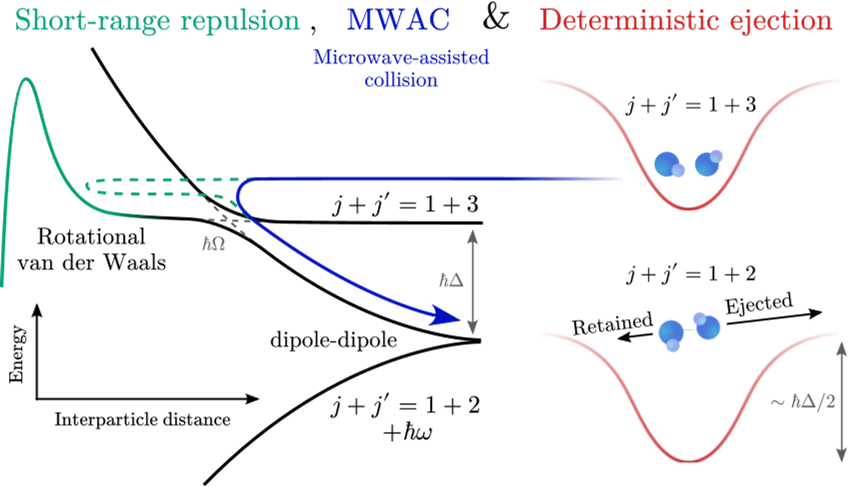
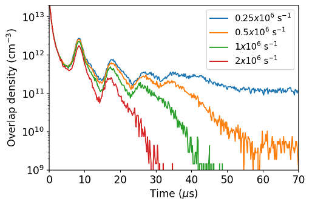
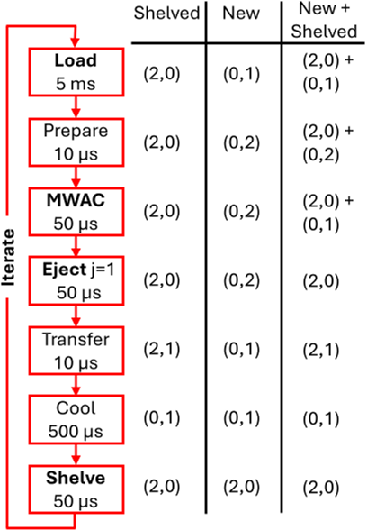
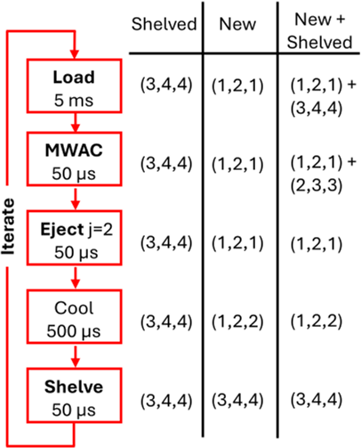

Imagine trying to arrange tiny molecules one by one into a neat grid, each held gently by a focused beam of light. This molecular ‘tweezer array’ promises to be a powerful platform for quantum computing and simulation, but a key challenge has been loading these arrays efficiently and reliably. Now, scientists have found a clever way to use microwaves to control how molecules collide and interact, enabling near-perfect loading of these arrays. This breakthrough could pave the way for scalable quantum technologies based on molecules.

> **TL;DR**
> - Microwave-assisted collisions allow precise control over molecular interactions, suppressing unwanted losses and enabling deterministic loading of molecules into optical tweezers.
> - By shelving molecules in excited rotational or vibrational states and using microwaves to induce controlled collisions, filling fractions up to 96% can be achieved, significantly improving the scalability of molecular quantum arrays.

*Note: this summary is based on a preprint — research shared ahead of formal peer review.*

Optical tweezer arrays—grids of tightly focused laser beams that trap individual atoms or molecules—have become central tools in quantum information science. While atomic arrays have reached impressive sizes and loading efficiencies, molecular arrays lag behind due to more complex collisional dynamics that cause losses. Traditional methods that work well for atoms, such as light-assisted collisions, cannot be directly applied to molecules because molecular collisions often lead to loss rather than elastic scattering. Improving the loading efficiency of molecular arrays is crucial for advancing quantum simulation and computation with molecules, which offer rich internal structure and strong interactions.

The researchers propose a novel approach that combines three key ideas: first, they ‘shelve’ molecules into specific rotational or vibrational excited states that create repulsive van der Waals interactions, preventing molecules from colliding at short range where loss occurs. Second, they apply microwave fields to induce controlled inelastic collisions between molecules, transferring them between rotational states and releasing a precise amount of kinetic energy. This microwave-assisted collision (MWAC) process is analogous to light-assisted collisions used in atomic arrays but tailored to molecular physics. Finally, they implement strategies to deterministically eject one molecule after a collision, ensuring only a single molecule remains per tweezer. The team uses detailed coupled-channels scattering calculations to model these interactions and optimize parameters such as microwave detuning and power.

The theoretical analysis shows that by shelving molecules in rotational states like j=3 and applying microwaves to couple these states, the repulsive interactions effectively suppress collisional loss. The MWAC process releases a well-defined amount of energy, enabling the ejection of one molecule with high probability. Depending on the choice of rotational or vibrational states, the predicted filling fractions of the molecular arrays reach up to 87% using rotational repulsion and up to 96% when leveraging stronger ro-vibrational repulsion. These high filling fractions represent a significant improvement over current stochastic loading methods, which typically achieve only 30–40% for molecules. The approach is compatible with existing laser cooling and trapping techniques for molecules such as calcium monofluoride (CaF).

Achieving near-deterministic loading of molecular tweezer arrays is a critical step toward scalable quantum simulators and computers based on molecules. The ability to precisely control molecular collisions and interactions using microwaves opens new avenues to harness the complex internal structure of molecules for quantum technologies. This method could enable larger, defect-free arrays that are essential for exploring many-body quantum phenomena, implementing quantum gates, and improving quantum sensors. By building on currently available experimental tools, the approach offers a practical path forward in the rapidly evolving field of molecular quantum science.

While the theoretical predictions are promising, experimental realization will require careful control of molecular states, microwave fields, and trapping conditions. Residual collisional losses and the finite lifetime of excited vibrational states may limit ultimate loading efficiencies. The approach also depends on the availability of laser-coolable molecules with suitable rotational and vibrational structure. Moreover, the technical complexity of manipulating molecular hyperfine states and ensuring deterministic ejection poses challenges. Future experiments will be needed to validate these schemes and to optimize protocols for different molecular species and array sizes.

## Figures

*Microwaves help molecules repel each other and eject one particle by changing their energy states during collisions. — Figure from Etienne F. Walraven et al., [CC BY 4.0](http://creativecommons.org/licenses/by/4.0/), caption edited.*

*Simulations show one molecule cooled while another is pushed out using a resonant beam in a tiny light trap over time. — Figure from Etienne F. Walraven et al., [CC BY 4.0](http://creativecommons.org/licenses/by/4.0/), caption edited.*

*Diagram showing five main steps to control molecules in tweezers, with times and molecule states for different loading scenarios. — Figure from Etienne F. Walraven et al., [CC BY 4.0](http://creativecommons.org/licenses/by/4.0/), caption edited.*

*Diagram shows key steps and times to control molecules using rotational states, with different scenarios for loading and ejecting molecules. — Figure from Etienne F. Walraven et al., [CC BY 4.0](http://creativecommons.org/licenses/by/4.0/), caption edited.*

## Sources

- [Deterministic loading of molecular arrays by microwave-assisted collisions](https://arxiv.org/abs/2607.25783)
- DOI: [10.48550/arxiv.2607.25783](https://doi.org/10.48550/arxiv.2607.25783)

*This article reuses and adapts text and figures from the original research by Etienne F. Walraven et al., available via arXiv Chemical Physics, under the [CC BY 4.0](http://creativecommons.org/licenses/by/4.0/) license.*
