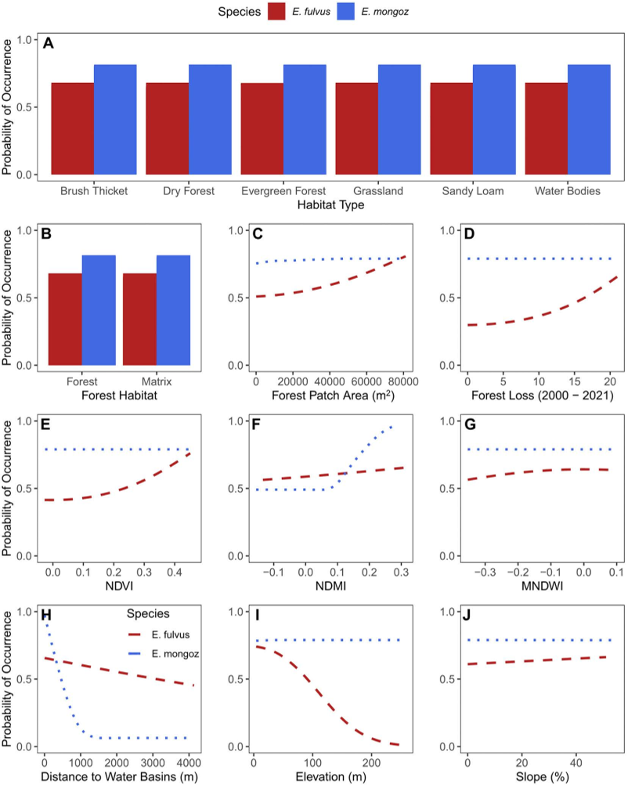
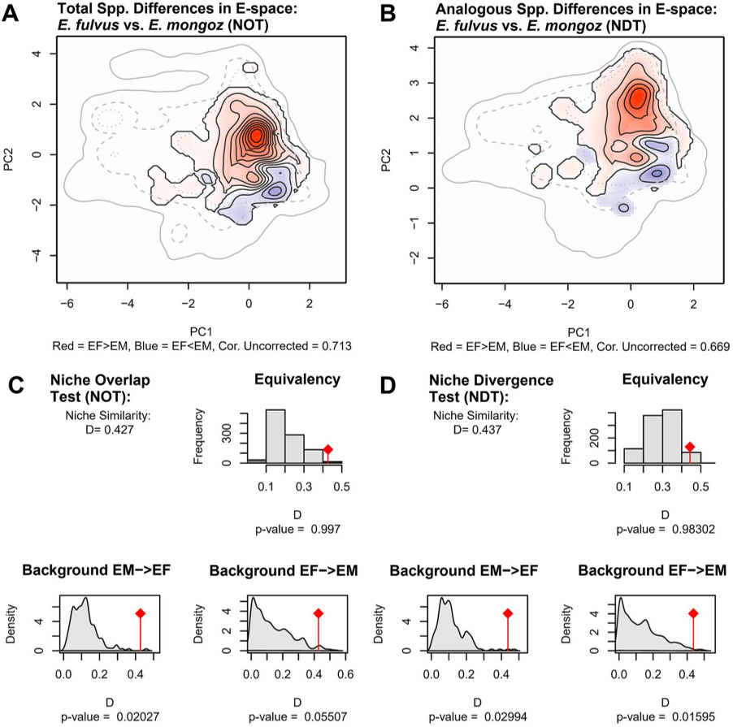
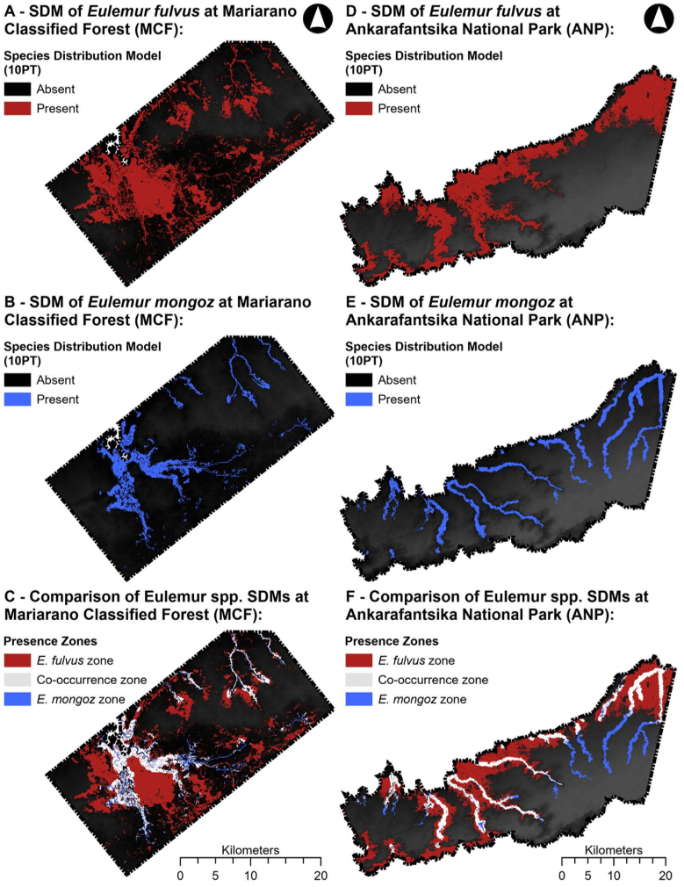
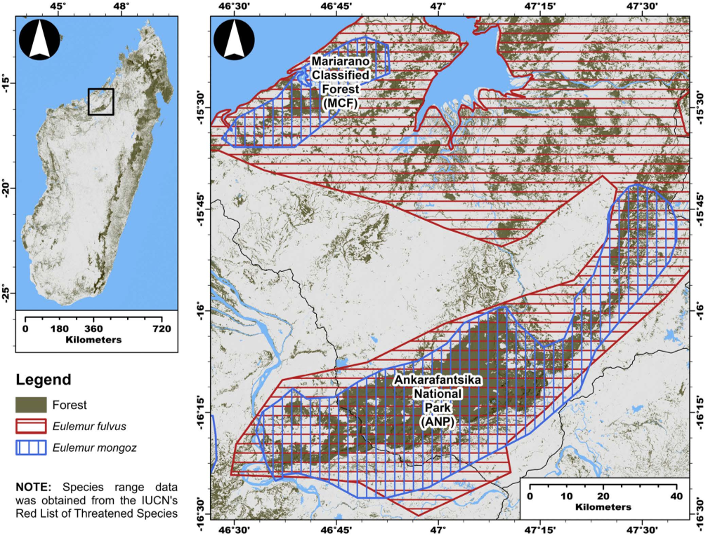

Madagascar is home to some of the world’s most unique and threatened wildlife, including a dazzling variety of lemurs. But even closely related lemurs that live side by side in the same forests can have very different survival stories. Why does one species thrive while its close cousin teeters on the brink of extinction? The answer lies in the subtle ways they use their habitat — a detail that could hold the key to saving them both.

> **TL;DR**
> - The Common Brown Lemur (Eulemur fulvus) occupies a broader and more connected range of habitats, making it less vulnerable to environmental changes.
> - The Mongoose Lemur (Eulemur mongoz), restricted mainly to moist lowland forests near water, has a narrower ecological niche, contributing to its higher extinction risk.

Species’ ecological niches—the specific environmental conditions and resources they require—play a crucial role in their ability to survive habitat loss and fragmentation. Madagascar’s dry-deciduous forests, where these two lemur species coexist, have been heavily impacted by human activities such as agriculture and wildfires. While both lemurs share similar diets and arboreal lifestyles, their differing social structures, territorial behaviors, and habitat preferences suggest that they respond differently to environmental pressures. Understanding these differences is essential for effective conservation planning in one of the world’s most critical biodiversity hotspots.

Researchers collected presence-only data for both lemur species during the dry seasons from 2018 to 2021 across two fragmented forest landscapes in northwestern Madagascar: Mariarano Classified Forest and Ankarafantsika National Park. Using ten environmental variables—such as elevation, moisture levels, and proximity to water—they developed species distribution models to predict where each species is likely to occur. They also conducted niche equivalence analyses to assess how much the two species’ environmental requirements overlap or diverge within the study area.

The models revealed that the Common Brown Lemur occupies a much larger and more continuous predicted range (approximately 48,591 hectares) compared to the Mongoose Lemur’s smaller, fragmented range (about 17,757 hectares). The Mongoose Lemur showed a strong preference for moist lowland forests near water basins, whereas the Common Brown Lemur was more flexible, inhabiting a wider variety of forest types and conditions. Despite this, the niche equivalence analysis indicated substantial overlap in the environmental conditions both species use, suggesting that factors beyond the measured environmental variables—like behavioral or demographic constraints—also influence the Mongoose Lemur’s limited distribution.

These findings highlight how even subtle differences in ecological niche requirements can have profound effects on species’ vulnerability to environmental change. For conservationists, this means that protecting moist lowland forests near water bodies is critical for the survival of the Mongoose Lemur, while efforts to maintain or improve habitat connectivity will benefit the more adaptable Common Brown Lemur. This study underscores the importance of tailored conservation strategies that consider species-specific habitat needs, especially in biodiversity hotspots facing rapid habitat loss.

While the study provides valuable insights, it relies on presence-only data and a limited set of environmental variables, which may not capture all factors influencing lemur distributions. Behavioral traits, social dynamics, and unmeasured environmental variables could also play significant roles. Future research integrating these aspects will help refine conservation strategies further and improve predictions of how these species will respond to ongoing environmental changes.

## Figures

*Graphs show how changes in environmental factors affect the chances of finding E. fulvus and E. mongoz species.*

*This figure compares habitat use and overlap between two species in Madagascar, showing how their environments differ and overlap based on tests of niche similarity.*

*Maps show where two species live in two forests, highlighting areas unique to each and where they overlap, using detailed terrain data.*

*Map showing where two mongoose species live together in Madagascar's dry forests, highlighting Mariarano Forest and Ankarafantsika Park.*

## Sources

- [Differentiation of ecological niche patterns between sympatric lemurs in northwestern Madagascar: Implications for their conservation](https://journals.plos.org/plosone/article?id=10.1371/journal.pone.0345256)
- DOI: [10.1371/journal.pone.0345256](https://doi.org/10.1371/journal.pone.0345256)
