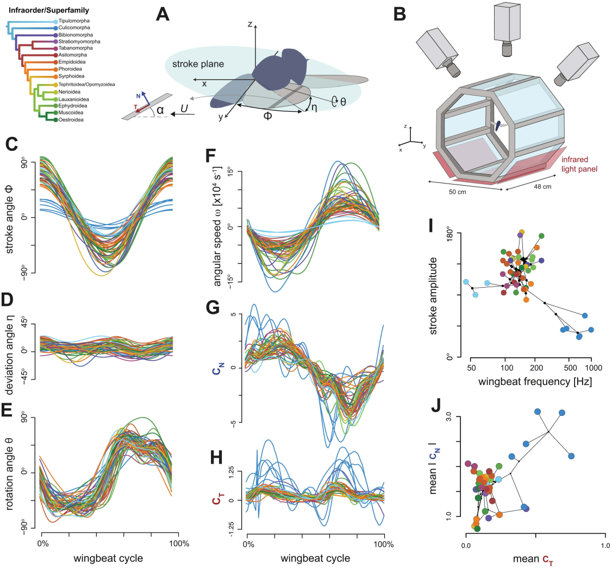
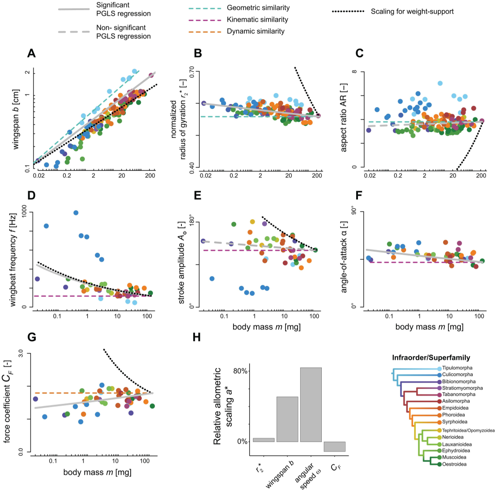

Imagine the delicate buzz of a mosquito or the graceful glide of a crane fly. Though both belong to the same insect order—Diptera, or true flies—their flight styles couldn’t be more different. What drives this diversity? Recent research reveals that the interplay of physical constraints, evolutionary pressures, and body size shapes how these insects take to the air, balancing the demands of aerodynamics, energy use, and even mating signals.

> **TL;DR**
> - True flies exhibit a wide range of flight styles shaped by aerodynamic constraints, body size scaling, and evolutionary trade-offs.
> - Mosquitoes and midges show extreme adaptations, trading off flight efficiency for acoustic signaling used in mating swarms.

Flight has been a cornerstone of insect evolution, enabling access to new habitats, food sources, and mating opportunities. Diptera, the true flies, represent one of the largest and most ecologically diverse insect groups, with over 160,000 named species. Despite their diversity, understanding how their flight mechanics evolved under the constraints of physics and biology has remained a challenge. Unlike larger fliers such as birds or bats, insect flight involves rapid wingbeats and complex aerodynamics that don’t always follow classical aerodynamic theories. Moreover, flies vary drastically in size—from tiny midges weighing mere micrograms to larger crane flies—posing additional challenges for maintaining effective flight.

To unravel these mysteries, researchers studied 133 species of Diptera, capturing detailed wing and body morphology across their wide size and evolutionary range. For 46 of these species, they recorded high-speed, three-dimensional wing movements using stereoscopic videography. They then applied computational fluid dynamics (CFD) simulations to model the airflow and aerodynamic forces generated by these wingbeats. By integrating this data within a phylogenetic framework, the team could compare how flight traits evolved in relation to body size, lineage, and ecological pressures.

The study found that while wing and body shapes are strongly influenced by evolutionary history, wingbeat patterns are surprisingly conserved across most flies, reflecting fundamental aerodynamic constraints. However, two early-diverging lineages—mosquitoes and midges (Culicomorpha) and crane flies (Tipulomorpha)—show distinctly different flight mechanics. Smaller flies tend to have relatively larger wings and flap them faster to support their weight, whereas larger flies invest more in flight muscle mass to generate the necessary power. Mosquitoes and midges stand out by flapping their wings at very high frequencies, resulting in increased aerodynamic and acoustic power. This likely reflects a trade-off where producing loud wingbeat sounds enhances mating communication, even at the cost of flight efficiency.

This comprehensive study provides a mechanistic framework linking physics, morphology, and evolutionary biology to explain how complex flight behaviors diversify. It highlights how physical laws like scaling and aerodynamics set the stage for evolutionary innovations and trade-offs. Understanding these principles not only sheds light on insect evolution but also informs broader questions about how animals adapt locomotion to their size and environment. The detailed flight data and simulations also offer valuable resources for future research in biomechanics and evolutionary biology.

While the study covers a broad range of species and integrates multiple data types, it focuses primarily on hovering flight as a standardized behavior, which may not capture the full diversity of flight modes in Diptera. Additionally, the aerodynamic models rely on assumptions inherent in CFD simulations and high-speed video analysis, which, while advanced, may not account for all complexities of insect flight in natural settings. Further research could explore other flight behaviors and ecological contexts to deepen our understanding of flight evolution.

## Figures

*Wing motion and flight forces of 46 fly species were recorded and analyzed using 3D tracking and airflow simulations.*

*This figure shows how body size affects wing shape, movement, and flight forces across species, highlighting key patterns and comparisons to expected trends.*

## Sources

- [Dipteran flight diversity is shaped by aerodynamic constraints, scaling, and evolutionary trade-offs](https://journals.plos.org/plosbiology/article?id=10.1371/journal.pbio.3003473)
- DOI: [10.1371/journal.pbio.3003473](https://doi.org/10.1371/journal.pbio.3003473)
