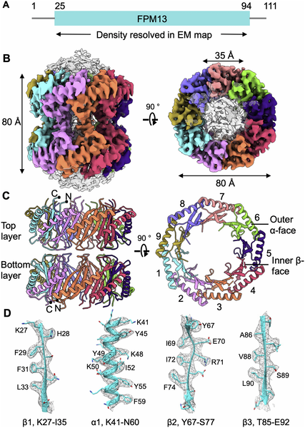
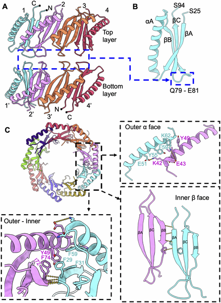
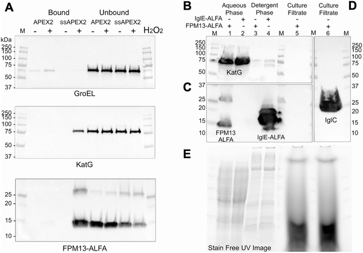
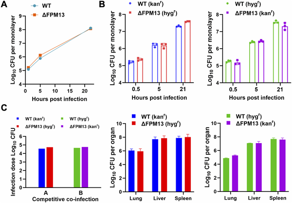

Inside the microscopic world of bacteria, countless proteins carry out vital functions that keep these tiny organisms alive and thriving. Among these, some remain hidden, their roles mysterious. Recently, scientists uncovered a new protein inside Francisella novicida, a close relative of the bacterium responsible for tularemia, a serious infectious disease. This protein, named FPM13, forms a striking ring-shaped complex and binds metals essential for its activity. By using cutting-edge cryo-electron microscopy, researchers revealed its detailed 3D structure, opening a window into the subtle chemistry that supports bacterial survival.

> **TL;DR**
> - FPM13 is a newly discovered 13 kDa protein unique to Francisella bacteria, assembling into an 18-part ring-shaped complex.
> - It binds metals like iron, copper, and zinc and catalyzes disulfide bond formation, but its deletion does not impair bacterial growth, suggesting functional redundancy.

Francisella tularensis is a highly infectious bacterium causing tularemia, sometimes called “rabbit fever.” Its close relative, Francisella novicida, is less pathogenic but genetically similar and widely used as a model to study the disease-causing mechanisms. Understanding proteins involved in Francisella’s survival and virulence is crucial, especially those linked to its type VI secretion system, a molecular apparatus the bacterium uses to interact with host cells. While investigating this system, researchers unexpectedly found a small protein that had never been characterized before. This discovery highlights how even well-studied pathogens can harbor unknown molecular players.

The researchers purified proteins from F. novicida focusing on components of its type VI secretion system. During this process, they noticed a small protein band around 13 kDa that eluted as a larger complex. Using cryogenic electron microscopy (cryoEM), they captured high-resolution images of this protein complex, revealing a donut-shaped structure composed of 18 subunits arranged in two stacked rings. To identify the protein, they applied an innovative method called cryoID, which matches structural data to genetic sequences. Further biochemical tests confirmed the protein’s location in the periplasmic space (the area between the bacterium’s inner and outer membranes) and its ability to bind metals. Mutational analysis pinpointed key amino acids responsible for metal binding and enzymatic activity.

The protein, named FPM13, forms a cylindrical complex roughly 8 nanometers in diameter and height, with a central channel about 3.5 nanometers wide. Each monomer consists of a compact fold with beta strands and alpha helices, assembling into a stable 18-mer ring with 9-fold symmetry. FPM13 binds iron, copper, and zinc via specific cysteine and histidine residues. Functionally, it catalyzes the formation of disulfide bonds, important chemical links that stabilize proteins in the periplasm. When these metal-binding residues were mutated, the protein lost its enzymatic activity. However, deleting the FPM13 gene in F. novicida did not affect bacterial growth in lab cultures, inside immune cells, or in mice, suggesting other proteins may compensate for its function.

This study uncovers a previously unknown metalloprotein unique to the Francisella genus, expanding our understanding of bacterial physiology. The detailed cryoEM structure provides a vivid picture of how such proteins assemble and function at the molecular level. Although FPM13’s exact role in infection remains unclear due to apparent redundancy, its discovery underscores the power of advanced structural biology techniques like cryoID and cryoEM to reveal hidden components in pathogens. These insights could inform future research on bacterial survival strategies and potentially identify new targets for antimicrobial development.

While the biochemical properties of FPM13 are well characterized, its biological role in the bacterium is not fully defined, as deleting the gene caused no obvious defects under tested conditions. This suggests that other proteins may perform similar functions, masking the impact of FPM13 loss. Additionally, the study focused on F. novicida, a model organism, so the relevance to the more virulent F. tularensis remains to be explored. Further research is needed to determine whether FPM13 contributes to virulence or environmental survival in more complex settings.

## Figures

*CryoEM reveals the detailed 3D structure of the FPM13 protein from Francisella novicida, showing its 18-part assembly and key shapes.*

*Fig 3 shows how FPM13 units connect, highlighting key areas where they interact to form a stable structure.*

*FPM13 is a soluble protein found in the space between cell membranes, not secreted outside the cell.*

*FPM13 gene is not needed for F. novicida bacteria to grow in human immune cells or spread in mice organs.*

## Sources

- [Discovery and cryoEM structure of FPM13, a periplasmic metalloprotein unique to Francisella](https://journals.plos.org/plospathogens/article?id=10.1371/journal.ppat.1014024)
- DOI: [10.1371/journal.ppat.1014024](https://doi.org/10.1371/journal.ppat.1014024)
