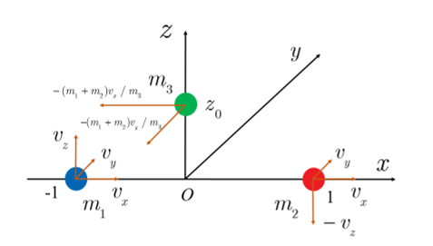
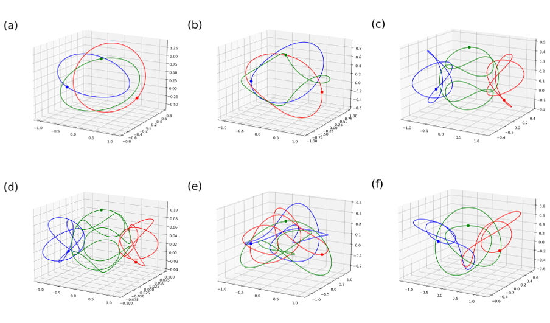
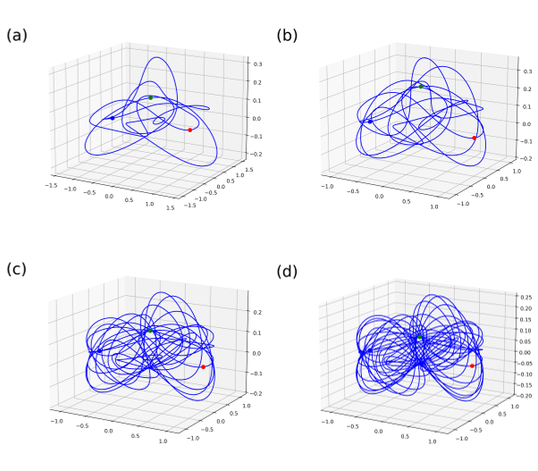
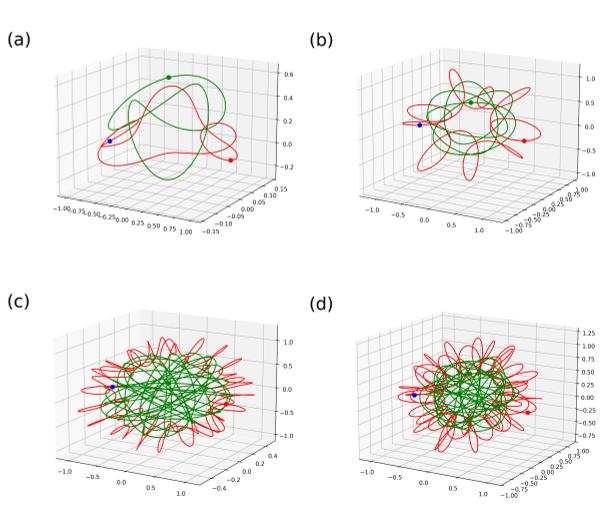

Imagine three celestial bodies—stars, planets, or moons—dancing through space under their mutual gravitational pulls. Since Newton first pondered this ‘three-body problem’ in the 1680s, scientists have sought to understand the complex motions that emerge. Now, researchers have discovered over 10,000 new elegant, repeating three-dimensional orbits in this famously chaotic system, revealing surprising patterns that resemble a cosmic piano trio or a choreographed ballet in space.

> **TL;DR**
> - Using advanced numerical methods, researchers discovered 10,059 new three-dimensional periodic orbits of the general three-body problem, many of which are stable.
> - Among these orbits are novel types where all three bodies follow a single closed path (‘choreographic’ orbits) and others where two bodies share one orbit while the third follows a different path (‘piano-trio’ orbits).

*Note: this summary is based on a preprint — research shared ahead of formal peer review.*

The three-body problem asks how three masses move under their mutual gravitational attraction. Unlike the simpler two-body problem, which has well-known solutions like elliptical orbits, the three-body problem is notoriously difficult and chaotic. For centuries, only a handful of special periodic orbits—paths that repeat exactly—were known, mostly confined to two dimensions. The problem’s chaotic nature means tiny changes in starting conditions can wildly alter trajectories, making it hard to find exact repeating solutions, especially in three dimensions.

To tackle this challenge, the researchers employed a high-accuracy numerical strategy combining a grid search of initial conditions, the Newton-Raphson method to refine candidate orbits, and a ‘clean numerical simulation’ technique that minimizes numerical noise. This approach allowed them to reliably identify orbits whose states return very close to their starting points after some period, confirming periodicity. They focused on systems where two masses are equal and the third varies, exploring a wide range of mass ratios using supercomputing resources to search billions of initial conditions.

This exhaustive search uncovered 10,059 new three-dimensional periodic orbits, with about 20% being linearly stable, meaning small disturbances won’t cause the system to deviate wildly. Among these, 21 ‘choreographic’ orbits were found where all three bodies follow the same closed 3D path, a generalization of the famous planar ‘figure-8’ orbit. Additionally, 273 ‘piano-trio’ orbits were discovered where two equal masses share one closed orbit while the third mass traces a different path, evocatively named after a musical trio of two violins and a piano. These orbits had never been reported before and showcase rich, previously hidden structures within the chaotic three-body system.

The discovery of thousands of new 3D periodic orbits provides fresh insights into the nature of chaos and order in gravitational systems. These orbits serve as ‘windows’ into the complex dynamics that govern celestial motions, helping scientists better understand stability and transitions in multi-body systems. While primarily theoretical, this work advances foundational knowledge in physics and astronomy, potentially informing future studies of planetary systems, star clusters, and gravitational interactions. Moreover, the ability to find such precise solutions in a chaotic system pushes the boundaries of numerical methods and computational physics.

Despite the large number of new orbits found, these results are based on idealized Newtonian gravity without relativistic effects or external perturbations. The practical application of these orbits to real astrophysical systems remains limited, as natural environments are more complex. Also, the classification and topological understanding of these 3D orbits remain open questions for future research. Nonetheless, the methods and discoveries mark significant progress in a centuries-old mathematical and physical challenge.

## Figures

*The starting positions and speeds of three objects in a 3D space are shown for a three-body system. — Figure from Xiaoming Li and Shijun Liao, [CC BY 4.0](http://creativecommons.org/licenses/by/4.0/), caption edited.*

*3D paths of three bodies in space showing different orbit patterns with initial positions marked by filled circles in blue, red, and green. — Figure from Xiaoming Li and Shijun Liao, [CC BY 4.0](http://creativecommons.org/licenses/by/4.0/), caption edited.*

*Three equal masses follow the same 3D path in four choreographed orbits, starting from marked positions in blue, red, and green. — Figure from Xiaoming Li and Shijun Liao, [CC BY 4.0](http://creativecommons.org/licenses/by/4.0/), caption edited.*

*Three-body orbits show two equal masses sharing one path (red) while a third mass moves on a different path (green) in 3D space. — Figure from Xiaoming Li and Shijun Liao, [CC BY 4.0](http://creativecommons.org/licenses/by/4.0/), caption edited.*

## Sources

- [Discovery of 10,059 new three-dimensional periodic orbits of general three-body problem](https://arxiv.org/abs/2508.08568)
- DOI: [10.1007/s11433-026-3056-8](https://doi.org/10.1007/s11433-026-3056-8)

*This article reuses and adapts text and figures from the original research by Xiaoming Li and Shijun Liao, available via SCIENCE CHINA Physics, Mechanics &amp; Astronomy, Advance online publication (29 June 2026), under the [CC BY 4.0](http://creativecommons.org/licenses/by/4.0/) license.*
