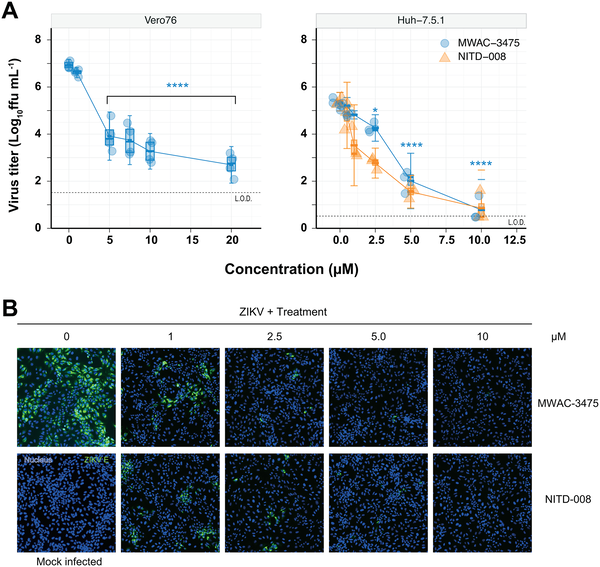
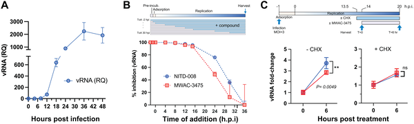

Since its alarming spread in 2015–2016, Zika virus has remained a persistent public health threat worldwide. Known for causing severe birth defects and neurological complications, Zika still lacks approved treatments or vaccines. Now, scientists have identified a new class of drug candidates that can halt Zika virus replication by targeting a previously underappreciated viral protein, NS4B — potentially opening doors to therapies not only for Zika but for other related viruses as well.

> **TL;DR**
> - A novel series of benzamide compounds was discovered that potently inhibits Zika virus replication by interfering with the viral NS4B protein.
> - This viral protein, NS4B, represents a shared vulnerability across flaviviruses, suggesting potential for broad-spectrum antiviral drugs.

Zika virus, a member of the flavivirus family transmitted primarily by Aedes mosquitoes, surged into global attention during the 2015–2016 pandemic. While most infections cause mild symptoms, the virus can lead to devastating outcomes such as congenital Zika syndrome in newborns and Guillain-Barré syndrome in adults. Despite this, no effective antiviral drugs or vaccines currently exist. The expanding range of mosquito vectors due to climate change further raises the risk of future outbreaks. Addressing this urgent need, researchers have sought to identify compounds that can block Zika virus replication by targeting essential viral components.

To find new antiviral candidates, the research team employed a high-throughput screening approach, testing over 650,000 chemical compounds for their ability to protect cells from Zika virus-induced damage. Hits sharing a benzamide chemical core were identified and optimized through medicinal chemistry to improve potency. The researchers then conducted detailed experiments to understand how these compounds work, including timing studies to pinpoint which stage of the viral life cycle is affected, resistance selection to identify viral mutations that confer drug resistance, and biophysical assays such as fluorine-19 nuclear magnetic resonance (19F-NMR) to confirm direct binding to the viral NS4B protein.

The optimized benzamide compounds demonstrated remarkable potency against multiple Zika virus strains, reducing viral replication by over 1,000-fold at micromolar concentrations, and showed minimal toxicity to host cells. Time-of-addition experiments revealed that these compounds block viral RNA replication during the virus’s middle replication phase, requiring new viral protein synthesis to exert their effect. Resistance studies pinpointed mutations in the C-terminal region of the NS4B protein, confirming it as the drug’s target. Notably, these mutations differed from resistance sites identified in dengue or yellow fever viruses, highlighting a distinct binding site. 19F-NMR experiments further supported direct interaction between the compounds and NS4B. Importantly, these benzamides were specific to Zika virus and did not inhibit other flaviviruses, underscoring the uniqueness of the target site. However, prior studies on dengue and yellow fever viruses have also identified NS4B as a vulnerable target, suggesting that NS4B is a shared Achilles’ heel across flaviviruses.

This discovery marks an important advance in the search for effective anti-Zika therapies. By identifying a potent new class of benzamide compounds that target NS4B, the study not only offers promising drug candidates but also highlights NS4B as a universal weak point in flaviviruses. Given the global health burden posed by flaviviruses—including dengue, yellow fever, West Nile, and Japanese encephalitis—therapies targeting NS4B could potentially be developed into broad-spectrum antivirals. Such treatments would be invaluable in controlling current and future outbreaks, especially as mosquito vectors expand their reach due to climate change.

While these findings are encouraging, the benzamide compounds are currently effective specifically against Zika virus and have not yet demonstrated broad-spectrum activity against other flaviviruses. Further optimization and testing are needed to enhance their antiviral spectrum and to evaluate safety and efficacy in animal models and clinical trials. Additionally, the membrane-bound nature of NS4B poses challenges for detailed structural studies and drug development. Nonetheless, this work lays a strong foundation for future antiviral drug discovery targeting NS4B.

## Figures

*MWAC-3475 reduces Zika virus levels and protein in infected cells, showing strong antiviral effects at various doses.*

*MWAC-3475 reduces Zika virus RNA levels in infected cells when added at different times, showing its ability to block virus replication.*

## Sources

- [Discovery of a potent anti-Zika virus benzamide series targeting the viral protein NS4B](https://journals.plos.org/plospathogens/article?id=10.1371/journal.ppat.1013609)
- DOI: [10.1371/journal.ppat.1013609](https://doi.org/10.1371/journal.ppat.1013609)
