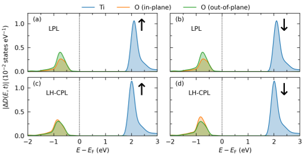
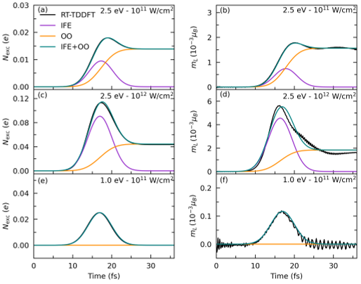
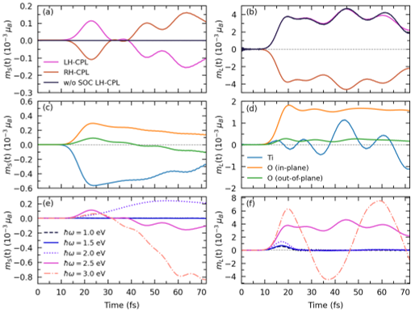

What if light alone could switch magnetism on and off in a material that’s usually non-magnetic? Imagine shining a carefully tailored beam of circularly polarized light on a simple crystal and watching it briefly become magnetic—not by moving its atoms, but by spinning its electrons in just the right way. Recent computational research reveals exactly how this surprising transformation happens in strontium titanate (SrTiO3), a well-known insulating crystal.

> **TL;DR**
> - Circularly polarized light can induce a transient magnetic moment in SrTiO3 purely by manipulating the electrons’ orbital and spin angular momentum, without any atomic motion.
> - This ultrafast magnetization arises mainly from the transfer of angular momentum from light to the electrons’ orbitals, with spin-orbit coupling enabling a smaller spin contribution.

*Note: this summary is based on a preprint — research shared ahead of formal peer review.*

SrTiO3 is a diamagnetic insulator, meaning it normally shows no magnetism. However, recent experiments hinted that under certain conditions, it can exhibit ferroelectricity and even multiferroic behavior, where electric and magnetic properties intertwine. Traditionally, magnetization changes in materials involve atomic vibrations or movements, but here the focus is on purely electronic effects triggered by ultrafast laser pulses. Understanding these effects could open new pathways for light-controlled magnetic devices and information technologies.

The researchers used real-time time-dependent density functional theory (RT-TDDFT), a powerful quantum mechanical simulation method, to track how electrons in SrTiO3 respond to ultrashort laser pulses of linearly and circularly polarized light. By modeling the electronic states and their evolution over femtoseconds (quadrillionths of a second), they could observe how charge redistributes between oxygen and titanium atoms and how angular momentum transfers from the light to the electrons’ orbitals and spins. The simulations included spin-orbit coupling effects, which are crucial for linking orbital motion to spin magnetization.

When SrTiO3 is hit with linearly polarized light, electrons oscillate between oxygen and titanium sites in a way that mimics certain vibrational modes but does not produce magnetization. In contrast, circularly polarized light causes the electron charge clouds around oxygen atoms to rotate coherently, creating an effective circular current. This rotation transfers angular momentum from the light to the electrons’ orbital motion, generating a transient orbital magnetic moment. Spin-orbit coupling then converts part of this orbital angular momentum into a smaller spin magnetic moment. The induced magnetization depends on the light’s helicity (its handedness) and persists briefly after the pulse ends, all without any atomic displacement.

This work highlights a novel mechanism for ultrafast magnetization in a material that is normally non-magnetic, achieved purely through electronic dynamics driven by light. It disentangles two related effects—the inverse Faraday effect, which follows the laser pulse envelope, and optical orientation, which builds up during excitation and saturates afterward. By demonstrating how visible light can transiently switch on magnetism in SrTiO3 without lattice motion, the study suggests new possibilities for designing light-controlled magnetic functionalities in oxide materials and beyond.

While the simulations provide detailed insight into the electronic processes, experimental validation of these ultrafast magnetization effects in SrTiO3 under optical excitation remains to be done. The predicted magnetic moments are small and transient, and the practical realization of light-controlled magnetism in devices will require overcoming challenges such as stability, scalability, and detection sensitivity. Additionally, the complexity of real materials and environmental factors could influence the observed phenomena.

## Figures

*Spin and element-specific changes in electron states during a 17 fs laser pulse with different light polarizations at 2.5 eV energy. — Figure from Andri Darmawan et al., [CC BY 4.0](http://creativecommons.org/licenses/by/4.0/), caption edited.*

*Graphs show how excited electrons and magnetization change over time at oxygen sites when exposed to light pulses. — Figure from Andri Darmawan et al., [CC BY 4.0](http://creativecommons.org/licenses/by/4.0/), caption edited.*

*Light triggers changes in spin and orbital magnetism, with effects varying by element and laser frequency, and spin needing spin-orbit coupling to appear. — Figure from Andri Darmawan et al., [CC BY 4.0](http://creativecommons.org/licenses/by/4.0/), caption edited.*

## Sources

- [Disentangling the dynamics of transient spin and orbital magnetization in SrTiO$_3$ via the inverse Faraday effect from RT-TDDFT](https://arxiv.org/abs/2602.20693)
- DOI: [10.48550/arxiv.2602.20693](https://doi.org/10.48550/arxiv.2602.20693)

*This article reuses and adapts text and figures from the original research by Andri Darmawan et al., available via arXiv Materials Science, under the [CC BY 4.0](http://creativecommons.org/licenses/by/4.0/) license.*
