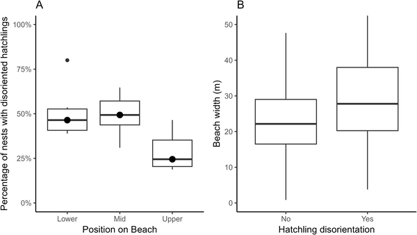
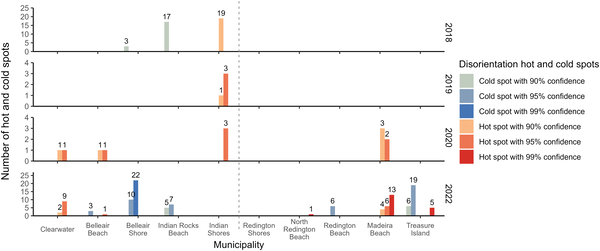
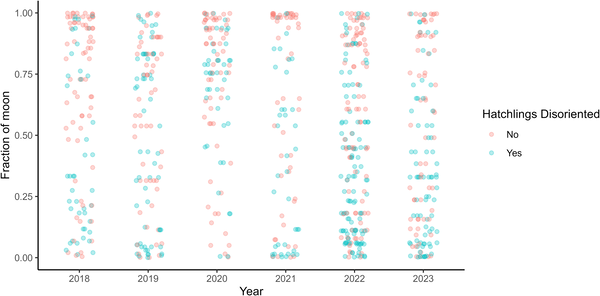

Why do baby sea turtles sometimes get lost on their way to the ocean? Each year, loggerhead sea turtle hatchlings emerge from nests along Florida’s beaches, instinctively crawling toward the water guided by natural light cues. But in developed coastal areas, artificial lighting can confuse these tiny travelers, leading them away from the safety of the sea and putting their survival at risk. Understanding how and where this disorientation happens is crucial to protecting these endangered animals.

> **TL;DR**
> - Artificial lighting along Pinellas County beaches causes significant disorientation in loggerhead sea turtle hatchlings, with 36% of nests experiencing disorientation events between 2018 and 2023.
> - Moonlight helps reduce disorientation, and spatial analysis identifies specific beach areas where hatchlings are most at risk, informing targeted conservation efforts.

Loggerhead sea turtle hatchlings rely on environmental cues—especially natural light reflecting off the ocean horizon—to find their way from the nest to the sea, a journey known as “sea-finding.” Phototaxis, the movement toward certain wavelengths of light, helps guide them. However, artificial lights from beachfront developments can obscure these natural cues, causing hatchlings to crawl inland toward roads, parking lots, or buildings instead of the ocean. This misdirection increases their chances of dehydration, predation, and death. Pinellas County, Florida, is a critical nesting area characterized by extensive coastal development and limited natural dunes, making it a hotspot for hatchling disorientation.

Researchers analyzed data collected from 2018 to 2023 by the Clearwater Marine Aquarium on loggerhead nesting activity across 33.59 km of beaches in north and central Pinellas County. They recorded GPS locations of nests, hatchling emergence, and disorientation events, noting the position of nests on the beach and environmental factors such as moonlight. Statistical models assessed how variables like beach position and width influenced disorientation likelihood. Additionally, an Optimized Hot Spot Analysis (OHSA) mapped spatial clusters of disorientation severity each year, identifying specific areas where hatchlings were most vulnerable to artificial light interference.

Out of 1,048 nests with hatchling emergence, 36% experienced disorientation events. Nests located in the middle portion of the beach were more likely to produce disoriented hatchlings than those in the upper portion. Spatial analysis revealed significant clustering of disorientation events in certain beach areas during some years, notably 2022, while other years showed no such clustering. Importantly, nights with lower moonlight exposure corresponded to more frequent disorientation, suggesting moonlight’s natural illumination helps hatchlings better distinguish the ocean horizon from artificial lights. These results highlight the complex interplay between beach geography, artificial lighting, and natural lunar cycles in influencing hatchling navigation.

This study provides valuable insights into how artificial lighting disrupts the crucial early life stage of loggerhead sea turtles and identifies specific spatial and temporal patterns of risk. The findings support the need for improved lighting regulations, such as enforcing “turtle-friendly” lighting that uses shielded, long-wavelength fixtures, and for enhancing natural beach features like dunes to block upland light sources. By pinpointing hotspots of disorientation, conservation efforts can be more effectively targeted, increasing hatchling survival and contributing to the recovery of this threatened species.

While the study offers strong evidence linking artificial light and disorientation, some limitations remain. Data gaps in certain years and variations in beach morphology due to storms may affect the generalizability of spatial patterns. Additionally, although moonlight appears to mitigate disorientation, other environmental factors like weather conditions and magnetic cues also influence hatchling navigation but were not fully explored here. Continued monitoring and integrating multiple environmental variables will be important for refining conservation strategies.

## Figures

*Boxplots show yearly percentages of disoriented nests by beach position and how beach width affects disorientation rates.*

*Yearly counts of hot and cold spots in Pinellas County, with data gaps in 2018-2019 and no spots in 2021 and 2023.*

*This plot shows how the moon's brightness each year relates to whether baby turtles got confused when hatching.*

## Sources

- [Disorientation patterns of loggerhead sea turtle (Caretta caretta) hatchlings in Pinellas County, Florida, USA](https://journals.plos.org/plosone/article?id=10.1371/journal.pone.0347104)
- DOI: [10.1371/journal.pone.0347104](https://doi.org/10.1371/journal.pone.0347104)
