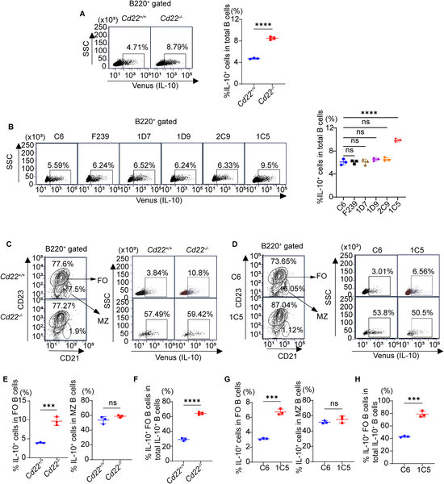

Autoimmune diseases and transplant rejection both arise when the immune system’s checks and balances falter, leading to damaging inflammation. Scientists have now identified a novel way to boost a calming subset of immune cells—regulatory B cells—by disrupting a key molecular interaction on their surface. This discovery could pave the way for new treatments that help the body better control autoimmune attacks and accept transplanted organs.

> **TL;DR**
> - Blocking the binding of CD22, an inhibitory receptor on B cells, to its natural ligands expands regulatory B cells that produce anti-inflammatory signals.
> - In mouse models, this approach reduces type 1 diabetes symptoms and prolongs skin graft survival, highlighting its potential for autoimmune disease and transplant therapy.

B cells are best known for producing antibodies that fight infections, but a specialized subset called regulatory B cells (Bregs) plays a critical role in suppressing excessive immune responses. These Bregs produce molecules like interleukin-10 (IL-10) that help keep inflammation in check. CD22 is a receptor found on B cells that normally acts as a brake on their activation by binding to sugar molecules (ligands) on the same cell surface, a process called cis-ligand interaction. Previous studies showed that mice lacking CD22 have more regulatory B cells, suggesting that CD22’s interactions limit Breg expansion. However, it was unclear whether the ligand binding itself was responsible for this effect.

To investigate this, researchers developed a novel antibody named 1C5 that specifically blocks CD22’s ability to bind its ligands without removing CD22 from the cell surface. They tested 1C5 both in laboratory cultures of mouse spleen B cells and in live mice. They measured B cell activation, proliferation, and the presence of IL-10-producing regulatory B cells using flow cytometry and genetic reporter tools. The team also evaluated the therapeutic potential of 1C5 by applying it in mouse models of type 1 diabetes and skin transplant rejection, observing disease progression and graft survival.

Treatment with the 1C5 antibody effectively inhibited CD22-ligand binding, leading to increased B cell activation in response to stimulants in vitro. Importantly, in live mice, 1C5 treatment expanded a specific subset of regulatory B cells within the follicular B cell population that produce IL-10, a key anti-inflammatory cytokine. These expanded Bregs expressed markers such as CD5 and Tim-1, consistent with known regulatory phenotypes. Functionally, mice receiving 1C5 showed reduced severity of type 1 diabetes and prolonged survival of skin grafts. The protective effects were associated with an increase in regulatory γδ T cells, likely promoted by the expanded Bregs.

This study reveals that the interaction between CD22 and its cis-ligands acts as a molecular checkpoint limiting the expansion of regulatory B cells. By selectively blocking this interaction, it is possible to unleash the body’s own regulatory mechanisms to suppress harmful inflammation. This approach offers a promising new therapeutic strategy for autoimmune diseases like type 1 diabetes and for preventing transplant rejection, conditions where current treatments often rely on broad immunosuppression with significant side effects. Targeting CD22-ligand binding could provide a more precise way to enhance immune tolerance.

While these findings are compelling, they are currently limited to mouse models. The immune system’s complexity means that translating this approach to humans will require careful evaluation to confirm safety and efficacy. Additionally, the long-term effects of disrupting CD22 interactions on overall immune function remain to be fully understood. Further research is needed to explore the potential for off-target effects and to develop clinically viable antibodies or molecules that can safely modulate CD22 in patients.

## Figures

*Treating mice with antibody 1C5 boosts IL-10 producing B cells in the spleen, showing a strong immune response increase.*

## Sources

- [Disrupting CD22-cis-ligand interactions ameliorates type 1 diabetes and graft rejection by expanding regulatory B cells](https://journals.plos.org/plosbiology/article?id=10.1371/journal.pbio.3003681)
- DOI: [10.1371/journal.pbio.3003681](https://doi.org/10.1371/journal.pbio.3003681)
