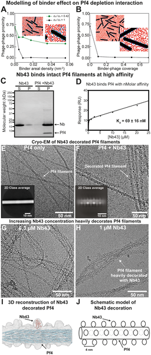
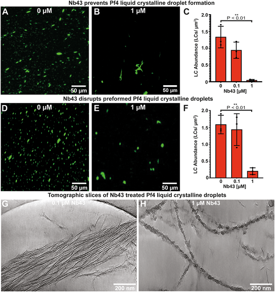
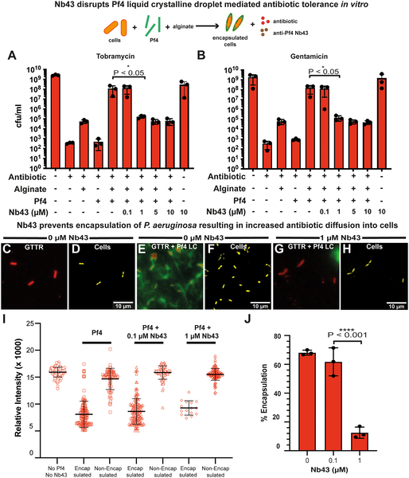
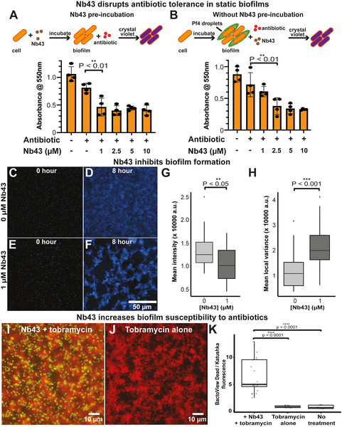

Bacterial infections that resist antibiotics pose a growing threat to global health. One particularly stubborn culprit is Pseudomonas aeruginosa, a pathogen known for forming biofilms—dense bacterial communities encased in a protective matrix that shields them from drugs. Scientists have now uncovered a novel way to crack open this bacterial fortress by targeting the physical structure of viral particles embedded within the biofilm. Using tiny nanobodies, they disrupted liquid crystalline droplets formed by filamentous phages, restoring the bacteria’s vulnerability to antibiotics.

> **TL;DR**
> - Pseudomonas aeruginosa biofilms contain filamentous Pf4 bacteriophages that assemble into liquid crystalline droplets, creating a physical barrier that reduces antibiotic penetration and promotes tolerance.
> - Researchers developed nanobodies that bind to the surface of Pf4 phages, disrupting these liquid crystalline droplets and thereby restoring antibiotic susceptibility in biofilms.

Biofilms are complex communities where bacteria live encased in a self-produced matrix of molecules like DNA, polysaccharides, and proteins. This matrix not only holds the community together but also protects bacteria from antibiotics and immune responses. In Pseudomonas aeruginosa, a common and dangerous pathogen, biofilms are especially problematic because they harbor filamentous bacteriophages called Pf4. These phages align to form spindle-shaped liquid crystalline droplets—tactoids—that physically shield bacteria by limiting antibiotic diffusion. Understanding and disrupting this protective structure is a promising strategy to tackle antibiotic tolerance in biofilm-related infections.

The researchers combined biophysical modeling with experimental work to explore how to disrupt Pf4 liquid crystalline droplets. Their simulations suggested that small molecules binding to the phage surface could increase surface roughness and interfere with the phages’ ability to pack tightly, thereby breaking down the droplets. To test this, they generated nanobodies—single-domain antibodies derived from alpacas—that specifically target the outer coat protein of Pf4 phages. Using electron cryomicroscopy, they visualized how these nanobodies decorate the phage surface. They then assessed the nanobodies’ ability to disrupt droplets in vitro, promote antibiotic penetration, and reduce antibiotic tolerance in P. aeruginosa biofilms under various conditions.

The nanobody Nb43 bound tightly to the Pf4 phage surface, as confirmed by biochemical assays and high-resolution microscopy. Adding Nb43 disrupted the formation of liquid crystalline droplets in laboratory conditions, breaking apart the protective phage assemblies. Importantly, when applied to Pseudomonas aeruginosa biofilms, Nb43 enhanced antibiotic diffusion into bacterial cells and abolished the biofilms’ characteristic tolerance to antibiotics like tobramycin. This effect was observed across different growth conditions, demonstrating the robustness of the approach. By targeting a biophysical property—the assembly of phage filaments—rather than a biochemical pathway, the nanobodies effectively dismantled a critical physical barrier protecting the bacteria.

This study highlights an innovative strategy to combat antibiotic tolerance by focusing on the physical organization of biofilm components rather than traditional biochemical targets. Since filamentous phages and similar filamentous molecules are common in many bacterial biofilms, this approach could be generalized to other pathogens. By disrupting the protective liquid crystalline droplets formed by phages, nanobody-based treatments could restore the effectiveness of existing antibiotics, offering a new avenue to address chronic and hard-to-treat infections. This work also exemplifies how combining theoretical modeling with molecular biology and advanced imaging can yield fresh insights into microbial defense mechanisms.

While these findings are promising, the research is currently at the laboratory stage. The nanobody treatment’s safety, delivery, and efficacy in living organisms remain to be tested. Additionally, biofilms in clinical settings are complex and influenced by many factors beyond phage droplets. Further studies will be needed to explore how broadly this strategy applies to different bacterial species and infection types, and whether bacteria might develop resistance to nanobody disruption. Nonetheless, targeting the biophysical properties of biofilms opens a new frontier in antimicrobial therapy worth exploring.

## Figures

*Simulations and lab tests show how Pf4 binders disrupt phage clumping by attaching along the phage length, reducing their close alignment.*

*Nanobody Nb43 strongly blocks and breaks down Pf4 liquid crystal droplets, shown by microscopy and cryo-ET images at different concentrations.*

*Nb43 reduces P. aeruginosa's antibiotic tolerance by disrupting Pf4, shown by fewer bacteria surviving and increased antibiotic uptake in lab tests.*

*Nb43 treatment makes P. aeruginosa biofilms more sensitive to antibiotics, reducing their growth when combined with tobramycin.*

## Sources

- [Disrupting phage liquid crystalline droplets restores antibiotic susceptibility in Pseudomonas aeruginosa biofilms](https://journals.plos.org/plosbiology/article?id=10.1371/journal.pbio.3003834)
- DOI: [10.1371/journal.pbio.3003834](https://doi.org/10.1371/journal.pbio.3003834)
