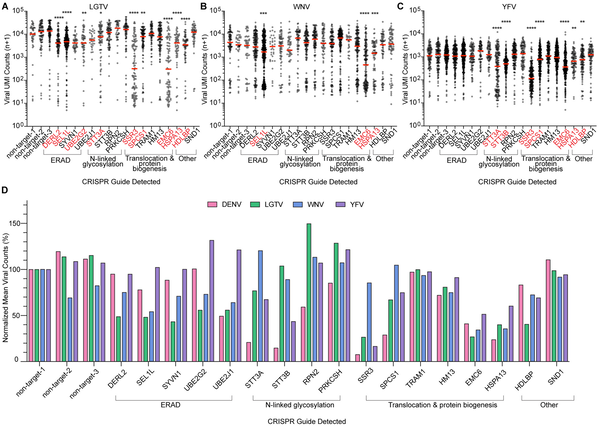
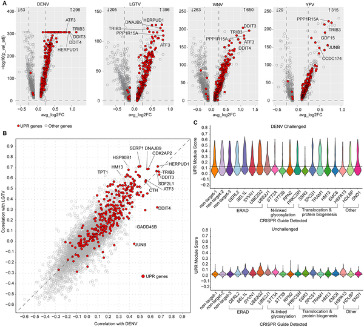
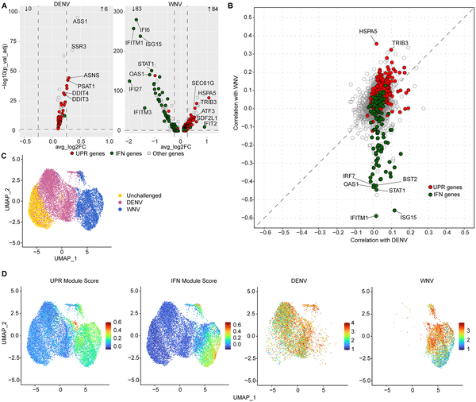
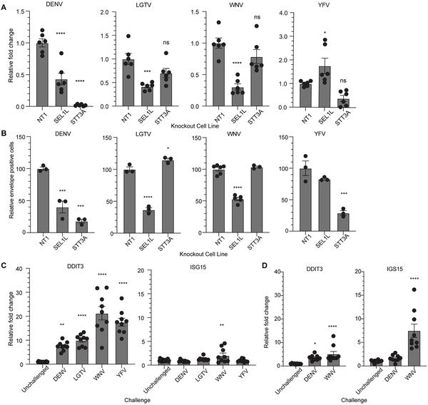

Flaviviruses like dengue, yellow fever, West Nile, and tick-borne Langat virus are notorious for causing a range of diseases—from hemorrhagic fever to encephalitis. Despite their genetic similarities, these viruses hijack our cells in surprisingly distinct ways. How do they exploit the cellular machinery differently, and what can that tell us about fighting these infections? A new study introduces an innovative single-cell CRISPR method to dissect these viral strategies, offering fresh insights into the cellular battles that unfold during infection.

> **TL;DR**
> - A new single-cell CRISPR screening method, QIC-seq, allows simultaneous measurement of viral replication, host gene disruption, and host cell responses in individual cells.
> - Different flaviviruses depend on unique sets of host cell proteins related to endoplasmic reticulum proteostasis, but all trigger a universal cellular stress response called the unfolded protein response.

Orthoflaviviruses are a diverse group of RNA viruses transmitted by mosquitoes or ticks, responsible for millions of infections worldwide each year. While they share common features in their replication strategies, they cause vastly different diseases. For example, dengue and yellow fever viruses can cause severe hemorrhagic symptoms, West Nile virus is linked to neurological disease, and tick-borne viruses like Langat can cause encephalitis. Understanding exactly which host cell factors these viruses rely on—and how the cells respond—could help identify new antiviral targets. However, previous studies often focused on one virus at a time or lacked the resolution to capture detailed host-virus interactions at the single-cell level.

To address this, researchers developed Quantification of Infection and CRISPR guide sequencing (QIC-seq), a novel approach that combines CRISPR/Cas9 gene knockout with virus-inclusive single-cell RNA sequencing. They engineered a library of human liver cells (Huh7.5.1) each lacking a specific gene involved in endoplasmic reticulum (ER) proteostasis—a key cellular process for protein folding and quality control. After infecting these cells with four different flaviviruses—dengue virus (DENV), yellow fever virus (YFV), West Nile virus (WNV), and Langat virus (LGTV)—they used QIC-seq to simultaneously measure viral RNA levels, identify which gene was knocked out in each cell, and profile host gene expression. This allowed a direct comparison of how each virus depends on specific host factors and how infected cells respond transcriptionally.

The study revealed both shared and unique host dependencies among the flaviviruses. Dengue and yellow fever viruses strongly relied on components of the oligosaccharyltransferase (OST) complex, essential for adding sugar groups to proteins during their synthesis in the ER. In contrast, West Nile and Langat viruses depended more on the ER-associated degradation (ERAD) machinery, which helps remove misfolded proteins. Interestingly, proteins involved in translocating and inserting viral proteins into the ER membrane were important for all viruses tested, though with some virus-specific differences. Across all infections, cells activated the unfolded protein response (UPR), a stress pathway triggered by accumulation of misfolded proteins in the ER. This suggests that flavivirus infection universally stresses the ER, but the viruses exploit different ER-related pathways to replicate. The study also observed virus-induced upregulation of interferon-stimulated genes, though this immune activation occurred mostly in neighboring cells rather than the infected cells themselves, likely due to the cell line’s impaired immune signaling.

By combining CRISPR gene editing with single-cell transcriptomics, QIC-seq offers a powerful tool to dissect virus-host interactions in unprecedented detail. Understanding which host proteins are essential for different flaviviruses can inform the development of host-directed antiviral therapies that may be broadly effective or tailored to specific viruses. The identification of a universal unfolded protein response activation highlights a common cellular stress that could be targeted to mitigate infection. Moreover, this approach can be extended to study other viruses and pathogens, advancing our ability to map the complex interplay between infectious agents and host cells at the single-cell level.

While the study provides valuable insights, it was conducted in a liver-derived cell line (Huh7.5.1) that lacks a fully functional innate immune response, limiting observations of natural antiviral defenses. The focus on ER proteostasis genes means other important host factors might have been missed. Additionally, the viruses were studied in isolation and in vitro, which may not fully capture the complexity of infections in living organisms. Further research in more physiologically relevant models and with broader gene libraries will be needed to validate and expand these findings.

## Figures

*Different viruses rely on unique host genes for infection, shown by varying viral levels in cells with specific gene disruptions.*

*Orthoflaviviruses trigger stress responses in liver cells, shown by gene changes linked to infection levels and viral counts.*

*WNV infection triggers stress and immune responses in HAP1 cells, shown by gene activity and viral counts comparisons.*

*Testing how specific genes affect virus levels and cell responses in infected liver cells using RNA and protein measurements.*

## Sources

- [Dissecting the host determinants of orthoflavivirus infection using QIC-seq](https://journals.plos.org/plospathogens/article?id=10.1371/journal.ppat.1014279)
- DOI: [10.1371/journal.ppat.1014279](https://doi.org/10.1371/journal.ppat.1014279)
