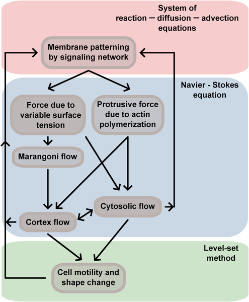
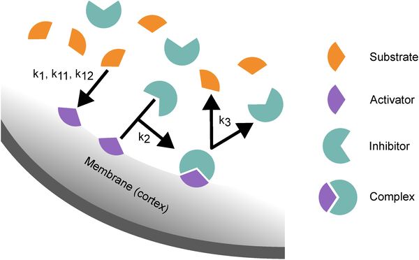
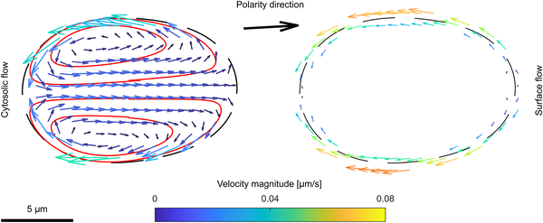
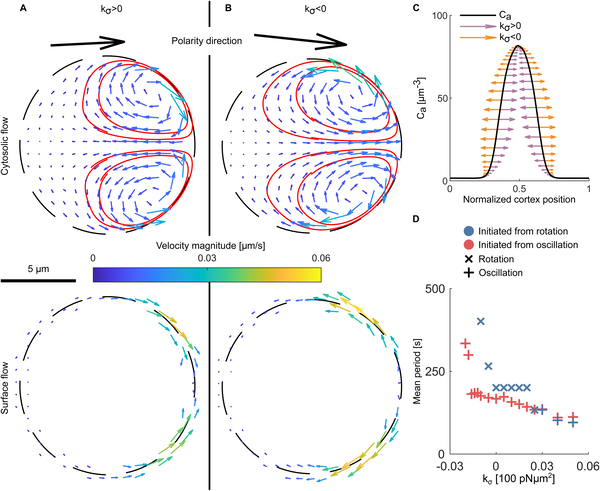

Imagine a tiny cell navigating its environment without any external map or guide. How does it decide where to go and how to move? Recent research shows that the answer lies within the cell itself, where simple chemical reactions and physical flows team up to create surprisingly complex movement patterns. This self-organization allows cells to crawl steadily, shift directions, circle, or turn intermittently — all without external signals.

> **TL;DR**
> - Cells can generate diverse locomotion patterns through the coupling of internal chemical reactions with fluid flows on their surface and inside their interior.
> - A new computational model integrates biochemical signaling and hydrodynamics to explain how small changes inside cells lead to different movement behaviors observed in real cells.

Cell migration is a fundamental process essential for life, from single-celled amoebas exploring their surroundings to cells in our bodies healing wounds. This crawling movement depends on the cell’s cytoskeleton — a dynamic network of protein filaments regulated by biochemical signals, notably the Rho family of GTPases. These molecules switch on and off in reaction–diffusion cycles that pattern the cell membrane and establish a front and rear, guiding movement. But understanding how these chemical signals translate into the physical shape changes and motions of cells has been a complex challenge.

To tackle this, researchers developed a computational model that combines reaction–diffusion dynamics of signaling molecules with fluid flows inside the cell (cytosol) and on its surface (cortex). They used a level-set method to represent the cell boundary as a smooth, evolving interface and coupled it with the Navier-Stokes equations describing fluid motion at low Reynolds numbers. The model incorporates forces such as surface tension that varies with chemical activator concentration, protrusive forces from actin polymerization, and drag forces resisting movement. By simulating this tightly coupled system, the model captures how biochemical patterns and mechanical feedback drive changes in cell shape and movement.

The simulations revealed that even small changes in the coupling parameters between chemical signaling and fluid flows can produce a wide range of cell behaviors seen experimentally: steady gliding forward, spontaneous turning, circular motion, or intermittent direction changes. These behaviors emerge as self-organized limit cycles — stable, repeating patterns arising from the internal dynamics of the cell. The study highlights that both the flow inside the cytosol and spatial variations in surface tension on the cortex are crucial to reproduce the full diversity of motility modes, providing a theoretical foundation for understanding amoeboid migration.

This work advances our understanding of cell motility by showing how simple physical principles and biochemical reactions inside cells can generate complex, diverse movement patterns without external cues. Such insights not only deepen our knowledge of fundamental biological processes but may also inform medical research areas like wound healing, immune response, and cancer metastasis where cell migration plays a key role. Furthermore, the model’s ability to simulate realistic cell shapes and motions offers a valuable tool for exploring how cells explore and adapt to their environments.

While the model successfully reproduces a variety of motility patterns, it remains a simplified representation of the highly complex biology of real cells. It focuses on two-dimensional shapes and assumes certain linear dependencies, such as surface tension varying with activator concentration. Also, the model currently addresses amoeboid-like crawling on flat surfaces and does not yet incorporate external guidance cues or three-dimensional environments. Future work will need to extend and validate these findings with experimental data and more detailed biological factors.

## Figures

*Diagram showing how cell movement involves membrane patterns, forces, and flows that all work together to change cell shape and motion.*

*Diagram showing how molecules bind and react on the cell membrane, forming complexes that then break apart to restart the cycle.*

*Cell movement causes flows inside and on the surface, shown by arrows and colors, driven by protrusive forces in the cell's moving direction.*

*Flow patterns in cells show how surface tension affects activator movement and oscillation timing during early simulation stages.*

## Sources

- [Diversity in emergent cell locomotion from the coupling cytosolic and cortical Marangoni flows with reaction–diffusion dynamics](https://journals.plos.org/ploscompbiol/article?id=10.1371/journal.pcbi.1014216)
- DOI: [10.1371/journal.pcbi.1014216](https://doi.org/10.1371/journal.pcbi.1014216)
