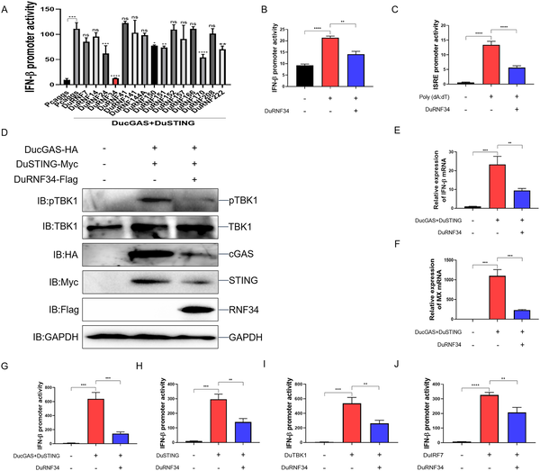
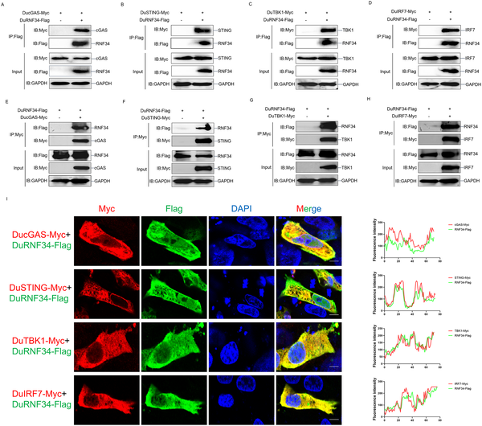
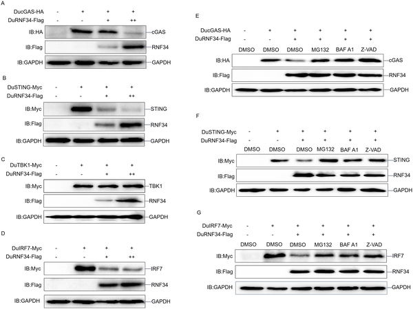

Imagine a virus so cunning that it not only invades its host but also sabotages the bird’s own immune system from within. Duck plague virus (DPV), a herpesvirus that causes a devastating disease in waterfowl, has evolved a sophisticated molecular trick to do just that. By recruiting a host enzyme to destroy a critical immune protein, DPV effectively shuts down the bird’s frontline antiviral defenses, allowing the infection to spread unchecked.

> **TL;DR**
> - Duck plague virus uses its unique protein LORF2 to hijack a host enzyme, DuRNF34, which tags the immune factor IRF7 for destruction.
> - This targeted degradation of IRF7 disables the bird’s key antiviral signaling pathway, suppressing interferon production and promoting viral replication.

Duck plague is a serious disease affecting ducks and other waterfowl, caused by DPV, an alphaherpesvirus. Unlike many mammals, birds have lost the immune protein IRF3 through evolution, making IRF7 the crucial transcription factor that triggers antiviral interferon responses. The cGAS-STING pathway detects viral DNA and activates IRF7 to initiate these defenses. However, DPV has developed multiple ways to undermine this pathway. Understanding these viral strategies is important not only for protecting poultry health but also for gaining insights into viral immune evasion mechanisms more broadly.

Researchers used duck embryonic fibroblast cells and molecular biology techniques to investigate how DPV manipulates the host immune system. They identified the duck E3 ubiquitin ligase DuRNF34 as a suppressor of the cGAS-STING pathway by promoting degradation of several key proteins, including IRF7. Using affinity purification and mass spectrometry, they discovered that the viral protein LORF2 binds DuRNF34 and directs it to ubiquitinate IRF7 at specific sites, marking it for destruction. Functional experiments knocking down LORF2 showed reduced IRF7 degradation and impaired viral replication, confirming the role of this interaction in immune evasion.

The study revealed that DPV infection increases the levels of DuRNF34 in host cells. The viral protein LORF2 acts as a molecular adapter, recruiting DuRNF34 to IRF7 and catalyzing its polyubiquitination at lysine residues K51 and K453. This modification leads to IRF7 degradation, which in turn suppresses the production of interferon-beta and downstream antiviral genes. By dismantling this critical immune signaling node, DPV effectively disables the duck’s innate antiviral response, facilitating viral replication and disease progression.

These findings uncover a novel immune evasion mechanism where a viral protein exploits the host’s ubiquitin system to selectively degrade a key immune factor. This not only advances our understanding of herpesvirus biology and host-virus interactions in birds but also highlights potential therapeutic targets. Interfering with the LORF2-DuRNF34 interaction could provide new strategies to control duck plague, a disease with significant economic impact in poultry farming. Moreover, this research sheds light on how viruses adapt to unique aspects of their hosts’ immune systems.

While the molecular details of this immune evasion strategy are well supported by cellular experiments, further studies in live animals are needed to fully understand its role during natural infection. Additionally, the broader applicability of this mechanism to other avian herpesviruses or host species remains to be explored. As with many viral-host interactions, the complexity of immune regulation means that other viral factors and host pathways likely contribute to DPV’s success in evading immunity.

## Figures

*DuRNF34 reduces duck immune signaling by lowering activity and gene expression in the cGAS-STING pathway in duck cells.*

*DuRNF34 protein binds and co-locates with DucGAS, DuSTING, DuTBK1, and DuIRF7 in cells, shown by lab tests and microscopy.*

*DuRNF34 helps break down key proteins in cells using different pathways, shown by experiments in duck cells with various treatments.*

## Sources

- [Duck plague virus LORF2 utilizes RNF34 to inhibit antiviral innate immunity by ubiquitination and degradation of IRF7](https://journals.plos.org/plospathogens/article?id=10.1371/journal.ppat.1014174)
- DOI: [10.1371/journal.ppat.1014174](https://doi.org/10.1371/journal.ppat.1014174)
