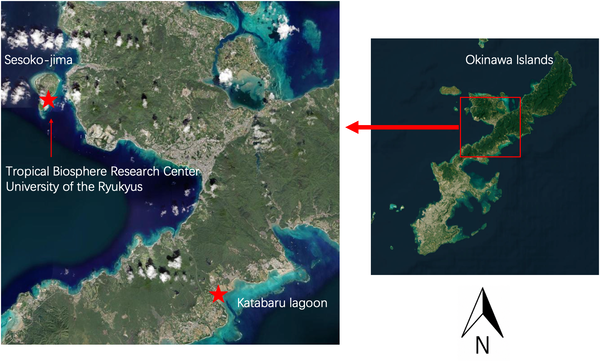
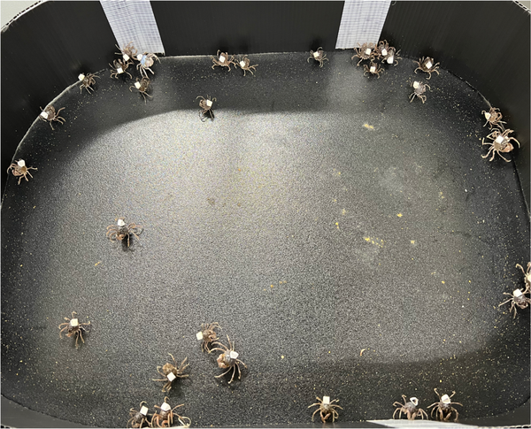
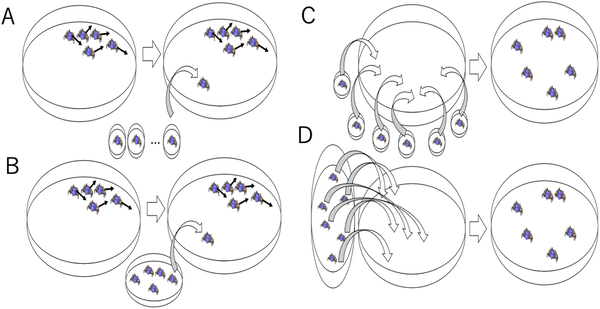
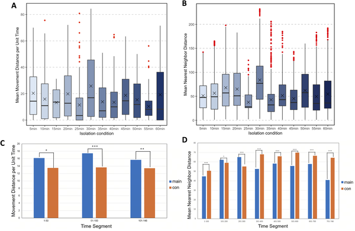

What happens when a soldier crab is separated from its swarm for just a few minutes? While social isolation is known to affect mammals and eusocial insects, its impact on less hierarchical, anonymous animal groups remains less understood. Recent research on Mictyris guinotae, the swarming soldier crab, uncovers surprising, duration-dependent behavioral shifts that ripple through their dense, coordinated marches along intertidal flats.

> **TL;DR**
> - Short isolation (5–30 minutes) makes soldier crabs move more actively and stay closer to their neighbors upon rejoining the swarm.
> - Long isolation (3 hours) causes a two-phase response: initial reduced movement followed by increased but poorly coordinated activity with the group.

Social living offers animals benefits like improved foraging and predator avoidance, but maintaining group cohesion requires constant interaction. In many animals, even brief social isolation can disrupt behavior and physiology. While effects of isolation are well-studied in mammals and eusocial insects, less is known about species like soldier crabs that form large, anonymous swarms without fixed social roles. Mictyris guinotae, native to Okinawan tidal flats, offers a natural system to explore how transient social disruption influences individual behavior and collective dynamics.

Researchers collected active soldier crabs from Okinawa and conducted two experiments in a controlled arena mimicking natural conditions. In the first, individual crabs were isolated for varying durations between 5 and 60 minutes before being reintroduced into an established swarm. In the second, groups of 20 crabs were isolated simultaneously for 5, 10, 30 minutes, or 3 hours, then released together to observe swarm formation. Behavioral metrics such as movement distance, local alignment (polarity), and nearest-neighbor proximity were tracked via high-speed video and analyzed statistically to compare isolated and non-isolated crabs.

The study revealed a non-linear, threshold-dependent effect of isolation duration on reintegration behavior. Crabs isolated briefly (5–30 minutes) showed increased locomotor activity and moved closer to neighbors compared to controls, suggesting an enhanced drive to reconnect socially. In contrast, crabs isolated for 3 hours exhibited a biphasic pattern: an initial decrease in movement followed by elevated but weakly coordinated activity, indicating a disruption in swarm integration. These behavioral shifts demonstrate how even short social interruptions can alter individual participation in collective movement, with longer isolation producing more complex effects.

This research highlights soldier crabs as a tractable invertebrate model for studying how transient social disruption influences both individual behavior and emergent group dynamics. Unlike eusocial insects with fixed roles, these crabs’ flexible, anonymous interactions allow for clear observation of how isolation-induced behavioral changes propagate through local interactions to affect swarm cohesion. Understanding these dynamics enriches our broader knowledge of social homeostasis across species and scales, from neural circuits to collective animal behavior.

While the experiments controlled isolation duration and measured clear behavioral changes, the ecological relevance of longer isolation periods beyond natural conditions remains to be fully explored. Additionally, the mechanisms underlying these behavioral shifts—whether physiological stress, altered sensory processing, or motivational changes—require further investigation. The study focused on a single species and setting, so generalizing findings to other swarming animals should be done cautiously. Nonetheless, the work provides a valuable foundation for future research into social disruption effects in non-hierarchical animal groups.

## Figures

*Map showing the lab and Katabaru lagoon where crabs were collected for the study.*

*Soldier crabs in an arena showing their natural swarming behavior.*

*Diagrams showing steps for two experiments testing effects of isolation on groups of individuals under different conditions.*

*Graphs show how isolation time affects movement and closeness to others, comparing isolated and non-isolated individuals over 5 to 60 minutes.*

## Sources

- [Duration-dependent effects of social isolation on reintegration behavior in the swarming soldier crab, Mictyris guinotae](https://journals.plos.org/plosone/article?id=10.1371/journal.pone.0350642)
- DOI: [10.1371/journal.pone.0350642](https://doi.org/10.1371/journal.pone.0350642)
