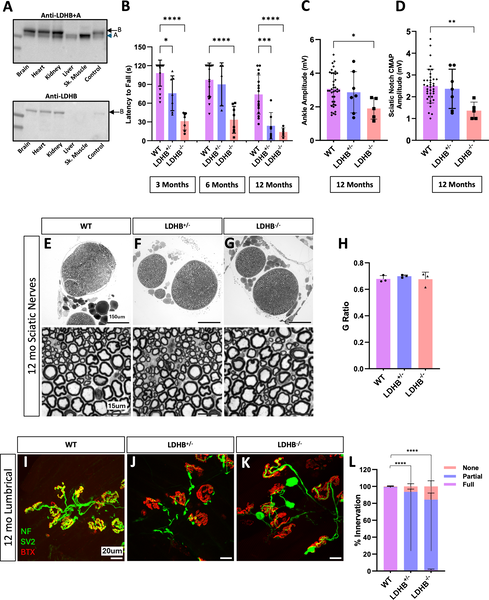
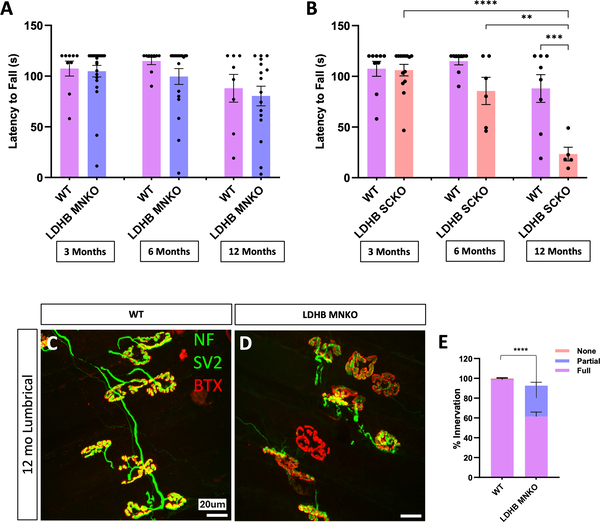
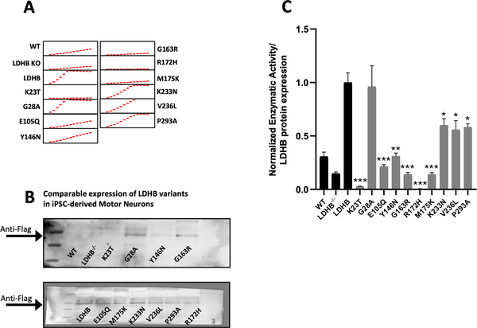
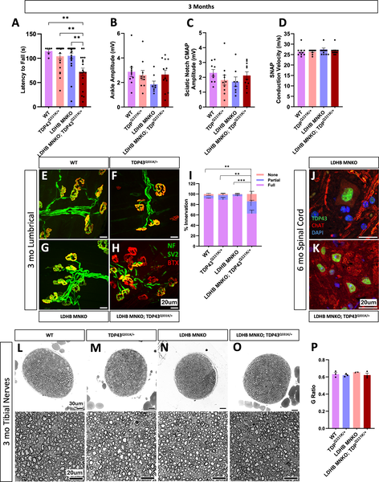

Amyotrophic lateral sclerosis (ALS) is a devastating neurodegenerative disease characterized by progressive loss of motor function. While genetic mutations are known contributors, the role of cellular metabolism—especially how nerve cells get their energy—has been less clear. Recent research uncovers how a subtle glitch in lactate metabolism, the process by which nerve-supporting cells shuttle energy to neurons, can amplify the effects of ALS genetic risk factors and speed up motor decline.

> **TL;DR**
> - Partial disruption of lactate metabolism in mice causes neuromuscular junction deterioration and motor dysfunction without outright nerve fiber loss.
> - Loss of lactate dehydrogenase B (LDHB) in motor neurons worsens motor symptoms when combined with mild ALS genetic mutations, suggesting lactate metabolism influences disease risk.

Neurons have high energy demands and rely on neighboring glial cells to supply them with lactate, a key metabolic fuel. This lactate shuttling supports neuronal function by converting lactate back into pyruvate, which feeds the cell’s energy cycle. Aging and neurodegenerative diseases like ALS are associated with declines in this metabolic support. Lactate dehydrogenase enzymes, especially LDHB, play a central role in converting lactate and pyruvate. Prior studies showed that completely blocking lactate shuttling causes nerve degeneration, but how partial disruptions—more typical of aging—affect motor function was unknown.

Researchers used genetically engineered mice lacking the LDHB enzyme either throughout the body or selectively in motor neurons or Schwann cells, the glial cells that wrap around nerves. They assessed motor behavior over time, examined nerve and neuromuscular junction structure, and measured muscle electrical responses. To explore human relevance, they analyzed genetic data from ALS patients for rare LDHB variants and tested these variants’ enzyme activity in human motor neurons derived from stem cells. Finally, they combined LDHB loss in motor neurons with mild ALS genetic mutations in mice to study interactions.

Whole-body LDHB knockout mice developed progressive motor deficits and neuromuscular junction deterioration without loss of nerve fibers, indicating that LDHB is critical for maintaining nerve-muscle connections. Selective LDHB deletion in Schwann cells caused similar motor problems, while deletion in motor neurons alone had only mild effects on neuromuscular junctions. Analysis of ALS patient genomes revealed rare LDHB variants that significantly reduced enzyme activity in human motor neurons. Importantly, motor neuron-specific LDHB loss combined with mild ALS mutations in TDP43 or SOD1 genes led to early and severe motor dysfunction, demonstrating that disrupted lactate metabolism can exacerbate genetic ALS risk.

This study highlights lactate metabolism, specifically the role of LDHB, as a key modifier of motor neuron vulnerability and disease progression in ALS. The findings suggest that even modest declines in lactate shuttling—such as those occurring with aging—can worsen outcomes when combined with genetic risk factors. Targeting lactate metabolism pathways could therefore represent a promising therapeutic strategy to slow motor decline in ALS and potentially other neurodegenerative diseases.

While the mouse models and cellular assays provide strong evidence linking LDHB loss to motor dysfunction and ALS risk, the rarity of LDHB variants in patients limits statistical power to confirm their contribution to disease prevalence. The metabolic interactions are complex, and further research is needed to understand how lactate metabolism integrates with other ALS mechanisms in humans. Additionally, translating these findings into therapies will require careful evaluation of safety and efficacy in clinical contexts.

## Figures

*Removing LDHB in mice leads to worsening movement problems and nerve-muscle connection issues but doesn't harm nerve fibers.*

*Removing LDHB in Schwann cells, not motor neurons, causes motor problems by 6 months, shown by movement tests and nerve-muscle connection images.*

*Rare LDHB gene changes in ALS patients reduce enzyme activity in human motor neurons compared to the normal gene version.*

*Removing LDHB in motor neurons worsens early movement and nerve connection problems in mice with TDP43 mutation.*

## Sources

- [Dysregulated lactate metabolism synergizes with ALS genetic risk factors to accelerate motor decline](https://journals.plos.org/plosone/article?id=10.1371/journal.pone.0347135)
- DOI: [10.1371/journal.pone.0347135](https://doi.org/10.1371/journal.pone.0347135)
