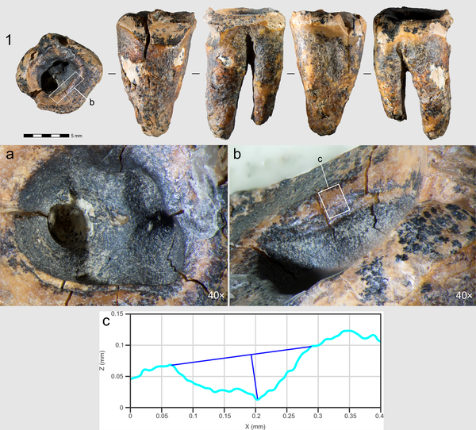
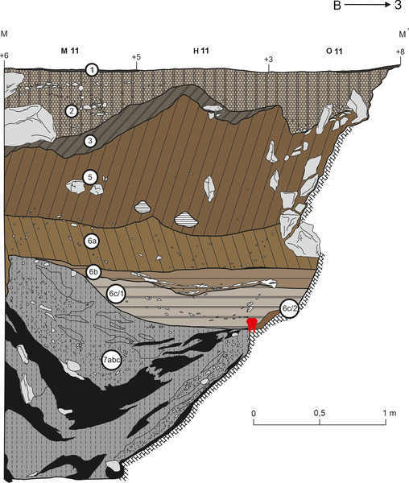
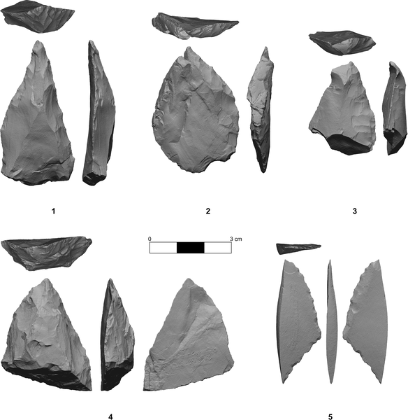

Did Neanderthals perform the world’s first dental drilling nearly 60,000 years ago? A remarkable discovery from Chagyrskaya Cave in southwestern Siberia suggests they did. A Neanderthal molar bearing a carefully crafted concavity carved during the individual's lifetime reveals a sophisticated attempt to treat dental caries—long before the advent of modern dentistry. This finding challenges long-held assumptions about Neanderthal cognitive abilities and medical practices.

> **TL;DR**
> - A Neanderthal molar from Chagyrskaya Cave shows the earliest documented evidence of invasive dental treatment involving drilling with stone tools around 59,000 years ago.
> - The complexity of the dental modifications indicates Neanderthals had the cognitive capacity to identify tooth pain sources and deliberately intervene to relieve it, demonstrating advanced medical knowledge.

Neanderthals have long fascinated scientists for their close evolutionary relationship to modern humans and their survival in harsh Ice Age environments. While evidence has suggested they cared for injured or sick group members and possibly used medicinal plants, it remained unclear whether such care was instinctive or involved deliberate medical strategies. Until now, the earliest known dental interventions were associated with Upper Paleolithic Homo sapiens, and Neanderthal dental care was limited to evidence of toothpick use. The discovery of a deeply carved concavity on a Neanderthal molar from Chagyrskaya Cave, dated to approximately 59,000 years ago, offers compelling evidence that Neanderthals practiced invasive dental treatment far earlier than previously documented.

Researchers analyzed the lower left second molar, known as Chagyrskaya 64, using a combination of microscopic traceological analysis, scanning electron microscopy, micro-computed tomography (micro-CT), and Raman spectroscopy. These techniques revealed a large, human-made concavity on the tooth’s occlusal (biting) surface, extending to the pulp chamber. To understand how this concavity formed, the team conducted experimental studies replicating drilling and scraping on modern human molars using stone tools similar to those found in the same archaeological layer. This multidisciplinary approach allowed them to distinguish intentional dental modification from natural wear or post-depositional damage.

The analyses showed that the concavity on the Neanderthal molar was created by a drilling or rotating action using a lithic perforator—a stone tool designed to bore holes. The presence of two distinct types of manipulations, requiring different tools and complex finger movements, indicates a deliberate and skilled dental intervention. The modifications suggest that the Neanderthal individual suffered from dental caries (tooth decay) and that the treatment aimed to remove the decayed tissue and alleviate pain. This invasive procedure predates previously known dental treatments by tens of thousands of years and reveals that Neanderthals possessed the cognitive ability to understand the source of pain and select effective medical solutions.

This discovery reshapes our understanding of Neanderthal intelligence and cultural complexity. It demonstrates that Neanderthals were capable of sophisticated medical interventions, moving beyond instinctive self-care to deliberate treatment strategies. The ability to perform precise drilling on a tooth implies advanced motor skills, knowledge of anatomy, and pain management. These findings narrow the behavioral gap between Neanderthals and modern humans, suggesting that medical knowledge and caregiving were integral parts of Neanderthal social life. Moreover, it highlights the deep roots of healthcare practices in human evolution, extending tens of thousands of years into the past.

While the evidence strongly supports the interpretation of deliberate dental treatment, some uncertainties remain. The exact materials used for drilling and how Neanderthals managed pain during the procedure are unknown. The findings come from a single tooth, so it is unclear how widespread such practices were among Neanderthal populations. Additionally, although experimental replications support the drilling hypothesis, the precise techniques and tools may have varied. Future discoveries of similar dental modifications could help clarify the extent and variability of Neanderthal medical knowledge.

## Figures

*Images showing different views and close-ups of the Chagyrskaya 64 molar tooth's surface and grooves.*

*Location and layers where the Chagyrskaya 64 molar was found, shown using excavation data.*

*Tools and holes found in Layer 6c/2 of Chagyrskaya Cave showing ancient human activity.*

## Sources

- [Earliest evidence for invasive mitigation of dental caries by Neanderthals](https://journals.plos.org/plosone/article?id=10.1371/journal.pone.0347662)
- DOI: [10.1371/journal.pone.0347662](https://doi.org/10.1371/journal.pone.0347662)
