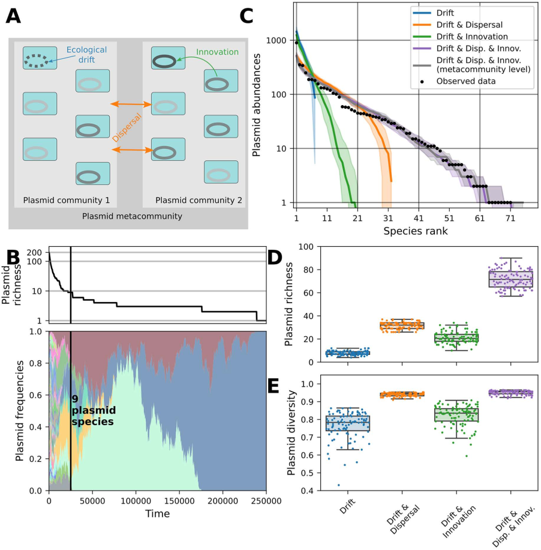

What if the tiny DNA circles inside bacteria, known as plasmids, behave like species competing in an ecosystem? Just as animals and plants compete for resources in nature, plasmids compete for space within bacterial hosts. This fresh perspective from ecology helps us understand how bacteria rapidly adapt to stresses like antibiotics, by revealing the hidden dynamics of plasmid communities.

> **TL;DR**
> - Plasmids within bacteria form diverse communities whose abundance patterns resemble those of species in ecological systems.
> - A new theoretical model combining ecological niche and neutral theories explains how plasmid diversity arises from competition, chance, and innovation.

Bacteria are remarkably adaptable organisms, partly due to their dynamic genomes shaped by horizontal gene transfer—the exchange of genetic material between cells. Plasmids, which are small, self-replicating DNA molecules, play a key role in this process. They carry genes that can help bacteria survive antibiotics and other stresses. However, plasmids themselves follow evolutionary paths that are distinct from their bacterial hosts. Traditionally, studies have focused on plasmid-host relationships, but this approach doesn’t fully explain how many different plasmids coexist within bacterial populations. Drawing from ecological theory, researchers now view plasmids as communities of competing entities, each vying for the limited resource of the bacterial host. This ecological lens offers new insights into plasmid diversity and bacterial genome evolution.

The researchers analyzed thousands of plasmids found in complete genomes of common bacteria such as Escherichia coli, grouping plasmids into taxonomic units analogous to species. They observed that plasmid abundance within bacterial populations follows patterns similar to species abundance in ecological communities, where a few plasmid types are very common and many others are rare. To explain these patterns, they developed a minimal mathematical model inspired by ecological theories. This model integrates niche theory, which emphasizes differences in traits allowing coexistence, and neutral theory, which highlights the role of random processes like chance and dispersal. The model also accounts for plasmid innovation—the emergence of new plasmid types—and their movement among bacterial populations.

The study found that plasmid communities exhibit rank-abundance curves and trait distributions resembling those seen in ecological communities of birds and trees. Their model showed that plasmid diversity results from a balance between niche differentiation—where plasmids with different traits can coexist—and neutral processes such as random drift and dispersal. For example, plasmids carrying antibiotic resistance genes may dominate under antibiotic stress, while others with higher transfer rates prevail in antibiotic-free environments. Importantly, stochastic events and the introduction of new plasmid types help maintain diversity despite competitive exclusion pressures. These findings challenge the view that bacterial genomes are organized solely by deterministic genetic rules, highlighting instead the importance of ecological interactions and chance.

By applying ecological theory to plasmids, this work bridges microbiology and ecology, providing a novel framework to understand how bacterial genomes evolve. This perspective not only deepens our fundamental knowledge of microbial life but also has practical implications. Since plasmids often carry antibiotic resistance genes, understanding their community dynamics could inform strategies to control the spread of resistance. Viewing plasmids as ecological communities competing within bacterial hosts opens new avenues for research and potential interventions in bacterial evolution and public health.

While the model captures key aspects of plasmid diversity, it simplifies complex biological realities. The ecological interactions among plasmids, hosts, and environments involve many factors not fully represented in the model, such as specific molecular mechanisms of plasmid incompatibility or host immune responses. Additionally, the conceptual nature of ecological modeling may be abstract for some audiences, and empirical validation in diverse bacterial systems is needed. Nonetheless, this interdisciplinary approach provides a valuable starting point for integrating ecological and genomic perspectives on plasmid dynamics.

## Figures

*Modeling shows chance, movement, and innovation together keep diverse plasmid communities in bacteria, matching real-world patterns.*

## Sources

- [Ecological theory sheds light on plasmid diversity and dynamics](https://journals.plos.org/plosbiology/article?id=10.1371/journal.pbio.3003918)
- DOI: [10.1371/journal.pbio.3003918](https://doi.org/10.1371/journal.pbio.3003918)
