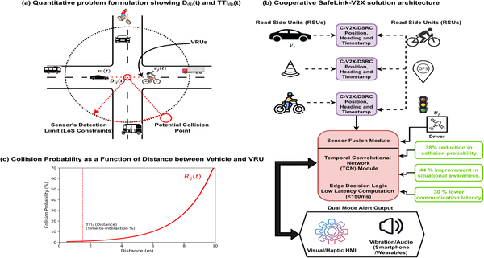
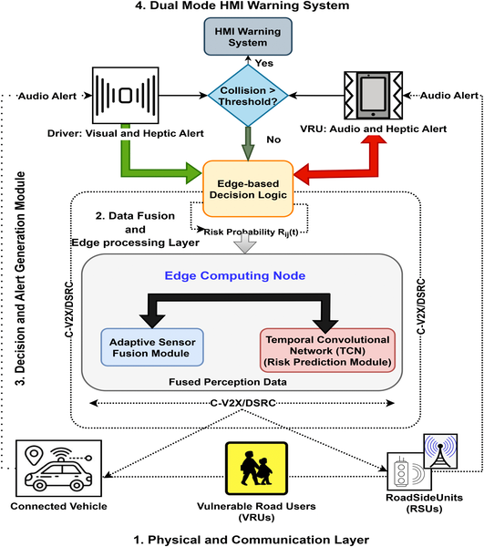

What if your phone and nearby cars could team up to keep you safe on busy city streets? Imagine a system that not only senses danger but predicts it—alerting drivers and pedestrians before a collision even becomes likely. This is the promise behind SafeLink-V2X, a cutting-edge cooperative framework that uses artificial intelligence and connected vehicle technology to protect pedestrians, cyclists, and scooter riders in real time.

> **TL;DR**
> - SafeLink-V2X combines vehicle-to-everything communication with AI-powered sensor fusion to predict and warn about potential collisions involving vulnerable road users.
> - Simulation tests show the system can reduce collision probability by over 90%, improve situational awareness by 44%, and cut alert latency by 30%, outperforming traditional onboard or communication-only systems.

Urban environments pose significant risks to Vulnerable Road Users (VRUs) like pedestrians and cyclists, who lack the physical protection of vehicles and are often hidden from drivers’ direct view. Conventional safety systems rely heavily on onboard sensors such as cameras and radar, but these can be limited by line-of-sight issues, poor weather, and occlusions. Meanwhile, communication-based systems that share vehicle and pedestrian data often operate in isolation without intelligent analysis, resulting in delayed or inaccurate warnings. The need for integrated, real-time, and predictive safety solutions is critical as cities grow smarter and traffic becomes more complex.

SafeLink-V2X addresses these challenges by integrating two communication protocols—Cellular Vehicle-to-Everything (C-V2X) and Dedicated Short-Range Communications (DSRC)—to enable seamless data exchange among vehicles, roadside infrastructure, and VRUs equipped with GPS-enabled smartphones or wearable tags. The system fuses sensor data from LiDAR, radar, and V2X inputs to create a comprehensive situational picture, even in occluded or adverse conditions. A Temporal Convolutional Network (TCN), a type of machine learning model, analyzes spatial and temporal data such as distance, speed, and heading to predict collision risk. Edge computing processes this data locally on vehicles and infrastructure to minimize communication delays. When a potential collision is detected, real-time, context-aware alerts are sent via human-machine interfaces—vibrotactile and visual cues for drivers, and vibration and audio warnings for VRUs—to prompt immediate evasive action.

Simulation studies conducted at urban intersections demonstrate that SafeLink-V2X significantly outperforms existing systems. It reduces the simulated probability of collisions by up to 91.4%, increases measures of situational awareness by 44%, and decreases end-to-end alert latency by 30% compared to baseline systems relying solely on onboard sensors or communication. These improvements suggest that the system can provide earlier and more accurate warnings, giving both drivers and vulnerable road users more time to react and avoid accidents.

The SafeLink-V2X framework represents a promising advancement in urban road safety by leveraging AI and cooperative communication to protect those most at risk—pedestrians, cyclists, and scooter riders. Its ability to integrate multiple data sources and predict collisions proactively could transform how smart cities manage traffic safety. Beyond reducing injuries and fatalities, such systems can improve traffic flow and support the development of more responsive, human-centered transportation networks. As connected and autonomous vehicles become more prevalent, frameworks like SafeLink-V2X will be essential components of future intelligent transportation systems.

While simulation results are encouraging, real-world deployment of SafeLink-V2X faces challenges including network coverage variability, device interoperability, and the costs of infrastructure upgrades. Environmental factors such as signal interference in dense urban areas and user adoption of wearable devices also affect effectiveness. Further field testing and pilot programs will be necessary to validate performance under diverse conditions and to address scalability and privacy concerns. Nonetheless, SafeLink-V2X provides a strong foundation for next-generation cooperative safety technologies.

## Figures

*Fig 1 shows how SafeLink-V2X uses math and teamwork to improve vehicle communication and safety.*

*Diagram showing the overall design of the SafeLink-V2X system for secure vehicle communication.*

## Sources

- [Edge-intelligent safelink-V2X: A low-latency cooperative framework for real-time vulnerable road user protection](https://journals.plos.org/plosone/article?id=10.1371/journal.pone.0353392)
- DOI: [10.1371/journal.pone.0353392](https://doi.org/10.1371/journal.pone.0353392)
