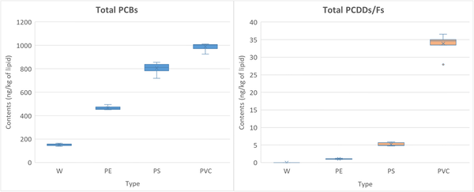
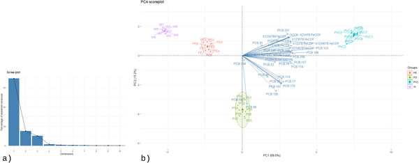
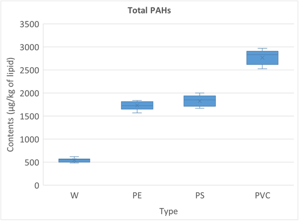

Did you know that the fuel used in traditional food smoking can turn your favorite smoked chicken into a source of harmful chemicals? In many places, including rural Vietnam, wood is the usual fuel for smoking meat, but sometimes plastics get mixed in—whether accidentally or to cut costs. Burning these plastics releases toxic pollutants that can cling to the meat you eat. But not all plastics are equal: different types produce different pollutants, some far more dangerous than others.

> **TL;DR**
> - Burning plastics mixed with wood during traditional smoking significantly increases toxic pollutants in smoked chicken compared to using clean wood alone.
> - Polyvinyl chloride (PVC), a chlorine-containing plastic, produces the highest levels of dioxins, PCBs, and carcinogenic PAHs, posing the greatest health risk.

Smoking food has been a culinary tradition for centuries, valued for preservation and flavor. Typically, natural biomass like wood or straw is burned to generate smoke rich in flavor compounds. However, in some traditional settings, fuels may be contaminated with plastics such as polyethylene (PE), polystyrene (PS), or polyvinyl chloride (PVC), often from waste materials or painted wood. When these plastics burn, they release persistent organic pollutants (POPs) including polychlorinated biphenyls (PCBs), dioxins (PCDD/Fs), and polycyclic aromatic hydrocarbons (PAHs). These compounds are toxic, carcinogenic, and can accumulate in fatty tissues, raising concerns about food safety and long-term health risks.

Researchers in Vietnam conducted controlled smoking experiments using whole chickens divided into portions. Each portion was smoked over five days using fuels of clean wood or wood mixed with 1% by weight of PE, PS, or PVC. The smoking chamber maintained temperatures around 80–90°C to simulate traditional conditions. After smoking, the chicken samples were freeze-dried and chemically analyzed for PCBs, PCDD/Fs, and PAHs using advanced gas chromatography and mass spectrometry techniques. Statistical analyses, including principal component analysis and hierarchical clustering, were applied to identify pollutant patterns and differences between fuel types.

The study found a clear contamination gradient: clean wood produced the lowest pollutant levels, while PVC-contaminated fuel caused the highest. Chicken smoked with PVC fuel contained all 29 PCB congeners tested, 12 dioxin/furan congeners, and multiple carcinogenic PAHs like benzo[a]pyrene at significantly elevated concentrations. PS fuel led to intermediate contamination with specific PCB markers (e.g., PCB 66 and 195) and moderate dioxin levels. PE fuel, despite lacking chlorine, still increased lighter PAHs and some dioxins compared to clean wood. Statistical tests confirmed significant differences among all fuel groups, and multivariate analyses showed distinct pollutant fingerprints linked to each plastic type.

These results highlight a hidden but serious public health hazard in traditional food smoking practices that use plastic-contaminated fuels. The type of plastic dramatically influences both the quantity and nature of toxic pollutants deposited on smoked meat. PVC, in particular, poses the greatest risk due to its chlorine content fostering dioxin formation. Understanding these contamination profiles is crucial for developing food safety regulations, guiding safer fuel choices, and protecting consumers from chronic exposure to carcinogenic and endocrine-disrupting chemicals through diet.

While the study carefully controlled smoking conditions and used robust chemical analyses, it focused on a specific traditional smoking setup and a limited plastic concentration (1% by weight). Real-world practices may vary in fuel composition, burning temperature, and exposure duration, which could influence pollutant formation. Additionally, the study measured contaminants in chicken meat but did not assess direct health outcomes in people consuming the meat. Further research is needed to evaluate exposure risks in diverse settings and to explore mitigation strategies for reducing pollutant transfer during food smoking.

## Figures

*Boxplots show the spread and average levels of total PCBs and PCDD/Fs in samples, highlighting their range and typical values.*

*Fig 3 shows key patterns and relationships in pollutant levels across samples using PCA charts.*

*Boxplot showing total PAH levels in samples with median, average, and range values.*

## Sources

- [Effect of plastic composition in the combustion material on the Persistent Organic Pollutant content in smoked chicken meat](https://journals.plos.org/plosone/article?id=10.1371/journal.pone.0350345)
- DOI: [10.1371/journal.pone.0350345](https://doi.org/10.1371/journal.pone.0350345)
