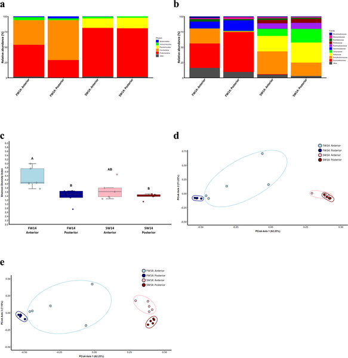

Imagine living in two worlds: one where water is fresh and abundant, and another where saltwater dominates and threatens to dehydrate you. The sailfin molly (Poecilia latipinna), a small fish native to coastal environments, thrives in both. But how does it manage the chemical challenges of switching between freshwater and salty seawater? Recent research reveals a fascinating story of how this fish reshapes its internal chemistry and teams up with gut microbes to keep a delicate balance of oxalate, a compound that binds calcium and plays a surprising role in its survival.

> **TL;DR**
> - Sailfin mollies shift oxalate excretion from kidneys to intestines when moving from freshwater to seawater, adapting to changes in salt levels.
> - Gut microbes that degrade oxalate adjust their communities with salinity changes, helping maintain oxalate balance; disrupting these microbes causes oxalate buildup.

Oxalate is a small molecule that binds calcium and can form crystals if it accumulates excessively, posing health risks in many animals. In mammals, oxalate balance involves coordinated action between kidneys, intestines, and gut bacteria. Fish like the sailfin molly face unique challenges because they move between freshwater and seawater, environments with very different salt concentrations. This requires them to constantly adjust how they regulate ions and water. While freshwater fish mainly excrete oxalate through urine, seawater fish produce less urine and must find other ways to handle oxalate. This study investigates how sailfin mollies manage oxalate across these environments, focusing on the roles of their organs and gut microbes.

Researchers acclimated sailfin mollies to freshwater or seawater conditions for up to 28 days, with some seawater fish receiving broad-spectrum antibiotics to disrupt their gut bacteria. They measured oxalate levels in key organs—the liver, intestines, and kidneys—and analyzed the fish’s gut microbiome using DNA sequencing. They also examined the expression of two oxalate transporter proteins, SLC26A3 and SLC26A6, known to regulate oxalate movement in mammalian intestines. Careful dissection and sterile techniques ensured accurate sampling of tissues and fluids for biochemical assays and gene expression analyses.

The study found that in seawater-acclimated fish, oxalate concentrations shifted away from the kidneys toward the intestines, indicating the gut takes on a larger excretory role under salty conditions. Correspondingly, the expression of oxalate transporters changed: SLC26A6 increased in the gut, promoting oxalate secretion into the intestinal lumen, while SLC26A3 decreased, reducing oxalate absorption. The gut microbiome also adapted, with the posterior intestine enriched in bacteria capable of degrading oxalate. These microbial communities shifted with salinity but maintained functional redundancy, preserving their ability to break down oxalate. When antibiotics disrupted these bacteria, oxalate degradation was impaired, leading to systemic oxalate stress in the fish.

This research uncovers a coordinated system where the sailfin molly reallocates oxalate excretion from kidney to gut when facing the osmotic challenges of seawater, leveraging both physiological changes and microbial symbiosis. It highlights the gut’s critical role not just in digestion but in ion and metabolite balance, paralleling mechanisms seen in mammals. Understanding these adaptations enriches our knowledge of fish physiology and environmental resilience, with potential implications for ecology and aquaculture, especially as aquatic environments face changing salinity patterns.

While this study provides a comprehensive look at oxalate metabolism in sailfin mollies, it focuses on one species and specific salinity conditions. The complexity of microbial communities and their interactions with host physiology means that further research is needed to generalize these findings across other euryhaline fish. Additionally, antibiotic treatments broadly affect microbes and may have indirect effects beyond oxalate degradation. Future studies could explore the precise microbial species involved and the molecular mechanisms linking transporter regulation with microbial activity.

## Figures

*Gut bacteria in sailfin mollies differ by water type and gut region after 14 days, showing changes in diversity and composition.*

## Sources

- [Effects of salinity and broad-range antibiotics on oxalate production, transport, and degradation in Poecilia latipinna](https://journals.plos.org/plosone/article?id=10.1371/journal.pone.0347147)
- DOI: [10.1371/journal.pone.0347147](https://doi.org/10.1371/journal.pone.0347147)
