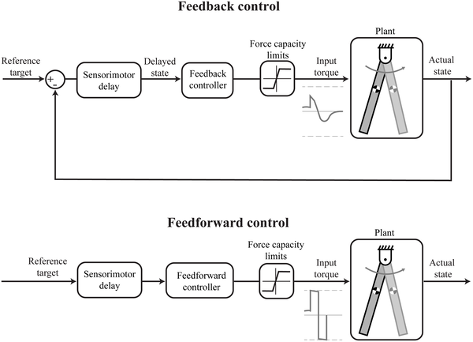
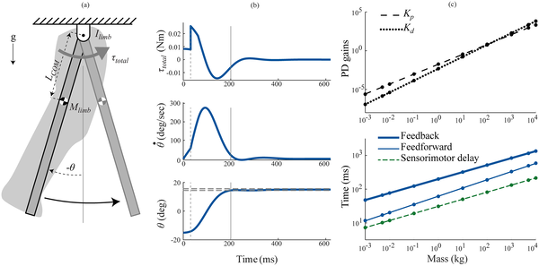

Imagine a tiny shrew scurrying through the underbrush. If it stumbles, it reacts almost instantly, righting itself before you even notice. Now picture a massive elephant navigating uneven terrain. When it stumbles, its reaction feels slower, more ponderous. Why do animals of vastly different sizes respond so differently to sudden disturbances? The answer lies deep in the interplay between their nervous systems, muscles, and body mechanics—and recent computational modeling sheds light on how size shapes these rapid responses.

> **TL;DR**
> - Feedback control in animals is mostly limited by sensorimotor delays, meaning the nervous system’s signal transmission speed restricts how quickly muscles can react, especially in larger animals.
> - Feedforward control strategies, which use pre-planned motor commands without waiting for sensory feedback, enable much faster responses and are essential for rapid recovery from perturbations across all animal sizes.

Animals constantly face unexpected disturbances—like tripping over a root or being pushed off balance—and must respond quickly to avoid falls or injury. To do this, their nervous systems use two main control strategies: feedback control, which adjusts movements based on ongoing sensory information, and feedforward control, which relies on pre-planned commands executed without waiting for feedback. However, several physiological factors that influence these responses, such as nerve conduction speed, muscle strength, and body segment weight, scale with animal size. Larger animals have longer nerves, heavier limbs, and muscles that are relatively weaker compared to their body mass. These differences raise important questions about how size affects the speed and effectiveness of these neural control strategies.

Researchers developed computational models representing two common movement challenges: repositioning a swinging limb after a trip and recovering whole-body posture after a push. These models used pendulums to simulate body segments and incorporated scaling data from the literature to parameterize sensorimotor delays, muscle force capacities, and inertial properties across the size range of terrestrial mammals—from tiny shrews to massive elephants. They simulated both feedback control systems, which rely on sensory feedback with inherent delays, and feedforward control systems, which execute pre-planned motor commands as quickly as physically possible. By optimizing these models, the team assessed how response times and control effectiveness change with animal size and the limitations imposed by neural delays and muscle strength.

The simulations revealed that feedback control responses are primarily limited by sensorimotor delays rather than muscle force capacity. In other words, the nervous system’s processing and signal transmission times restrict how quickly feedback can correct a perturbation, forcing animals to use only a fraction of their muscle strength during these responses. Feedforward control, on the other hand, bypasses these delays by using pre-planned motor commands, enabling response times about four times faster than feedback control in the smallest animals and roughly twice as fast in the largest ones. These findings suggest that for rapid recovery from sudden disturbances, animals rely heavily on feedforward strategies such as anticipatory muscle activation and ballistic movements, regardless of their size.

Understanding how animals control movement across sizes provides valuable insights into the fundamental principles of neuromuscular coordination. This knowledge not only deepens our grasp of animal locomotion and balance but also has practical implications for designing better robotic systems and prosthetics that must react quickly to unexpected changes. By highlighting the critical role of feedforward control in overcoming neural delays, this research points to strategies that engineers and clinicians might emulate to improve the speed and stability of artificial and rehabilitative movement systems.

While the models incorporate well-established scaling relationships and physiological parameters, they simplify complex biological systems and focus on idealized tasks. Real animals use a combination of feedforward and feedback control, and their neural and muscular systems exhibit additional complexities such as variable reflex pathways, sensory integration, and learning adaptations. Moreover, the feedforward control modeled here represents a theoretical upper limit on response speed, which may not always be achievable in practice. Future studies integrating more detailed biomechanics and neural circuitry could further refine our understanding of these control strategies in living animals.

## Figures

*This figure shows how the body uses feedback and feedforward control to quickly respond to pushes or trips, adjusting muscles to keep balance.*

*This figure shows how a model controls a limb swing after a trip, tracking torque, speed, and angle changes over time with different control methods.*

## Sources

- [Effects of sensorimotor delays and muscle force capacity limits on the performance of feedforward and feedback control in animals of different sizes](https://journals.plos.org/ploscompbiol/article?id=10.1371/journal.pcbi.1012502)
- DOI: [10.1371/journal.pcbi.1012502](https://doi.org/10.1371/journal.pcbi.1012502)
