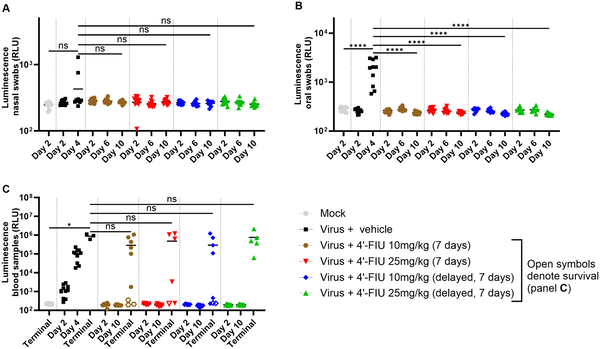
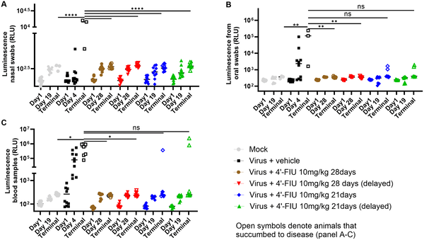
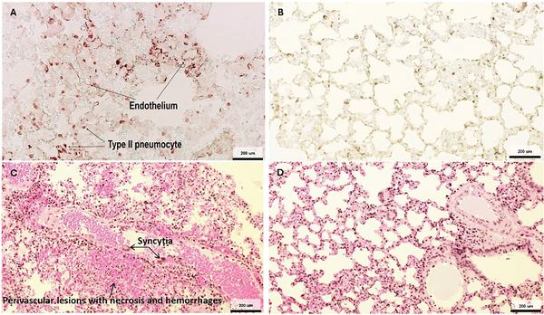
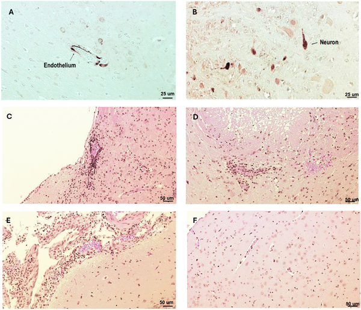

Nipah virus is a highly lethal pathogen with pandemic potential, yet no approved treatments or vaccines exist to combat it. Recently, scientists tested an experimental oral drug, 4′-Fluorouridine (4′-FlU), in hamsters infected with Nipah virus and found that it can reach the brain, delay disease progression, and improve survival. This study offers early hope for a practical antiviral therapy against a virus that poses a serious threat to human health.

> **TL;DR**
> - 4′-Fluorouridine, given orally, reaches the brain and reduces Nipah virus levels and disease severity in infected hamsters.
> - Extended treatment improves survival and reduces lung damage, though some viral persistence and mutations were observed.

Nipah virus (NiV) is a zoonotic paramyxovirus that has caused repeated outbreaks in Southeast Asia since 1998, with case fatality rates often exceeding 40%. It can cause severe respiratory illness and encephalitis, leading to death or long-term neurological complications in survivors. Despite its danger and pandemic potential, there are currently no approved vaccines or antiviral drugs for human use. Existing experimental treatments include vaccines and monoclonal antibodies, but small-molecule oral antivirals could offer a more accessible and immediate option during outbreaks. The nucleoside analog 4′-Fluorouridine (4′-FlU) has shown broad antiviral activity against RNA viruses, including Nipah virus in laboratory tests, making it a promising candidate to evaluate further.

Researchers used Syrian Golden hamsters, a relevant animal model for Nipah virus infection, to test the efficacy of 4′-FlU. The drug was administered orally at different doses and treatment durations after infection with a recombinant Nipah virus strain from Bangladesh that expresses a luminescent reporter gene, allowing tracking of viral spread. Pharmacokinetic studies confirmed that 4′-FlU and its active metabolite reached the brain and lungs. The team monitored viral replication through luminescence in nasal, oral, and blood samples, assessed lung and brain tissue damage, and analyzed viral genetic changes after treatment. Survival and clinical signs were recorded over several weeks to evaluate treatment impact.

A 7-day course of 4′-FlU delayed the time to death in infected hamsters, while extending treatment to 21–28 days significantly reduced viral levels in blood and lungs, decreased lung inflammation and lesions, and improved survival rates by at least 60%. Luminescence tracking showed reduced viral shedding from the nose and mouth. Despite these improvements, some treated animals still harbored viral RNA or proteins in lung or brain tissues, indicating persistent infection in certain cases. Genetic sequencing revealed mutations in viral proteins from brain samples of treated animals; however, these changes did not increase viral fitness in human brain cells and slightly increased the drug’s potency in vitro. This suggests that while the virus can mutate during treatment, these mutations do not necessarily confer resistance or higher virulence.

This study provides the first proof-of-concept that an orally administered nucleoside analog can effectively combat lethal Nipah virus infection in a relevant animal model. The ability of 4′-FlU to reach the brain is particularly important because Nipah virus causes severe neurological disease. Oral availability makes the drug a practical candidate for rapid deployment during outbreaks, potentially reducing mortality and viral spread. These findings support further development and clinical evaluation of 4′-FlU as a treatment option for Nipah virus and related henipaviruses, filling a critical gap in current therapeutic options.

While promising, these results are preclinical and limited to an animal model. Some animals showed persistent viral presence despite treatment, raising questions about complete viral clearance and long-term outcomes. The impact of observed viral mutations on treatment efficacy and disease progression requires further investigation. Human safety, optimal dosing, and effectiveness remain to be established through clinical trials. Continued monitoring for potential viral resistance and adaptation will be essential as development progresses.

## Figures

*4’-FIU treatment reduced virus spread and shedding in hamsters infected with rNiV-B, tracked by glowing signals in nose, mouth, and blood over 10 days.*

*Prolonged 4’-FIU treatment reduces virus shedding and spread in hamsters infected with rNiV-B, shown by decreased luminescence in nasal, oral, and blood samples.*

*Virus proteins appear in lung cells and cause damage after infection, while uninfected lungs show no virus or damage.*

*Virus proteins and brain damage were found in key brain areas after infection, while healthy brains showed no damage.*

## Sources

- [Efficacy of the nucleoside analog 4′-Fluorouridine against Nipah virus in the Syrian hamster model](https://journals.plos.org/plospathogens/article?id=10.1371/journal.ppat.1014093)
- DOI: [10.1371/journal.ppat.1014093](https://doi.org/10.1371/journal.ppat.1014093)
