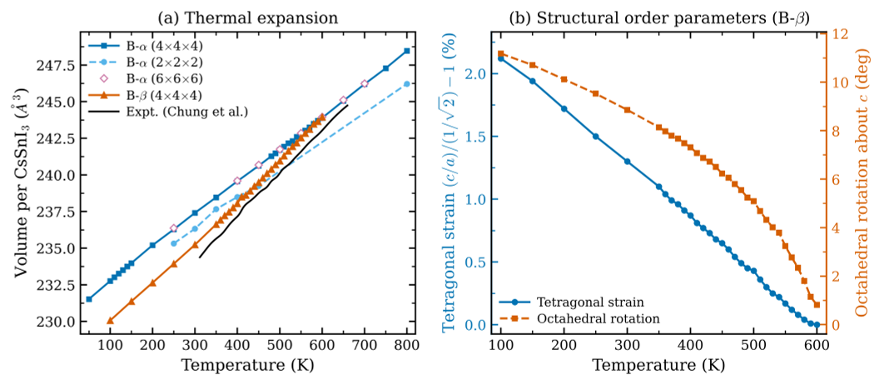
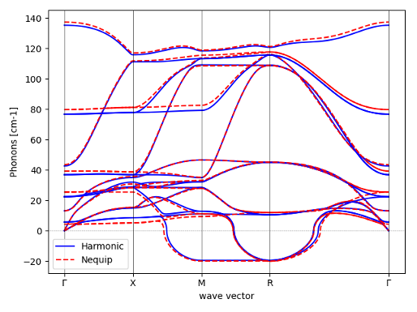
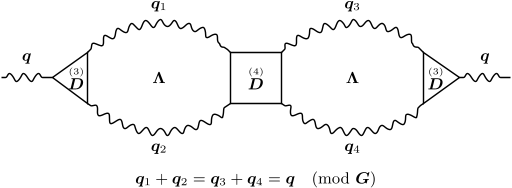
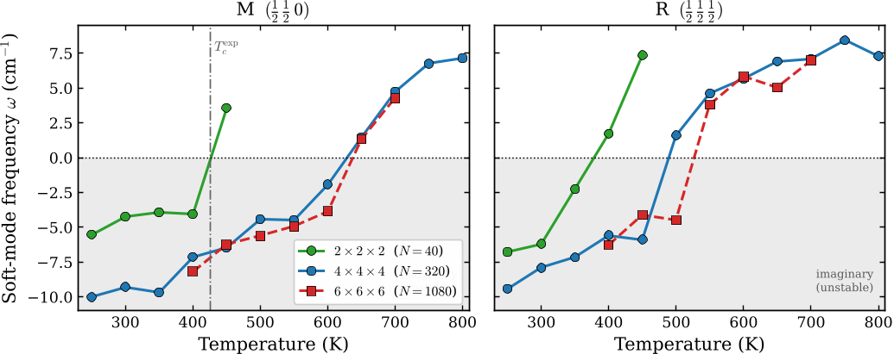

Imagine trying to capture the subtle dance of atoms in a crystal as it transforms from one phase to another—a process that can determine a material’s electrical, optical, or thermal properties. For decades, simulating these phase transitions, especially when quantum effects dominate, has been a monumental challenge, often requiring computational efforts stretching into thousands of years. Now, a breakthrough method slashes this time to mere hours, opening new doors for understanding and designing materials that power next-generation technologies like solar cells.

> **TL;DR**
> - The authors developed a novel computational approach that reduces the complexity of simulating second-order phase transitions in quantum anharmonic materials from O(N^6) to O(N^2), making previously impossible simulations feasible on consumer hardware.
> - They demonstrated the method on a lead-free metal-halide perovskite, CsSnI3, accurately predicting its phase stability and vibrational spectra near the transition, with simulations involving over 1000 atoms completed in hours instead of millennia.

*Note: this summary is based on a preprint — research shared ahead of formal peer review.*

Second-order structural phase transitions occur when a material’s crystal structure changes smoothly but dramatically, such as in ferroelectrics or charge-density wave materials. At the critical transition point, fluctuations in the atomic positions grow enormously, causing standard models that treat atomic vibrations as simple, independent quasiparticles to break down. These transitions are central to many technological applications, including thermoelectrics and photovoltaics, because the material’s response to external stimuli becomes highly sensitive. However, simulating these transitions is notoriously difficult due to the need for very large atomic models and the so-called critical slowdown—where the timescales of fluctuations diverge—making traditional molecular dynamics impractical.

The new approach builds on the stochastic self-consistent harmonic approximation (SSCHA), a method that approximates the quantum ionic density matrix with a Gaussian form and optimizes it to minimize the free energy. While SSCHA has been successful, calculating the free energy’s curvature (the Hessian) required handling large, complex tensors that scale poorly with system size, limiting simulations to small cells. The authors reformulated the problem as solving a sparse linear system involving a static Liouvillian operator, which they solve iteratively without explicitly constructing huge tensors. This reduces both computational time and memory requirements drastically—from O(N^6) to O(N^2) in time and from O(N^4) to O(N) in memory—enabling simulations of supercells with over a thousand atoms on standard computers.

Applying their method to CsSnI3, a promising lead-free perovskite for solar cells, the researchers accurately simulated its phase transition from cubic to tetragonal structure around 600 K. Their calculations captured the breakdown of the phonon quasiparticle picture near the critical point, reflected in the Raman spectra, and matched experimental observations of structural changes. Importantly, these simulations, which would have taken tens of thousands of years with previous methods, were completed in just a few hours. This demonstrates the method’s power to model complex quantum anharmonic effects in large realistic systems.

This computational breakthrough unlocks the ability to study phase transitions in quantum materials at scales and accuracies previously unattainable. By enabling fast, reliable predictions of critical temperatures and vibrational properties, it paves the way for designing materials with tailored functionalities—such as more efficient, stable photovoltaic materials—accelerating innovation in energy technologies and beyond. Furthermore, the approach’s scalability and efficiency make it accessible to a broader range of researchers without requiring supercomputing resources.

While the method represents a major advance, it currently relies on the SSCHA framework and Gaussian approximations of the quantum ionic density matrix, which may not capture all possible anharmonic effects in every material. Also, interpreting the complex spectral data near critical points requires careful analysis. Future work will be needed to extend the approach to even more complex materials and to integrate it with complementary experimental studies to fully realize its potential.

## Figures

*CsSnI3's cubic and tetragonal structures expand with heat, merging at 600K, marking a phase change confirmed by atomic shifts and angles. — Figure from Andrea Baldanza and Lorenzo Monacelli, [CC BY 4.0](http://creativecommons.org/licenses/by/4.0/), caption edited.*

*The graph shows how a machine learning model accurately predicts vibrations in cubic CsSnI3, matching detailed physics calculations. — Figure from Andrea Baldanza and Lorenzo Monacelli, [CC BY 4.0](http://creativecommons.org/licenses/by/4.0/), caption edited.*

*A phonon splits into two, interacts, and scatters, showing complex energy changes in a material's atomic vibrations. — Figure from Andrea Baldanza and Lorenzo Monacelli, [CC BY 4.0](http://creativecommons.org/licenses/by/4.0/), caption edited.*

*Graph shows how CsSnI3's structural stability changes with temperature and model size, matching experiments for larger models. — Figure from Andrea Baldanza and Lorenzo Monacelli, [CC BY 4.0](http://creativecommons.org/licenses/by/4.0/), caption edited.*

## Sources

- [Efficient simulation of second-order phase transitions in quantum anharmonic materials](https://arxiv.org/abs/2608.14292)
- DOI: [10.48550/arxiv.2608.14292](https://doi.org/10.48550/arxiv.2608.14292)

*This article reuses and adapts text and figures from the original research by Andrea Baldanza and Lorenzo Monacelli, available via arXiv Materials Science, under the [CC BY 4.0](http://creativecommons.org/licenses/by/4.0/) license.*
