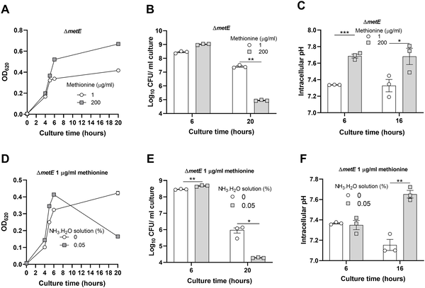
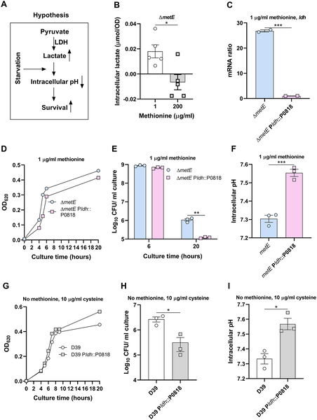
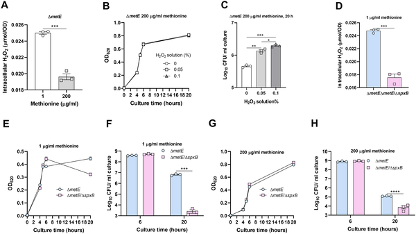
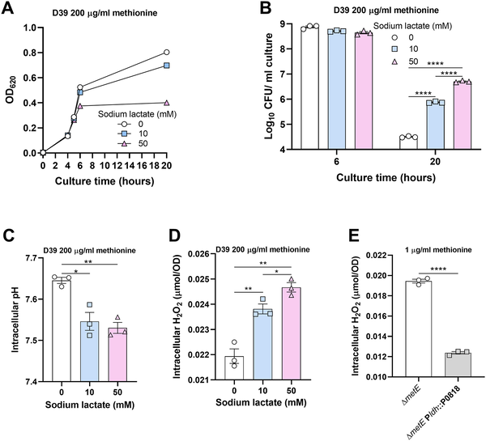

Imagine a common bacterium living in your nose that manages to survive tough conditions by turning its own chemistry against itself—in a surprising twist, producing a compound usually harmful to bacteria to help itself thrive. Scientists have uncovered this clever survival tactic in Streptococcus pneumoniae, a bacterium responsible for serious infections, especially in young children and the elderly. Even more exciting, they’ve found a new drug strategy that targets this trick to wipe out the bacteria before they cause disease.

> **TL;DR**
> - Pneumococcal bacteria survive nutrient starvation in the nasopharynx by acidifying their cytoplasm through increased lactate production, which promotes hydrogen peroxide (H2O2) accumulation.
> - A combination of sodium oxamate, which blocks lactate production and raises intracellular pH, and penicillin effectively kills pneumococci and nearly eradicates their colonization in the nose.

Streptococcus pneumoniae is a leading cause of pneumonia, meningitis, and other serious infections worldwide, particularly threatening children under five and elderly adults. Before causing disease, these bacteria first colonize the nasopharynx—the upper part of the throat behind the nose. This colonization is a critical step, but the nasopharynx is a nutrient-poor environment, posing a challenge for bacterial survival. Methionine, an essential amino acid, is especially scarce there. Understanding how pneumococci adapt to such starvation could reveal new ways to prevent infections by eliminating colonization itself.

Researchers studied pneumococci under methionine starvation conditions both in laboratory cultures and in mouse models. They measured bacterial growth, survival, intracellular pH, lactate levels, and hydrogen peroxide concentrations. Genetic techniques were used to manipulate key bacterial genes involved in lactate production (ldh) and hydrogen peroxide synthesis (spxB). They also tested the effects of sodium oxamate, a drug that inhibits lactate production, alone and combined with penicillin, on bacterial survival and colonization.

The study found that methionine starvation causes pneumococci to increase lactate production inside their cells, which lowers their internal pH—a process called intracellular acidification. This acidification surprisingly boosts the production of hydrogen peroxide (H2O2), a molecule usually harmful to bacteria. However, in this case, H2O2 prevents bacterial self-destruction (autolysis), helping the bacteria survive longer under nutrient stress. When lactate production was genetically reduced or chemically blocked by sodium oxamate, intracellular acidification and H2O2 levels dropped, and bacterial survival decreased. Notably, penicillin alone was less effective at killing bacteria under acidic conditions, but when combined with sodium oxamate, the treatment nearly eradicated pneumococcal colonization in the nasopharynx.

This research reveals a novel survival mechanism where pneumococci exploit intracellular acidification and hydrogen peroxide production to endure nutrient starvation in the nasopharynx. Importantly, it identifies sodium oxamate as a promising drug candidate that, especially when combined with penicillin, can disrupt this survival strategy and effectively eliminate bacterial colonization. Since colonization is a prerequisite for pneumococcal disease, this approach offers a new potential strategy to prevent infections and reduce the burden of pneumococcal diseases worldwide.

While these findings are promising, the research is primarily at the experimental stage, involving laboratory and animal models. Further studies are needed to confirm safety, efficacy, and optimal dosing of sodium oxamate in humans, as well as to explore whether similar mechanisms occur in diverse pneumococcal strains and clinical settings. Additionally, the complexity of bacterial survival strategies means that combination therapies will require careful evaluation to avoid unintended consequences such as resistance development.

## Figures

*Lowering internal pH helps bacteria survive better when grown with different methionine levels or ammonia.*

*Methionine starvation boosts lactate production, lowering bacterial pH and enhancing survival by increasing lactate dehydrogenase activity.*

*Higher internal hydrogen peroxide helps bacteria survive better when methionine is low, shown by growth and survival tests under different conditions.*

*Sodium lactate lowers bacterial pH, raising H2O2 levels and affecting growth and survival in different bacterial strains.*

## Sources

- [Eliminate pneumococcal colonization by targeting intracellular acidification that promotes H2O2 production to enhance bacterial survival](https://journals.plos.org/plospathogens/article?id=10.1371/journal.ppat.1014381)
- DOI: [10.1371/journal.ppat.1014381](https://doi.org/10.1371/journal.ppat.1014381)
