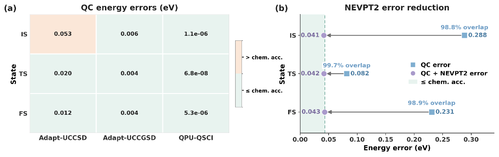
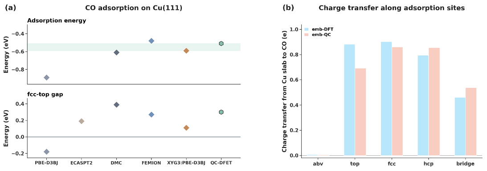
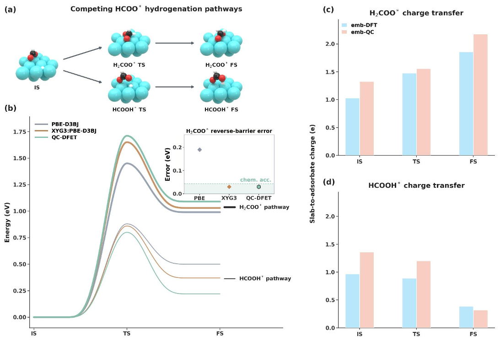

Catalysts—materials that speed up chemical reactions—are at the heart of many technologies, from clean energy production to industrial synthesis. Yet, understanding exactly how molecules interact and transform on metal surfaces remains a formidable challenge. Now, researchers have developed a novel approach that leverages quantum computing to simulate these complex surface reactions with unprecedented accuracy, opening new pathways for designing better catalysts.

> **TL;DR**
> - QC-DFET is a quantum-computing density-functional embedding framework that accurately models chemical reactions on metal surfaces by combining classical and quantum computational methods.
> - Validated on copper surface reactions including hydrogen dissociation, carbon monoxide adsorption, and formate hydrogenation, QC-DFET achieves chemical accuracy and resolves longstanding challenges in surface chemistry simulations.

*Note: this summary is based on a preprint — research shared ahead of formal peer review.*

Chemical reactions on catalytic metal surfaces involve intricate interplay between localized chemical changes—like bond breaking and formation—and the extended electronic environment of the metal. Traditional computational methods, such as density functional theory (DFT), have been invaluable but often fall short in capturing subtle electron correlation effects, leading to errors that can mispredict reaction pathways or adsorption sites. More accurate wave-function-based methods exist but are computationally expensive for realistic surfaces. Embedding techniques help by focusing high-level calculations on the active site while approximating the surrounding environment, but the critical bottleneck remains solving the complex electronic structure of the active region efficiently and accurately.

The researchers introduced QC-DFET, which integrates density-functional embedding theory (DFET) with quantum computing. Starting from a periodic DFT description of a copper surface, the method partitions the system into an active cluster containing the reaction site and its metallic environment. A reaction-consistent active-space protocol (MBECAS-SR) selects orbitals critical to the reaction, ensuring orbital continuity along the reaction path. This active-space Hamiltonian is then mapped onto qubits and solved using quantum-selected configuration interaction (QSCI) on a superconducting quantum processor, with residual dynamic correlation recovered via strongly contracted perturbation theory (SC-NEVPT2). This hybrid approach balances the need for accuracy with the limitations of current quantum hardware.

QC-DFET was tested on three experimentally benchmarked challenges on Cu(111) surfaces: hydrogen molecule dissociation and desorption, carbon monoxide adsorption site preference, and formate hydrogenation pathways. For hydrogen dissociation, QC-DFET accurately reproduced both forward and reverse reaction barriers within chemical accuracy, outperforming standard DFT and previous embedding methods by maintaining a chemically continuous active space. In the CO adsorption case, QC-DFET corrected the common DFT error of overstabilizing hollow sites, recovering the experimentally observed top-site preference and providing detailed orbital-resolved insights into metal-adsorbate bonding. Finally, for formate hydrogenation, the method distinguished competing reaction branches with different kinetic and thermodynamic signatures, demonstrating its capability to resolve complex reaction networks on surfaces.

This work establishes embedded quantum computing as a practical and powerful tool for simulating correlated electronic structures in catalytic surface reactions. By effectively combining classical embedding techniques with near-term quantum hardware, QC-DFET offers a pathway to predictive simulations that can guide catalyst design and optimization. The ability to accurately capture subtle electron correlation and charge redistribution effects on realistic metal surfaces could accelerate advances in energy conversion, chemical manufacturing, and environmental technologies.

While QC-DFET shows promising accuracy and practical applicability, it currently relies on relatively small active spaces (up to 28 qubits) and specific quantum hardware capabilities. Scaling to larger, more complex catalytic systems will require continued advances in quantum processor performance and error mitigation. Additionally, the method depends on careful selection of active orbitals and embedding potentials, which may need adaptation for different materials or reaction types. Nonetheless, this study demonstrates a significant step toward integrating quantum computing into mainstream computational chemistry workflows.

## Figures

*Quantum computing errors in H₂ on Cu (111) are reduced to accurate levels using NEVPT2 correction across different states. — Figure from Dedong Wan et al., [CC BY 4.0](http://creativecommons.org/licenses/by/4.0/), caption edited.*

*Energy and charge transfer of CO on Cu (111) show how CO binds and gains electrons from copper at different sites, matching experimental data closely. — Figure from Dedong Wan et al., [CC BY 4.0](http://creativecommons.org/licenses/by/4.0/), caption edited.*

*Energy and charge transfer analyses reveal two competing pathways for HCOO*

## Sources

- [Embedded quantum computing for many-body surface reaction](https://arxiv.org/abs/2607.27009)
- DOI: [10.48550/arxiv.2607.27009](https://doi.org/10.48550/arxiv.2607.27009)

*This article reuses and adapts text and figures from the original research by Dedong Wan et al., available via arXiv Chemical Physics, under the [CC BY 4.0](http://creativecommons.org/licenses/by/4.0/) license.*
