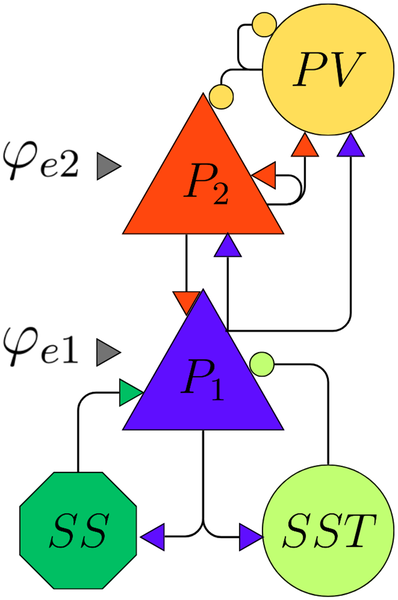

Our brains are alive with rhythms—waves of electrical activity oscillating at different speeds across various layers of the cortex. These brain waves are not just background noise; they coordinate perception, memory, and cognition. But how do these multiple rhythms emerge and interact within the brain’s layered structure? And what happens to this delicate dance in diseases like Alzheimer’s? A recent study uses a sophisticated computer model to explore these questions, offering new insights into the complex orchestration of brain activity and its disruption in disease.

> **TL;DR**
> - The study analyzes a layered neural mass model (LaNMM) that simulates how different cortical layers generate and couple slow and fast brain oscillations.
> - It shows that Alzheimer’s-related changes impair the model’s ability to sustain multifrequency rhythms, providing a mechanistic link between disease and disrupted brain waves.

Brain rhythms span a wide range of frequencies—from slow delta waves to fast gamma oscillations—and emerge from the synchronized firing of large populations of neurons. These rhythms are layered: slower waves tend to originate in deeper cortical layers, while faster oscillations dominate superficial layers. This layered organization supports cross-frequency coupling, where slower rhythms modulate faster ones, a process thought to be crucial for cognitive functions like attention and memory. Neural mass models (NMMs) are mathematical frameworks that capture the average activity of neural populations, helping researchers understand how such rhythms arise and interact. The laminar neural mass model (LaNMM) extends this approach by explicitly modeling the layered structure of the cortex and the distinct neuronal populations within each layer.

The researchers studied the LaNMM, which includes five interconnected neuron populations representing deep and superficial pyramidal cells, fast and slow inhibitory interneurons, and excitatory spiny stellate cells. Each population’s activity is described by differential equations capturing their membrane potentials and firing rates, influenced by synaptic inputs characterized by their strength and timing. The model incorporates two external inputs targeting deep and superficial pyramidal populations, simulating signals from other brain regions. Using bifurcation analysis and numerical simulations, the team explored how varying these inputs affects the model’s dynamics, revealing the emergence of different oscillatory patterns and their coupling across frequencies.

The study found that the LaNMM can generate a rich repertoire of brain rhythms, including periodic, quasiperiodic, and even chaotic oscillations. Notably, the model exhibited multiple forms of cross-frequency coupling, such as delta-gamma, theta-gamma, and alpha-gamma interactions, reflecting the complex interplay between slow and fast oscillations across layers. When simulating pathological changes associated with Alzheimer’s disease, the model’s ability to sustain these multifrequency rhythms was impaired, suggesting a mechanistic explanation for the disrupted brain waves observed in patients. Additionally, the model remained robust when connected to another neural mass, indicating its stability and potential for simulating larger brain networks.

This work advances our understanding of how layered brain circuits produce and coordinate multiple rhythms essential for cognition. By providing a mechanistic framework grounded in biophysical principles, the LaNMM offers a valuable tool for investigating normal brain function and the oscillatory dysfunctions that occur in diseases like Alzheimer’s. Understanding these dynamics could inform future research into cognitive processes and aid the development of interventions targeting disrupted brain rhythms. Moreover, the model’s robustness when coupled to other neural masses opens avenues for exploring interactions between brain regions in health and disease.

While the LaNMM captures many features of cortical oscillations, it remains a simplified representation of the brain’s immense complexity. The model focuses on average population activity and does not include all cellular or network details. Its predictions about Alzheimer’s disease are based on simulated parameter changes rather than direct patient data, so further experimental validation is needed. Additionally, the abstract nature of the model and its mathematical complexity may limit immediate clinical application. Nonetheless, it provides a solid foundation for future theoretical and experimental studies exploring brain rhythms and their breakdown.

## Figures

*Diagram showing excitatory (blue) and inhibitory (orange) brain cells and their connections, with inputs labeled for each group.*

## Sources

- [Emergence of multifrequency activity in a laminar neural mass model](https://journals.plos.org/ploscompbiol/article?id=10.1371/journal.pcbi.1014022)
- DOI: [10.1371/journal.pcbi.1014022](https://doi.org/10.1371/journal.pcbi.1014022)
