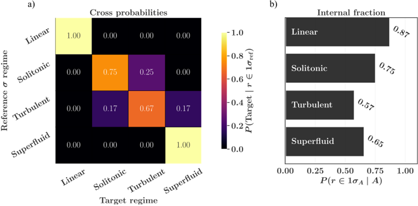
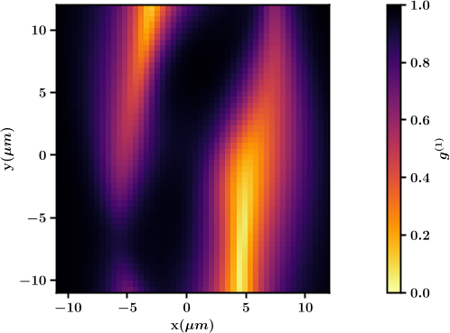
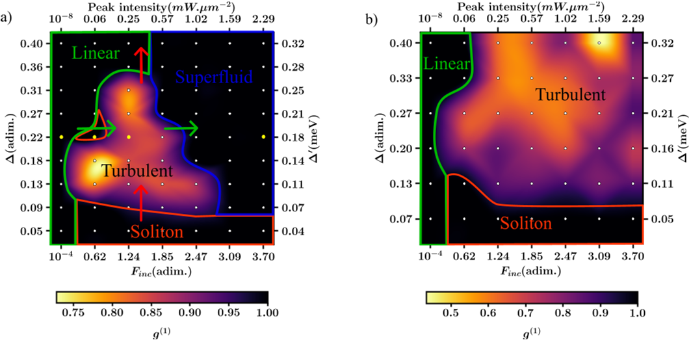
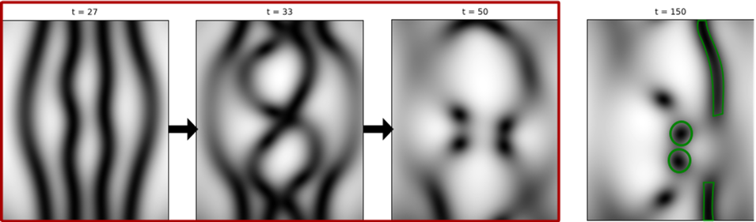

Turbulence is a familiar phenomenon — from swirling smoke to rushing rivers — but what does turbulence look like when it happens not in water or air, but in a quantum fluid made of light and matter? Recent computational research has uncovered how two-dimensional polariton quantum fluids, created and controlled by lasers, can spontaneously swirl into turbulent states, complete with tiny quantized vortices. This discovery opens a window into the rich and complex behaviors of quantum fluids far from equilibrium.

> **TL;DR**
> - Researchers identified four distinct flow regimes in 2D polariton fluids driven by counter-propagating lasers: linear, solitonic, turbulent, and superfluid.
> - The turbulent regime features spontaneous formation of quantized vortices and reduced temporal coherence, persisting in realistic experimental conditions.

*Note: this summary is based on a preprint — research shared ahead of formal peer review.*

Quantum fluids are exotic states of matter where particles behave collectively, exhibiting macroscopic quantum phenomena like superfluidity and quantized vortices. Exciton-polaritons — hybrid light-matter quasiparticles formed inside semiconductor microcavities — provide a unique platform to study such quantum fluids under driven and dissipative conditions. Unlike traditional fluids, polariton fluids are continuously pumped by lasers and lose particles through decay, leading to rich non-equilibrium dynamics. Understanding how turbulence emerges in these systems can shed light on fundamental quantum hydrodynamics and guide future experiments.

The study used numerical simulations based on coupled exciton-photon Gross-Pitaevskii equations to model the dynamics of polariton fluids driven by two lasers shining from opposite directions. This counter-propagating setup creates interacting polariton flows in a two-dimensional microcavity. By varying laser parameters such as pump strength, detuning, and injected momentum, the researchers mapped out the resulting fluid behaviors. They analyzed real-space density and phase patterns, momentum-space distributions, and temporal coherence to identify distinct flow regimes. The simulations incorporated realistic parameters from gallium arsenide-based microcavities, including disorder effects, ensuring experimental relevance.

The simulations revealed four clear regimes: at low pump power, the fluid exhibits linear interference patterns with stable standing waves; increasing power leads to solitonic structures—stable nonlinear waves with modulated density and phase. Beyond a critical pump strength, solitons become dynamically unstable and break down into a turbulent regime marked by spontaneous nucleation of quantized vortex-antivortex pairs and chaotic spatiotemporal fluctuations. At even higher pump powers, the system transitions into a superfluid regime characterized by frictionless flow and restored coherence. The turbulent regime occupies a broad parameter space and is robust against disorder, making it accessible to current experimental setups.

This work provides a detailed theoretical roadmap for exploring quantum turbulence in driven-dissipative polariton fluids, a frontier area in quantum fluid dynamics. By identifying distinct flow regimes and their transitions, it offers experimentalists clear guidance on how to realize and control turbulence and coherent structures using laser parameters. The findings deepen our understanding of non-equilibrium quantum states and could inspire future studies on energy cascades, vortex clustering, and quantum hydrodynamics in two dimensions. Moreover, the visual richness of vortex dynamics in these systems holds promise for captivating demonstrations of quantum phenomena.

While the simulations incorporate realistic parameters and disorder effects, they remain theoretical predictions that await full experimental confirmation. The complexity of driven-dissipative quantum systems means that subtle effects or additional interactions could influence the observed regimes. Furthermore, the study focuses on a specific geometry and material platform, so generalizing the results to other quantum fluids or cavity designs requires caution. Nonetheless, the strong theoretical foundation and connection to existing experimental capabilities make these findings a valuable step toward unraveling quantum turbulence.

## Figures

*(a) Chance of correctly spotting the target range when energy ratio is near ηref; (b) chance energy ratio is near ηA when chosen from regime A. — Figure from Louis Depaepe et al., [CC BY 4.0](http://creativecommons.org/licenses/by/4.0/), caption edited.*

*Color map showing how similar points are in space across the X-Y plane. — Figure from Louis Depaepe et al., [CC BY 4.0](http://creativecommons.org/licenses/by/4.0/), caption edited.*

*Phase diagrams show where polariton fluids are stable or turbulent based on input wavevector and coherence levels, with colors marking different flow regimes. — Figure from Louis Depaepe et al., [CC BY 4.0](http://creativecommons.org/licenses/by/4.0/), caption edited.*

*Snapshots show solitons in light waves breaking into swirling vortices during snake instability in photonic density. — Figure from Louis Depaepe et al., [CC BY 4.0](http://creativecommons.org/licenses/by/4.0/), caption edited.*

## Sources

- [Emergence of Turbulence in a counterflow geometry of 2D Polariton Quantum Fluids](https://arxiv.org/abs/2603.05125)
- DOI: [10.1103/37c3-mwcp](https://doi.org/10.1103/37c3-mwcp)

*This article reuses and adapts text and figures from the original research by Louis Depaepe et al., available via arXiv Quantum Physics, under the [CC BY 4.0](http://creativecommons.org/licenses/by/4.0/) license.*
