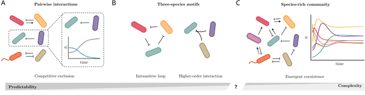
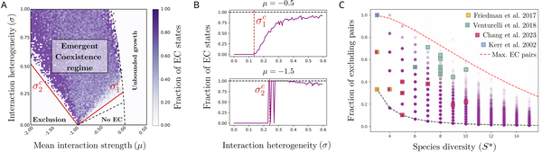
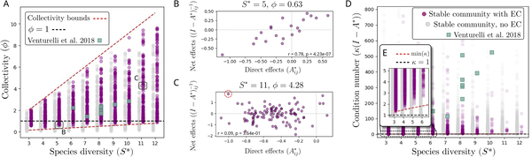
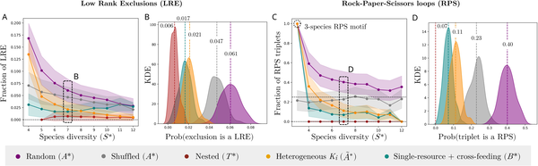

Why do some species manage to thrive together in a community even when experiments show they cannot coexist in pairs? This puzzling observation challenges a long-held assumption in ecology that understanding interactions between two species at a time is enough to predict the composition of entire ecosystems. Recent research reveals that the answer lies in the intricate web of indirect effects connecting many species, creating emergent coexistence patterns that simple pairwise studies miss.

> **TL;DR**
> - Species-rich ecological communities often contain species pairs that cannot coexist alone but survive together in larger groups due to complex indirect interactions.
> - Mathematical models show that these emergent coexistence patterns arise naturally from dense networks of pairwise interactions without needing special mechanisms like rock-paper-scissors dynamics or higher-order effects.

Ecologists have long sought to understand what determines which species live together in a community. Traditionally, communities are studied by examining pairwise interactions—how one species affects another. This reductionist approach assumes that knowing all pairwise relationships can predict the full community’s composition. However, experiments with microbial communities have shown that many species pairs that exclude each other when alone still coexist within the full community. This phenomenon, called Emergent Coexistence (EC), suggests that the whole community’s dynamics cannot be fully understood by simply summing up pairs. The question then becomes: how do these species manage to coexist despite strong pairwise competition?

To investigate this, researchers used mathematical models known as generalized Lotka-Volterra (GLV) equations, which describe how species populations change over time based on their interactions. Instead of focusing on specific species, they simulated large communities with many species interacting through randomly assigned pairwise effects. By varying the average strength and variability of these interactions, they explored when stable communities emerge that include species pairs that would exclude each other if isolated. The models also examined how indirect effects—where one species influences another through a chain of intermediaries—shape coexistence patterns.

The simulations revealed that Emergent Coexistence is not just possible but common in species-rich communities with competitive and heterogeneous interactions. Surprisingly, this coexistence arises without invoking complex mechanisms like intransitive competition (e.g., rock-paper-scissors cycles) or higher-order interactions involving three or more species simultaneously. Instead, the dense network of indirect effects reshapes the community’s structure, allowing species that cannot survive in pairs to persist within the full community. As diversity increases, these indirect effects become so intricate that pairwise interactions alone lose their predictive power for which species will coexist.

These findings challenge the reductionist view that pairwise interactions suffice to understand ecological communities. They highlight the importance of considering the full network of species interactions, especially indirect effects, to grasp how biodiversity is maintained. This insight has broad implications, from improving ecological theory to guiding biodiversity conservation and the design of synthetic microbial consortia. It underscores that ecosystems are more than the sum of their parts, with emergent properties arising from complex species networks.

While the models provide a robust theoretical framework, they rely on assumptions such as random interaction matrices and do not incorporate spatial structure or environmental variability. Real-world ecosystems may involve additional complexities like higher-order interactions or environmental feedbacks that also influence coexistence. Moreover, empirical validation beyond microbial communities is needed to generalize these results. Nonetheless, the study offers a valuable step toward understanding the limits of reductionism in ecology and the role of emergent phenomena in shaping natural communities.

## Figures

*Can we predict how species live together by studying pairs, or do complex community interactions create unique coexistence patterns?*

*Simulations show how species interactions lead to different coexistence patterns in ecosystems, highlighting areas where species exclude each other or coexist.*

*Strong indirect effects in communities can change species interactions, allowing coexistence beyond simple pairwise relationships.*

*Stable communities coexist without complex competition patterns, shown by analyzing different interaction types and their exclusion and rock-paper-scissors dynamics.*

## Sources

- [Emergent coexistence and the limits of reductionism in ecological communities](https://journals.plos.org/ploscompbiol/article?id=10.1371/journal.pcbi.1014116)
- DOI: [10.1371/journal.pcbi.1014116](https://doi.org/10.1371/journal.pcbi.1014116)
