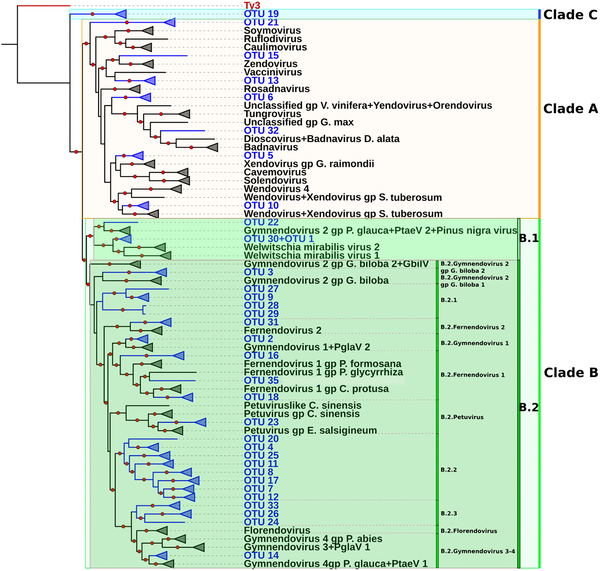
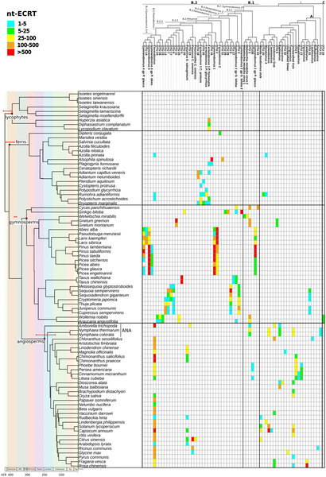

Did you know that plants carry ancient viral DNA fossils hidden within their genomes? These molecular relics provide a remarkable window into the long and intertwined evolutionary history of plants and the viruses that have infected them. Recent research has uncovered thousands of these viral sequences, revealing a surprising diversity of ancient plant viruses and offering new insights into how viruses and plants have coevolved over hundreds of millions of years.

> **TL;DR**
> - Scientists analyzed 93 diverse plant genomes, identifying over 47,000 endogenous viral elements (EVEs) related to the Caulimoviridae family of plant viruses.
> - They discovered 35 previously unknown viral lineages and evidence that many plant viruses diversified alongside their hosts through cospeciation over deep evolutionary time.

Tracing the ancient origins and evolution of viruses is challenging because viruses rarely leave direct fossil evidence. However, fragments of viral DNA sometimes become permanently integrated into the genomes of their hosts. These fragments, called endogenous viral elements (EVEs), act as molecular fossils preserving evidence of past infections. In plants, most characterized EVEs come from the Caulimoviridae family, the only known double-stranded DNA viruses infecting land plants. By mining plant genomes for these viral sequences, researchers can reconstruct the history of plant-virus interactions stretching back hundreds of millions of years.

In this study, researchers examined 93 plant genomes spanning all major groups of land plants, including ferns, lycophytes, gymnosperms (conifers and relatives), and angiosperms (flowering plants). Using a bioinformatic pipeline designed to detect viral reverse transcriptase sequences, they identified over 47,000 endogenous caulimovirid sequences across 75 genomes. These sequences were clustered based on similarity to define operational taxonomic units (OTUs), revealing 71 distinct viral groups, including 35 previously undescribed lineages. Phylogenetic analyses of conserved viral genes allowed the team to place these new viral lineages within the broader Caulimoviridae family tree and compare their evolutionary history with that of their plant hosts.

The analysis revealed an unexpectedly rich diversity of ancient Caulimoviridae viruses embedded in plant genomes. Notably, the researchers identified a basal viral clade restricted to the Araucariaceae family, an ancient lineage of Gondwanan conifers, highlighting previously unknown viral diversity in gymnosperms. Their phylogenetic comparisons supported a macroevolutionary model in which many Caulimoviridae viruses diversified in tandem with their vascular plant hosts, a process known as cospeciation. This suggests that plant viruses have been evolving alongside their hosts for hundreds of millions of years. The study also found evidence of host switching and viral extinction events, indicating a complex evolutionary history.

These findings establish endogenous caulimovirid sequences as powerful molecular fossils for studying the deep evolutionary history of plant viruses. By revealing a vast and previously hidden diversity of ancient viruses, this work expands our understanding of the plant virosphere and the long-term coevolutionary dynamics between plants and viruses. This knowledge has potential implications for plant biotechnology and virus management, as understanding viral evolution can inform strategies to combat plant diseases. Moreover, the study highlights the value of integrating genomic data from diverse and basal plant lineages to uncover the full scope of viral diversity.

While the study greatly expands known Caulimoviridae diversity, it relies on detecting viral sequences integrated into plant genomes, which represent only a subset of past infections. Some viral lineages may be missing due to degradation or absence of integration. Additionally, the evolutionary timelines inferred depend on assumptions about host-virus cospeciation and available genomic data, which may be incomplete for some basal plant groups. Further genomic sampling and functional studies will be needed to fully understand the biology and ecological roles of these ancient viruses.

## Figures

*A family tree of Caulimoviridae viruses shows their groups and new types found, with strong support marked by red circles and color-coded clades.*

*Heatmap shows how viral DNA elements vary across different plant species over time, grouped by plant family and virus type.*

## Sources

- [Endogenous viral elements trace the ancient origins and early evolution of the Caulimoviridae](https://journals.plos.org/plospathogens/article?id=10.1371/journal.ppat.1014340)
- DOI: [10.1371/journal.ppat.1014340](https://doi.org/10.1371/journal.ppat.1014340)
