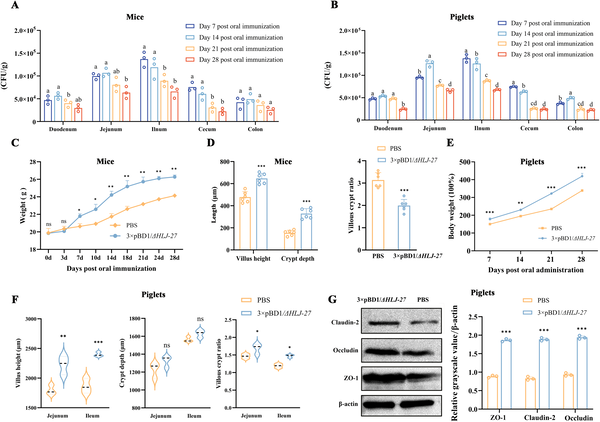
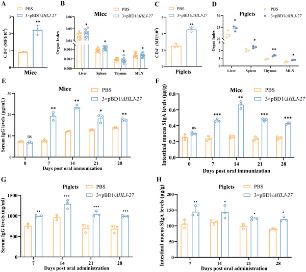
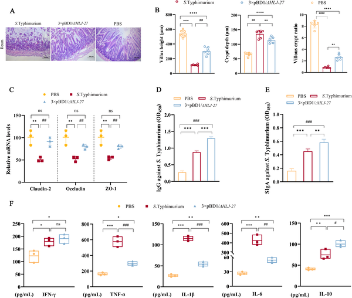
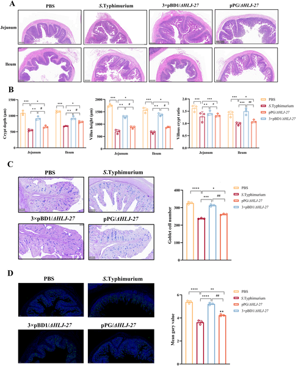

Could a designer probiotic replace antibiotics in livestock and fight dangerous infections? Antibiotic resistance is a growing global health concern, especially in agriculture where antibiotics are widely used to promote animal growth and prevent disease. A new study introduces an engineered gut bacterium that offers a promising alternative: it not only helps animals grow better but also protects them from Salmonella infections by strengthening the gut barrier and boosting the immune system.

> **TL;DR**
> - The engineered Lactobacillus paracasei strain secretes multiple copies of a potent antimicrobial peptide, porcine β-defensin-1, enhancing intestinal health and immune defenses in livestock.
> - This probiotic reduces mortality and intestinal damage caused by Salmonella Typhimurium infection while promoting beneficial gut microbiota, making it a promising antibiotic alternative.

Antimicrobial resistance (AMR) is a critical challenge linked to the widespread use of antibiotics in livestock farming. Salmonella Typhimurium, a common food-borne pathogen, poses significant health risks to both animals and humans. Traditional probiotics and antimicrobial peptides have shown limited success due to poor stability and systemic protection. To address these limitations, scientists engineered a strain of Lactobacillus paracasei to produce multiple copies of porcine β-defensin-1 (pBD1), a natural antimicrobial peptide with broad-spectrum activity. This approach aims to combine the natural probiotic benefits of Lactobacillus with enhanced antimicrobial and immune-modulating properties.

The research team constructed a recombinant Lactobacillus paracasei strain, named 3×pBD1/ΔHLJ-27, capable of secreting multicopy pBD1. They tested the strain’s ability to colonize the intestines of mice and neonatal piglets through oral administration. The study evaluated growth performance, intestinal morphology, expression of tight junction proteins critical for gut barrier integrity, and immune responses including T cell populations and antibody levels. To assess protection against infection, animals were challenged with Salmonella Typhimurium, and outcomes such as survival rates, bacterial dissemination, intestinal pathology, and inflammatory markers were measured. The gut microbiota composition was also analyzed to understand microbial community shifts.

The engineered Lactobacillus successfully colonized the intestines and significantly improved growth in both mice and piglets, as evidenced by increased body weight and enhanced development of intestinal villi. It strengthened the intestinal barrier by upregulating tight junction proteins like ZO-1, Occludin, and Claudin-2. Immune analyses showed increased CD4+ T cells and elevated levels of systemic IgG and mucosal SIgA antibodies, indicating boosted immune function. In Salmonella infection models, animals pretreated with the recombinant strain had notably higher survival rates, reduced bacterial spread to organs, and less intestinal damage. The probiotic also modulated immune responses by suppressing excessive inflammation and reshaped the gut microbiota towards beneficial, anti-inflammatory bacterial communities.

This study presents a multifunctional engineered probiotic that integrates antimicrobial activity with immune modulation and microbiota regulation, addressing key shortcomings of current antibiotic alternatives. By promoting growth and providing systemic protection against a major pathogen, this approach offers a scalable and practical strategy to reduce antibiotic use in livestock. Such innovations are crucial for tackling antimicrobial resistance and improving animal and public health within the One Health framework.

While the results are promising, these findings are based on controlled animal models, and further research is needed to confirm efficacy and safety in diverse livestock populations under real-world farming conditions. Long-term impacts on microbiota and potential ecological effects should also be monitored. Additionally, regulatory approval processes and production scalability will influence the practical adoption of this engineered probiotic.

## Figures

*3× pBD1/ΔHLJ-27 improves gut health and growth in mice and piglets by strengthening intestinal barriers and promoting tissue growth.*

*The 3× pBD1/ΔHLJ-27 treatment boosts immune cells and antibodies in mice and piglets, enhancing overall immune response.*

*Recombinant strain boosts gut barrier and immune response in mice infected with S. Typhimurium, improving gut structure and reducing inflammation.*

*3× pBD1/ΔHLJ-27 helps protect piglet intestines and mucus during Salmonella infection, keeping tissue structure and mucus cells healthy.*

## Sources

- [Engineered Lactobacillus paracasei 3×pBD1/ΔHLJ-27 as a novel antibiotic alternative for livestock: Dual efficacy in growth promotion and protection against Salmonella infection via integrated host-microbiota-immune regulation](https://journals.plos.org/plospathogens/article?id=10.1371/journal.ppat.1014367)
- DOI: [10.1371/journal.ppat.1014367](https://doi.org/10.1371/journal.ppat.1014367)
