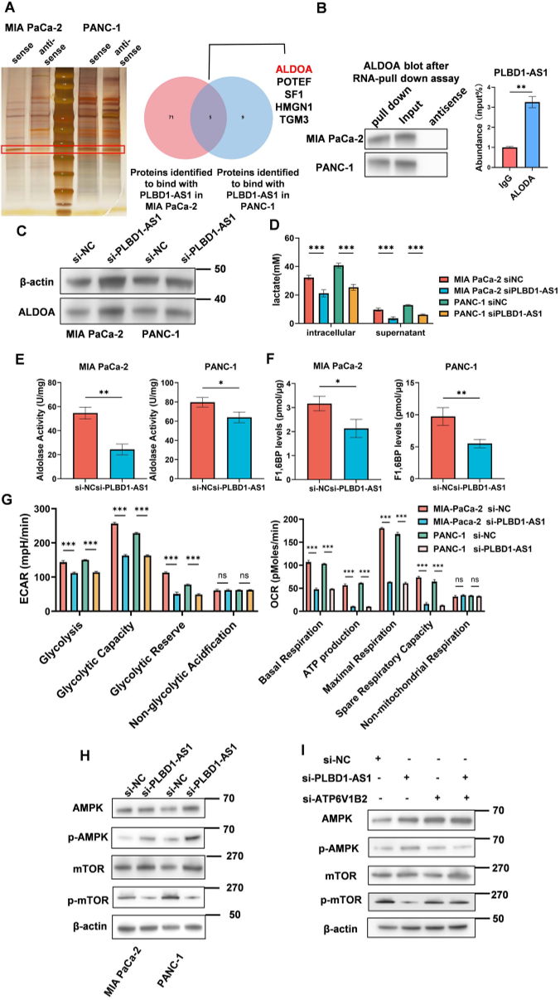
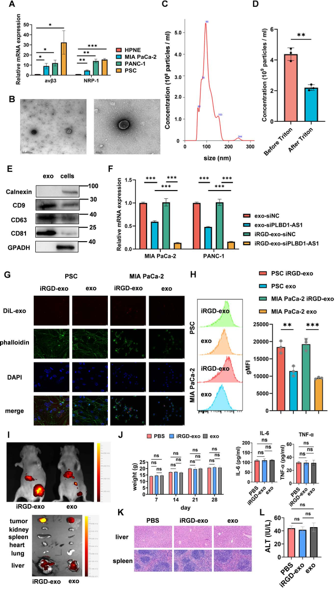
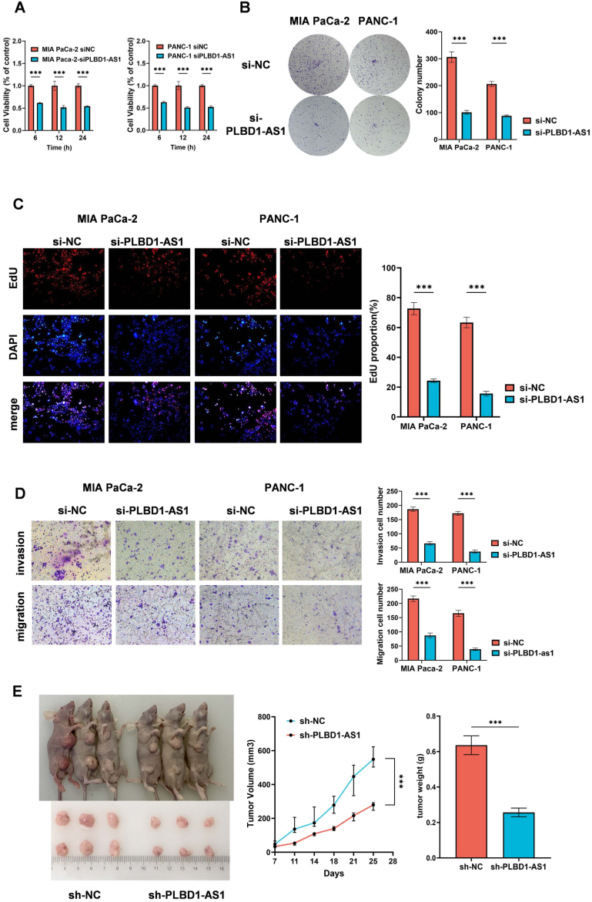
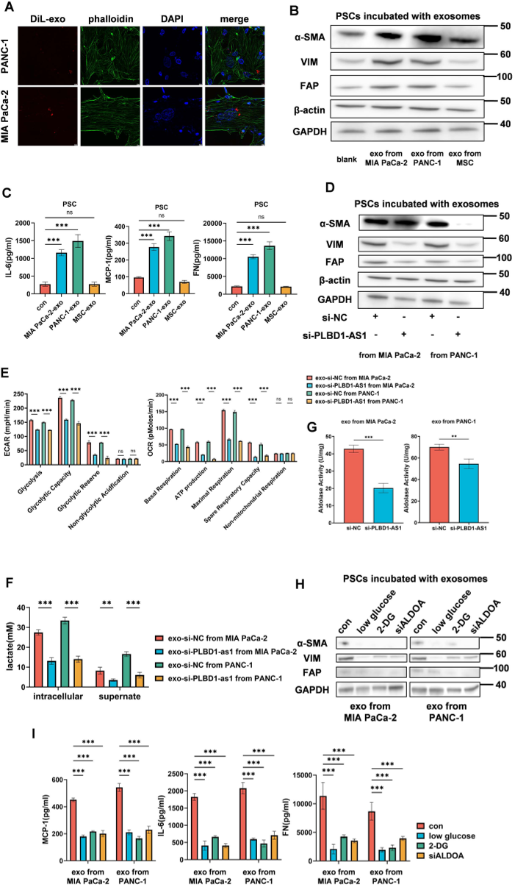

Pancreatic cancer remains one of the deadliest cancers, partly because its dense and complex tumor environment makes targeted treatment difficult. Now, scientists have engineered tiny natural delivery vehicles called exosomes to carry a genetic therapy directly into pancreatic tumors. This approach targets a specific long non-coding RNA that fuels cancer growth and reshapes the tumor’s surrounding cells, offering a promising new strategy against this challenging disease.

> **TL;DR**
> - The long non-coding RNA PLBD1-AS1 promotes pancreatic cancer progression by enhancing tumor cell metabolism and activating surrounding stromal cells.
> - Engineered exosomes modified with the tumor-penetrating peptide iRGD efficiently deliver RNA interference therapy targeting PLBD1-AS1, suppressing tumor growth in lab and animal models.

Pancreatic ductal adenocarcinoma (PDAC) is notorious for its poor prognosis and resistance to treatment. One reason is the tumor microenvironment—a complex network of cancer cells, supportive stromal cells like pancreatic stellate cells (PSCs), immune cells, and extracellular matrix—that fosters tumor growth and invasion. Recent research has shown that tumor cells communicate with these neighboring cells not only through secreted proteins but also via exosomes, tiny vesicles that carry molecular cargo including RNA. Understanding and disrupting this communication could open new avenues for therapy.

In this study, researchers identified the long non-coding RNA PLBD1-AS1 as highly enriched in exosomes derived from pancreatic cancer cells. They investigated how PLBD1-AS1 contributes to tumor progression by interacting with the glycolytic enzyme ALDOA, boosting the breakdown of sugars that cancer cells rely on for energy. To target this RNA, the team engineered exosomes with the tumor-penetrating peptide iRGD, which binds specific receptors on tumor and stromal cells, enhancing delivery into the dense tumor tissue. These modified exosomes were loaded with small interfering RNA (siRNA) designed to silence PLBD1-AS1. The researchers then tested the uptake, gene silencing efficiency, and therapeutic effects of these engineered exosomes in cell cultures and mouse models of pancreatic cancer.

The study revealed that PLBD1-AS1 promotes pancreatic tumor cell proliferation, migration, and invasion by enhancing glycolysis through its interaction with ALDOA. Moreover, tumor-derived exosomes transfer PLBD1-AS1 to pancreatic stellate cells, increasing their glycolytic activity and triggering their activation into cancer-associated fibroblasts, which support tumor growth. Importantly, the engineered iRGD-exosomes loaded with siPLBD1-AS1 showed improved uptake by both tumor and stromal cells, effectively reducing PLBD1-AS1 levels, inhibiting glycolysis, impairing stellate cell activation, and significantly slowing tumor growth in mice.

This work uncovers a novel mechanism of metabolic crosstalk between pancreatic tumor cells and their microenvironment mediated by exosomal PLBD1-AS1. By targeting this RNA with a sophisticated delivery system that penetrates the tumor stroma, the study provides a promising RNA interference-based therapeutic strategy for pancreatic cancer—a disease urgently in need of more effective treatments. The use of engineered exosomes as delivery vehicles also highlights the potential of harnessing natural biological systems for precise and efficient gene therapy.

While these findings are encouraging, they come from preclinical models and require further validation in clinical settings. The complexity of human pancreatic tumors and their microenvironment may present additional challenges for delivery and efficacy. Moreover, long-term safety and potential off-target effects of engineered exosome therapies need thorough investigation before clinical application. Nonetheless, this study lays important groundwork for future RNAi-based treatments targeting the tumor microenvironment in pancreatic cancer.

## Figures

*PLBD1-AS1 binds to ALDOA protein, boosting its activity and increasing sugar breakdown in cancer cells.*

*We prepared and confirmed targeted exosomes carrying siPLBD1-AS1, showing their size, structure, and key protein markers across different cell types.*

*PLBD1-AS1 boosts tumor cell growth, movement, and spread in lab tests and mouse models, showing its role in cancer progression.*

*Tumor cell exosomes are absorbed by PSCs, helping activate them into CAFs, shown by labeled cell parts and protein analysis.*

## Sources

- [Engineering exosomes with iRGD for targeted RNAi therapy against pancreatic cancer mediated by long non-coding RNA PLBD1-AS1](https://journals.plos.org/plosone/article?id=10.1371/journal.pone.0345697)
- DOI: [10.1371/journal.pone.0345697](https://doi.org/10.1371/journal.pone.0345697)
