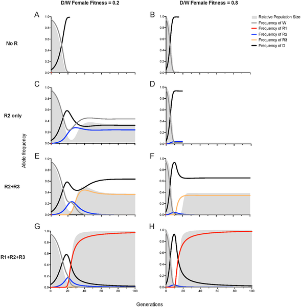
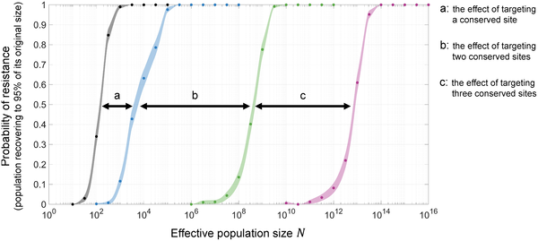
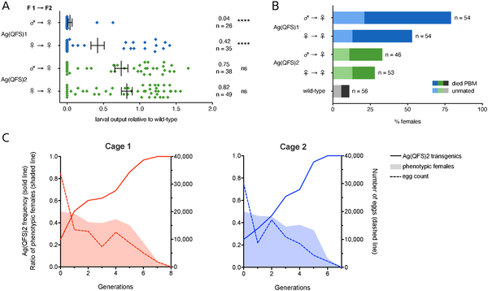

What if we could genetically engineer mosquitoes to stop spreading malaria? This ambitious idea has driven researchers to develop gene drives—genetic tools that can spread traits through mosquito populations to reduce their ability to reproduce. Yet, nature fights back: mosquitoes can evolve resistance to these drives, potentially undermining their effectiveness. A recent study tackles this challenge head-on by uncovering hidden genetic resistance and designing gene drives that can outsmart it, bringing us closer to sustainable malaria control.

> **TL;DR**
> - Rare genetic resistance alleles in Anopheles gambiae mosquitoes can emerge even against highly optimized gene drives, threatening their long-term effectiveness.
> - Multiplexed gene drives targeting multiple conserved sites can actively remove resistant alleles, improving the robustness of gene drives to suppress natural mosquito populations.

Malaria remains a devastating global health challenge, transmitted primarily by the Anopheles gambiae mosquito. Traditional control methods like insecticides face limitations, prompting scientists to explore genetic strategies. CRISPR-based gene drives are engineered genetic elements that bias inheritance, spreading traits that reduce mosquito fertility or survival. By targeting essential genes for female reproduction, gene drives can suppress mosquito populations in laboratory settings. However, evolutionary pressures can lead to the emergence of resistant mutations at the gene drive’s target site, potentially blocking the drive’s spread and limiting its impact in the wild.

To understand and overcome resistance, the researchers developed a comprehensive pipeline combining high-throughput mutagenesis, functional screening, and population genetic modeling. They focused on a leading suppression gene drive, Ag(QFS)1, which targets a critical site in the doublesex gene that controls female development. By simulating gene drive-induced mutations through crosses designed to enhance error-prone DNA repair, they generated thousands of mutant alleles. These were then screened to identify which mutations could block the gene drive while preserving gene function—key to resistance. The team also analyzed natural mosquito populations for existing genetic variation at the target site. Finally, they engineered multiplexed gene drives targeting multiple conserved sites and used computational models to predict their performance in large natural populations.

The study revealed that rare resistant alleles, including a novel partially resistant type, can arise at low frequencies even against the highly optimized Ag(QFS)1 gene drive. Some of these alleles maintain the function of the doublesex gene while blocking the gene drive, posing a threat to its spread. Population genetic modeling showed that single-target drives are unlikely to be robust in large natural mosquito populations due to the emergence and selection of resistant alleles. Importantly, the researchers demonstrated that multiplexed gene drives—targeting several conserved sites simultaneously—can actively remove resistant alleles and maintain drive efficacy. Their models predict that such multiplexed drives could sustainably suppress large mosquito populations in the field.

This work represents a significant advance in gene drive technology for malaria control by addressing a critical barrier: genetic resistance. By combining experimental and computational approaches, the researchers provide a framework to predict and preempt resistance before field deployment. Multiplexed gene drives offer a promising path toward robust, long-lasting suppression of malaria vectors, potentially reducing disease transmission on a large scale. This approach exemplifies how careful engineering and evolutionary insight can improve the sustainability of genetic biocontrol strategies.

While the study’s experimental and modeling results are encouraging, real-world validation in natural mosquito populations remains a future step. The complexity of ecological interactions and genetic diversity in the wild could influence gene drive dynamics differently than laboratory conditions. Additionally, ethical and regulatory considerations must be addressed before gene drives can be released. Thus, while multiplexed gene drives show promise, cautious progression with thorough risk assessment and community engagement is essential.

## Figures

*Simulations show how gene drive spreads and resistance types affect gene frequencies and population size over generations.*

*Simulations show resistance to gene drives drops as more conserved target sites are used, even in larger populations.*

*Improved female fertility in gene drive mosquitoes helps the gene spread efficiently in small lab populations.*

## Sources

- [Engineering resilient gene drives for sustainable malaria control by predicting, testing and overcoming target site resistance in Anopheles gambiae](https://journals.plos.org/plosbiology/article?id=10.1371/journal.pbio.3003879)
- DOI: [10.1371/journal.pbio.3003879](https://doi.org/10.1371/journal.pbio.3003879)
