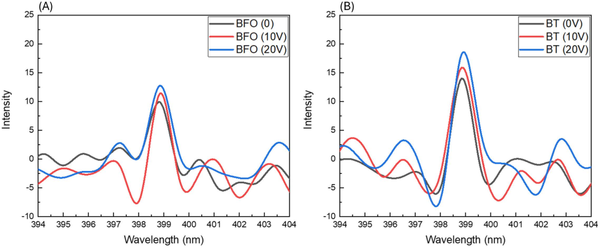
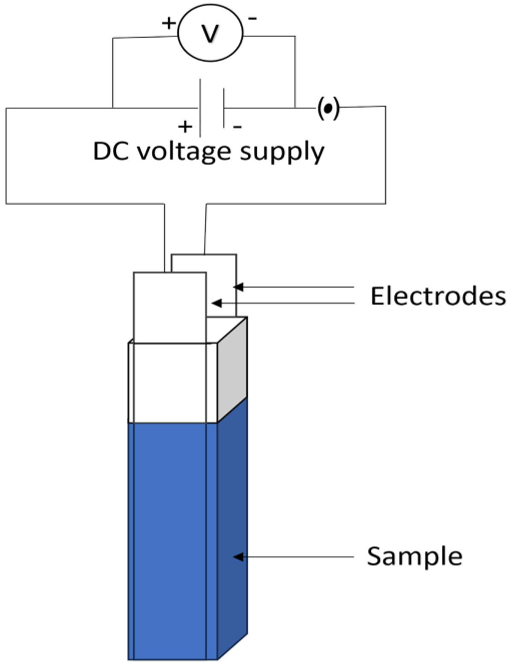
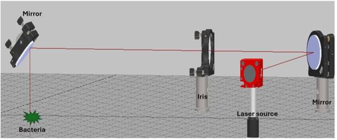
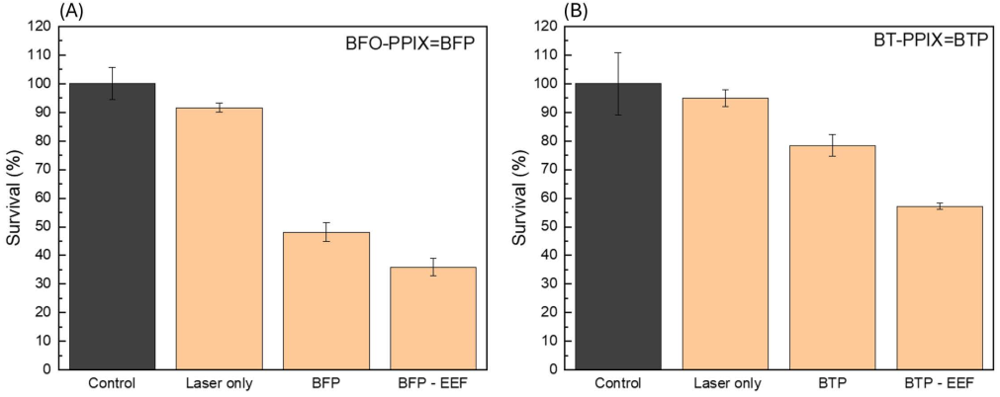

What if we could use physics to supercharge light-based therapies that fight stubborn bacterial infections? A new study reveals how applying external electric fields to tiny nanoparticles can amplify their light-converting abilities, making photodynamic therapy more effective against dangerous bacteria like Staphylococcus aureus.

> **TL;DR**
> - Applying an external electric field increases the second harmonic generation (SHG) intensity of harmonic nanoparticles conjugated with a photosensitizer, enhancing photodynamic therapy (PDT) efficacy.
> - This approach significantly reduces bacterial survival of antibiotic-resistant Staphylococcus aureus in laboratory tests, demonstrating a promising strategy to improve light-based antibacterial treatments.

Photodynamic therapy (PDT) is an innovative treatment that uses light-activated chemicals called photosensitizers to produce reactive oxygen species (ROS), which can kill harmful cells, including bacteria. However, PDT’s effectiveness is often limited by how deeply light can penetrate tissues and activate these photosensitizers. To overcome this, researchers have turned to harmonic nanoparticles (HNPs) that can convert near-infrared light—which penetrates deeper—into higher-energy light that activates the photosensitizer more efficiently. This process, known as second harmonic generation (SHG), has shown promise in improving PDT. Yet, maximizing SHG intensity remains a challenge.

In this study, scientists synthesized conjugates combining harmonic nanoparticles—specifically Bismuth Ferrite (BFO) and Barium Titanate (BT)—with the photosensitizer protoporphyrin IX (PPIX). These conjugates were suspended in solution and exposed to controlled external electric fields (EEF) of varying strengths (0, 10, and 20 volts) for five minutes. The samples were then irradiated with a near-infrared femtosecond pulsed laser at 798 nm, a wavelength chosen for its deep tissue penetration. The team measured SHG intensity and tested the antibacterial effects against cultures of Staphylococcus aureus, a common and often antibiotic-resistant bacterial pathogen. Experimental setups included electrodes submerged in the nanoparticle solutions to apply the electric fields and precise laser arrangements to uniformly treat bacterial samples.

The application of external electric fields significantly boosted the SHG intensity emitted by the nanoparticle-photosensitizer conjugates. This increase in SHG translated to more effective activation of the photosensitizer and enhanced generation of reactive oxygen species. As a result, bacterial survival rates dropped notably. For example, BFO-PPIX conjugates reduced Staphylococcus aureus survival to about 36% under electric field exposure, compared to roughly 48% without it. Similarly, BT-PPIX conjugates saw survival rates fall from around 78% without electric fields to 57% with them. These results confirm that electric field modulation can enhance the photodynamic antibacterial effect by intensifying the light conversion process.

This study presents the first demonstration that external electric fields can modulate second harmonic generation in harmonic nanoparticles to improve photodynamic therapy outcomes. By combining physics, nanotechnology, and microbiology, the research offers a promising route to enhance light-based antibacterial treatments, especially against antibiotic-resistant bacteria like Staphylococcus aureus. Such advancements could help address the growing global challenge of antimicrobial resistance by providing alternative or complementary therapies that do not rely on traditional antibiotics.

While these findings are encouraging, the experiments were conducted in vitro using bacterial cultures in controlled laboratory conditions. Further research is needed to evaluate the safety, effectiveness, and practicality of applying external electric fields and nanoparticle conjugates in living organisms or clinical settings. Additionally, optimizing electric field strengths and treatment durations for different infection types will be important before this approach can be translated into medical use.

## Figures

*Applying an electric field to BFO and BT nanoparticles boosts their light signal, showing a direct link between field strength and signal increase.*

*Setup showing two electrodes in a cuvette with nanoparticles exposed to electric fields of 0 to 2.5 V/mm for 5 minutes.*

*A 3D setup shows how a special laser beam is directed with mirrors and an iris to precisely treat bacteria using photodynamic therapy.*

*Laser treatment with special drug conjugates and electric fields boosts killing of S. aureus bacteria compared to controls.*

## Sources

- [Enhancing second harmonic generation-mediated photodynamic therapy via external electric field modulation](https://journals.plos.org/plosone/article?id=10.1371/journal.pone.0345214)
- DOI: [10.1371/journal.pone.0345214](https://doi.org/10.1371/journal.pone.0345214)
