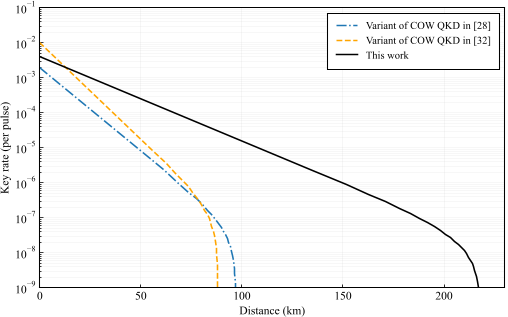
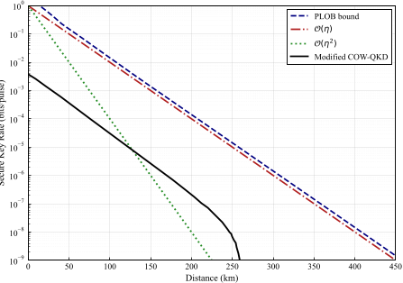
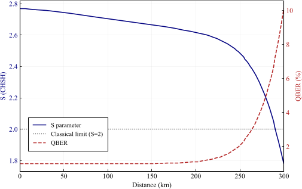
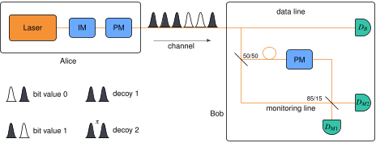

Imagine sending secret messages that are guaranteed secure by the very laws of physics. Quantum key distribution (QKD) promises exactly that, using the strange properties of quantum particles to create unbreakable encryption keys. Yet, making these systems both practical and secure over long distances remains a challenge. What if a subtle shift in how we monitor quantum signals could unlock much longer secure communication? Recent research shows that by harnessing a fundamental quantum phenomenon known as Bell inequality violation, we can enhance a widely studied QKD protocol to securely transmit keys over distances exceeding 250 kilometers.

> **TL;DR**
> - By replacing traditional coherence checks with monitoring of Bell-type quantum correlations, the security of the coherent one-way (COW) QKD protocol is significantly improved.
> - This modification extends the maximum secure communication distance from under 20 km to approximately 259 km, marking a major advance for practical quantum encryption.

*Note: this summary is based on a preprint — research shared ahead of formal peer review.*

Quantum key distribution allows two distant parties to share a secret encryption key with security guaranteed by quantum mechanics. The coherent one-way (COW) protocol is a popular QKD scheme known for its experimental simplicity and has even been commercialized. However, its security has been questioned, especially against sophisticated attacks that exploit device imperfections. Previous analyses capped the secure distance at less than 20 kilometers, limiting practical applications. To overcome this, researchers have explored device-independent approaches that certify security through violations of Bell inequalities — tests that reveal the 'spooky' nonlocal connections unique to quantum physics. While fully device-independent QKD is experimentally demanding, semi-device-independent methods offer a promising middle ground.

The researchers introduced a minimal but crucial change to the COW protocol. Instead of monitoring the coherence between successive pulses as before, they added an extra decoy state and modified the receiver’s measurement setup to perform a CHSH Bell test — a standard way to detect quantum correlations that defy classical explanation. Alice, the sender, prepares four types of optical pulse sequences encoding bits, including two new decoy states that form a symmetric basis. Bob, the receiver, splits incoming signals into a data line for key generation and a monitoring line equipped with a specially tuned Mach-Zehnder interferometer. By adjusting beam splitter ratios and phase shifts, Bob can measure in bases that test the CHSH inequality. After transmission, Alice and Bob sift their data and calculate the CHSH parameter S and the quantum bit error rate (QBER). If these meet predetermined security thresholds, they proceed with classical post-processing to extract a secure key.

Simulations showed that this approach enables detection of a broader range of eavesdropping attacks than traditional coherence monitoring. Crucially, the CHSH test restores a near-linear scaling of the secret key rate with channel transmittance, a significant improvement over previous quadratic or worse scaling. This enhancement extends the maximum secure distance from less than 20 km to approximately 259 km — a thirteenfold increase. The results suggest that integrating Bell inequality monitoring into coherent-state QKD protocols can substantially boost their practical security and reach without requiring drastic changes to existing experimental setups.

This work bridges fundamental quantum physics and real-world cybersecurity by showing how the intrinsic nonlocality of quantum mechanics can be harnessed to strengthen encryption protocols. Extending secure quantum key distribution over hundreds of kilometers is vital for building future quantum communication networks that protect privacy against increasingly powerful adversaries. The minimal modifications proposed mean that existing COW-QKD systems could be upgraded to achieve these gains without prohibitive complexity or cost. This advance also opens the door for applying similar Bell-based security checks to other coherent-state quantum communication schemes.

While the results are promising, they are based on detailed simulations rather than experimental demonstration. Implementing the required interferometer adjustments and maintaining stable phase control over long distances remain technical challenges. Moreover, the security analysis assumes idealized conditions and certain device characteristics; real-world imperfections could affect performance. Future work will need to validate these findings experimentally and explore robustness against practical noise and loss. Nonetheless, this study provides a compelling proof of principle that fundamental quantum correlations can be leveraged to substantially improve the security and distance of quantum key distribution.

## Figures

*This figure compares secret key rates of different COW-QKD methods under set error and detection conditions. — Figure from Mahdi Shaban et al., [CC BY 4.0](http://creativecommons.org/licenses/by/4.0/), caption edited.*

*Figure 3 shows how secret key rates grow linearly when error is 1%, compared to other scaling types and a known performance limit. — Figure from Mahdi Shaban et al., [CC BY 4.0](http://creativecommons.org/licenses/by/4.0/), caption edited.*

*Graph shows how quantum signal quality and error rate change with distance between two parties, highlighting a key classical limit. — Figure from Mahdi Shaban et al., [CC BY 4.0](http://creativecommons.org/licenses/by/4.0/), caption edited.*

*Alice sends special light pulses to Bob, who splits them to check data and monitor security using updated equipment and extra decoy signals. — Figure from Mahdi Shaban et al., [CC BY 4.0](http://creativecommons.org/licenses/by/4.0/), caption edited.*

## Sources

- [Enhancing the security of coherent one-way quantum key distribution using CHSH correlations](https://arxiv.org/abs/2607.26856)
- DOI: [10.1038/s41598-026-63901-5](https://doi.org/10.1038/s41598-026-63901-5)

*This article reuses and adapts text and figures from the original research by Mahdi Shaban et al., available via Sci. Rep. (2026), under the [CC BY 4.0](http://creativecommons.org/licenses/by/4.0/) license.*
