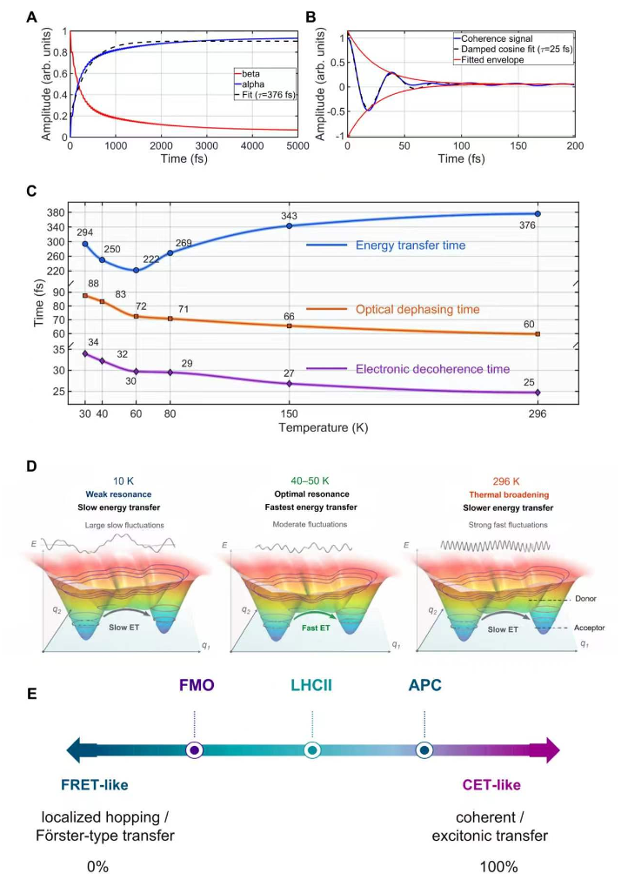

Photosynthesis is life’s remarkable way of converting sunlight into usable energy, and at its heart lies a quantum dance of energy transfer between molecules. But how does nature fine-tune this process so efficiently? Recent research uncovers that the surrounding environment of photosynthetic proteins plays a more intricate role than previously thought, controlling energy flow through subtle vibrations that change with temperature.

> **TL;DR**
> - Energy transfer times in a photosynthetic protein show a surprising non-linear response to temperature, speeding up then slowing down as temperature rises.
> - This behavior arises because the protein’s environment changes its vibrational characteristics with temperature, influencing energy transport beyond simple quantum dephasing effects.

*Note: this summary is based on a preprint — research shared ahead of formal peer review.*

In photosynthetic organisms, light energy absorbed by pigment-protein complexes must be swiftly and efficiently transferred to reaction centers where it can be converted into chemical energy. Traditionally, this energy transfer was modeled as a simple hopping process influenced by thermal fluctuations causing quantum dephasing—a loss of coherence in the electronic states involved. However, many photosynthetic systems operate in regimes where electronic interactions, vibrations of the molecules, and environmental fluctuations all intertwine on similar energy scales. This complexity challenges conventional models and calls for a deeper understanding of how the environment shapes energy transport at the quantum level.

To explore this, researchers studied the allophycocyanin (APC) protein, a photosynthetic antenna complex with a well-defined structure containing two closely coupled pigments. Using temperature-dependent two-dimensional electronic spectroscopy (2DES), they tracked how excitation energy moved between these pigments over a wide temperature range—from near absolute zero (10 K) up to room temperature (296 K). These ultrafast measurements, combined with advanced quantum simulations employing hierarchical equations of motion, allowed the team to model the protein as a vibronically coupled excitonic dimer interacting with a complex, temperature-sensitive environment.

The experiments revealed a striking non-monotonic temperature dependence in the energy transfer time: it decreased from about 400 femtoseconds at 10 K to a minimum near 200 femtoseconds around 30–40 K, then increased again at higher temperatures. Interestingly, the optical dephasing time—how quickly quantum coherence is lost—decreased steadily with temperature, showing a contrasting trend. Theoretical modeling showed that conventional models with fixed environmental properties could not reproduce this behavior. Instead, only when the low-frequency vibrational modes of the protein environment were allowed to change anharmonically with temperature did simulations match the experimental observations. This indicates that not just the strength but the distribution of environmental vibrations across frequencies critically controls energy transfer efficiency.

These findings deepen our understanding of quantum energy transport in biological systems by highlighting the active role of the environment’s vibrational landscape. They suggest that nature exploits a finely tuned interplay between electronic states and temperature-dependent environmental motions to optimize energy flow. Beyond photosynthesis, this insight could inform the design of bio-inspired materials and devices aiming to harness quantum effects for efficient energy conversion.

While the study provides compelling evidence linking environmental spectral changes to energy transfer dynamics, it focuses on a single photosynthetic protein and relies on complex theoretical models that await broader experimental validation. The quantum behaviors involved are subtle and challenging to probe directly, and practical applications of these insights remain a future prospect rather than an immediate outcome.

## Figures

*Simulations reveal how environmental factors affect energy transport and coherence in a molecular system across temperatures. — Figure from Junhua Zhou et al., [CC BY 4.0](http://creativecommons.org/licenses/by/4.0/), caption edited.*

## Sources

- [Environmental Control Extends Beyond Quantum Dephasing in Exciton Energy Transfer](https://arxiv.org/abs/2608.23423)
- DOI: [10.48550/arxiv.2608.23423](https://doi.org/10.48550/arxiv.2608.23423)

*This article reuses and adapts text and figures from the original research by Junhua Zhou et al., available via arXiv Chemical Physics, under the [CC BY 4.0](http://creativecommons.org/licenses/by/4.0/) license.*
