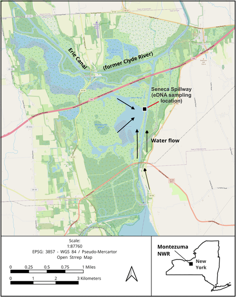
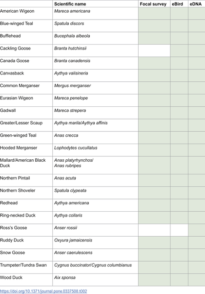
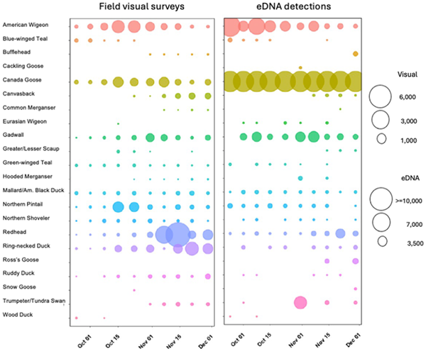
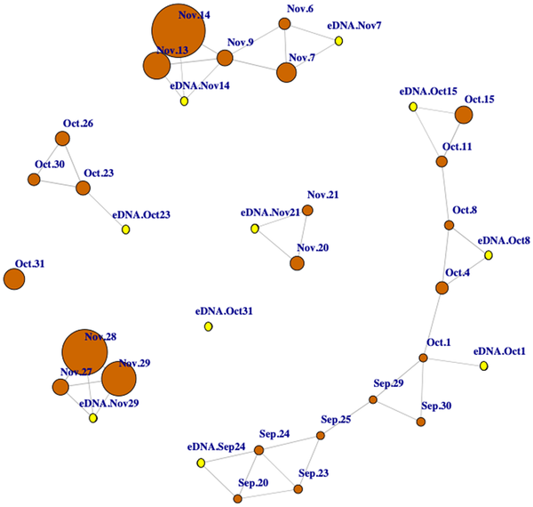

Imagine being able to track the movement and changing communities of migratory waterfowl without ever spotting a single bird. Scientists have developed a novel approach that does just that—by detecting traces of waterfowl DNA left behind in the water they inhabit during migration. This innovative use of environmental DNA, or eDNA, offers a promising tool to complement traditional bird monitoring methods, providing new insights into the dynamic patterns of waterfowl migration.

> **TL;DR**
> - Environmental DNA collected from water samples can reliably detect diverse waterfowl species during migration.
> - eDNA metabarcoding reveals temporal changes in waterfowl community composition that align well with visual surveys and citizen science data.

Monitoring wildlife populations, especially highly mobile species like migratory waterfowl, is essential for conservation and resource management. Traditional methods, such as ground and aerial visual surveys, can be labor-intensive, costly, and limited in frequency and spatial coverage. Waterfowl migrate across vast geographic areas, often changing their distribution rapidly, which makes capturing these shifts challenging. Environmental DNA (eDNA) metabarcoding—analyzing DNA fragments shed by organisms into their environment—has emerged as a powerful technique to detect aquatic species. However, its application to bird communities, particularly waterfowl, has been limited. This study explores how targeted eDNA methods can track waterfowl migration and community changes efficiently and accurately.

Researchers focused on Montezuma National Wildlife Refuge in New York, a key stopover for migrating waterfowl. Weekly water samples were collected during the fall migration period of 2020 from the refuge’s Main Pool, a large wetland habitat. The team developed new DNA primers targeting the mitochondrial ND2 gene, specifically designed for North American waterfowl species to improve detection accuracy and reduce cross-amplification with non-target species. They filtered water samples to capture DNA fragments, extracted the DNA in a controlled lab environment, and used high-throughput sequencing to identify waterfowl species present. To validate their approach, scientists compared eDNA results with intensive ground-based visual surveys and data from eBird, a large community science database of bird observations.

The eDNA method successfully detected all 25 waterfowl species observed during visual surveys, demonstrating high sensitivity. Moreover, the relative abundance of species inferred from eDNA data correlated positively with bird counts reported on eBird, both on the day of sampling and up to five days prior. Importantly, the eDNA data captured temporal shifts in waterfowl community composition throughout the migration period, reflecting species turnover and changing assemblages. While eDNA was effective at indicating relative species abundance, it was less reliable for estimating absolute numbers of birds, with significant correlations observed for only about a third of the species. Overall, the study confirms that eDNA metabarcoding can track dynamic waterfowl communities over time.

This research highlights environmental DNA metabarcoding as a promising complementary tool for wildlife monitoring, especially for migratory birds that are difficult to survey frequently or over large areas. The targeted ND2 primers developed here improve specificity for waterfowl, addressing limitations of previous assays that amplified DNA from other vertebrates. By providing a cost-effective, minimally invasive way to monitor species presence and community changes, eDNA methods can support conservation efforts, inform management decisions, and enhance our understanding of migratory patterns. Integrating eDNA with traditional surveys and citizen science data creates a more comprehensive picture of waterfowl ecology.

Despite its advantages, eDNA metabarcoding has limitations. It does not yet provide reliable estimates of absolute population sizes, as DNA quantity in water can be influenced by many factors unrelated to bird numbers, such as water flow and DNA degradation. The method also depends on comprehensive reference databases for accurate species identification. Additionally, eDNA reflects recent presence but cannot distinguish between live individuals and residual DNA from past visits. Therefore, eDNA is best used alongside, rather than as a replacement for, visual surveys and other monitoring approaches to provide robust assessments of waterfowl populations.

## Figures

*Map of water flow and sample sites at Montezuma NWR's Main Pool during peak 2020 fall waterfowl migration.*

*Waterfowl species found using visual surveys, eBird checklists, and DNA testing during 2020 field sampling.*

*Tracking waterfowl migration at Montezuma NWR using visual surveys and eDNA over time during fall.*

*Network showing strong positive links between bird counts and DNA data during fall waterfowl migration dates.*

## Sources

- [Environmental DNA monitoring of waterfowl reveals community changes during migration](https://journals.plos.org/plosone/article?id=10.1371/journal.pone.0337508)
- DOI: [10.1371/journal.pone.0337508](https://doi.org/10.1371/journal.pone.0337508)
