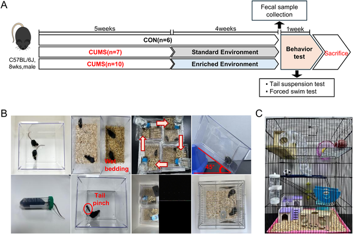
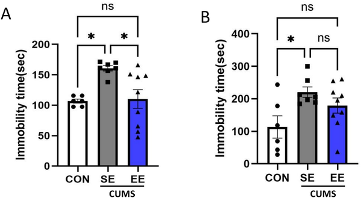
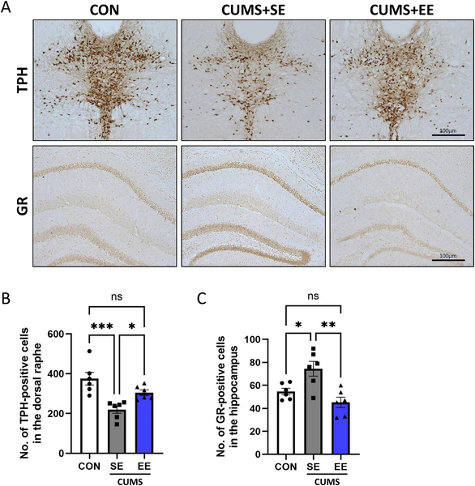

Can changing your surroundings actually heal your stressed brain and gut? Recent research using a mouse model of chronic stress suggests that the answer might be yes. By providing a stimulating, enriched environment, scientists found they could reverse some of the damaging effects of stress on gut microbes, intestinal health, and brain chemistry—factors all linked to depression.

> **TL;DR**
> - Chronic stress disrupts the gut microbiome and weakens the intestinal barrier, contributing to inflammation and brain changes associated with depression.
> - Environmental enrichment—offering mice a more stimulating and social living space—restores gut microbial balance, intestinal integrity, and brain markers, reducing depressive-like behaviors.

Major depressive disorder is a complex condition influenced by many factors, including chronic stress. Stress doesn’t just affect the brain; it also alters the gut microbiota—the trillions of bacteria living in our digestive tract. These changes can damage the intestinal lining, allowing inflammatory molecules to enter the bloodstream and affect brain function. This gut-brain connection is increasingly recognized as a key player in mood disorders. While medications exist, non-drug approaches that target this axis are of great interest.

Researchers used a well-established mouse model called chronic unpredictable mild stress (CUMS), which exposes mice to various mild stressors over five weeks to mimic aspects of human depression. After this period, mice were either kept in standard cages or moved to enriched environments—larger cages with climbing structures, tunnels, running wheels, and social companions—for four weeks. The team assessed depressive-like behaviors using tail suspension and forced swim tests, analyzed brain tissue for markers related to mood regulation, examined gut bacterial communities through DNA sequencing, and measured intestinal barrier proteins and inflammatory markers.

Mice exposed to chronic stress showed increased immobility in behavioral tests, indicating depressive-like states. Their gut microbiota became more diverse but shifted toward stress-associated bacterial groups, losing beneficial species like Akkermansia. The intestinal barrier weakened, with reduced levels of tight junction proteins and increased inflammatory molecules. In the brain, key enzymes and receptors involved in serotonin production and stress response were disrupted. Importantly, mice housed in enriched environments after stress showed significant improvements: their behavior normalized, gut microbial communities shifted back toward healthy profiles, intestinal barrier integrity was restored, inflammation decreased, and brain markers returned closer to normal levels.

This study highlights environmental enrichment as a promising non-pharmacological strategy to counteract the harmful effects of chronic stress on the microbiota-gut-brain axis. By improving both gut health and brain function, enriching surroundings could complement existing treatments for depression and other stress-related disorders. The findings also reinforce the importance of lifestyle and environment in mental health, suggesting that interventions beyond medication may have tangible benefits.

While these results are encouraging, they come from a mouse model, which may not fully replicate human depression. The specific elements of environmental enrichment that are most effective remain to be clarified, and translating such interventions to human settings poses challenges. Further research is needed to explore how these findings apply to people and to identify practical ways to harness environmental enrichment for mental health support.

## Figures

*Fig 1 shows the study setup, stress tests used, and the enriched environment cage for the experiment.*

*Environmental enrichment reduces depressive-like behaviors in mice, shown by less immobility in tail suspension and forced swim tests.*

*Enriched environments increase key brain cell markers in areas linked to mood and memory, shown by stained brain images and cell counts.*

## Sources

- [Environmental enrichment attenuates chronic stress–induced disruptions in the gut microbiota, intestinal barrier, and brain](https://journals.plos.org/plosone/article?id=10.1371/journal.pone.0355857)
- DOI: [10.1371/journal.pone.0355857](https://doi.org/10.1371/journal.pone.0355857)
