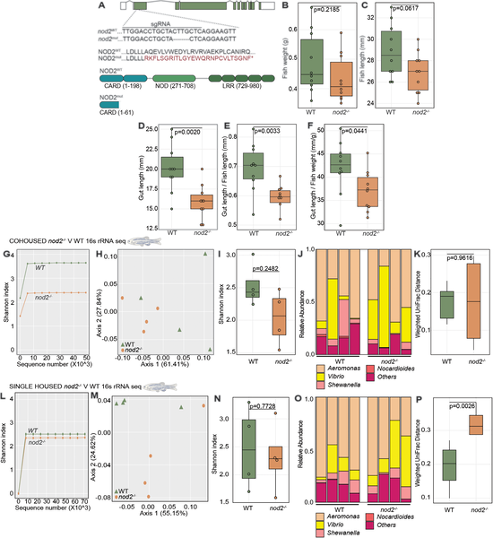
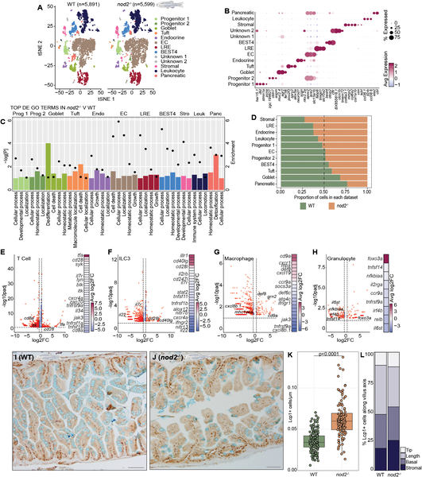
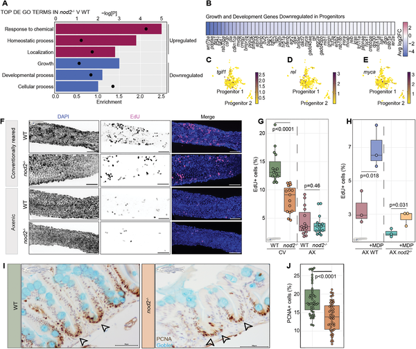
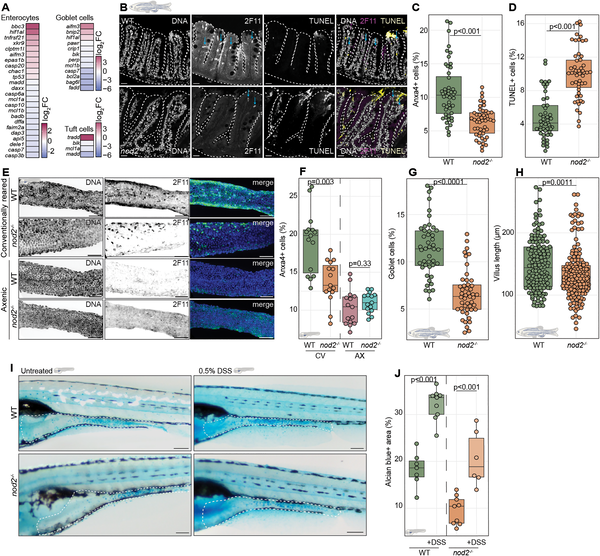

Crohn’s disease is a chronic inflammatory condition of the gut that affects millions worldwide. One of the strongest genetic risk factors for Crohn’s is mutations in the immune receptor gene NOD2. But how exactly NOD2 helps keep our intestines healthy has remained a mystery. Now, scientists have uncovered an unexpected partnership between NOD2 and the hormone estrogen that plays a key role in maintaining intestinal balance. This discovery not only sheds light on gut biology but also offers clues about why Crohn’s disease affects men and women differently.

> **TL;DR**
> - NOD2 deficiency in zebrafish leads to shorter intestines and disrupted gut cell growth and immune function.
> - Estrogen signaling interacts with NOD2 pathways, influencing intestinal health and potentially explaining sex-specific aspects of Crohn’s disease.

Crohn’s disease involves chronic inflammation of the gastrointestinal tract and is influenced by both genetic and environmental factors. Among the genes implicated, NOD2 stands out as the most significant single genetic risk factor, increasing susceptibility to Crohn’s disease by up to 40-fold. NOD2 is known to be involved in immune responses to gut bacteria, but its precise role in maintaining the intestinal lining and immune balance is not fully understood. Researchers have turned to zebrafish, a transparent and genetically tractable model organism, to study how loss of NOD2 affects gut health. Zebrafish share many intestinal features with humans, making them ideal for exploring complex interactions between genes, cells, and hormones.

Using CRISPR-Cas9 gene editing, researchers created zebrafish lacking functional NOD2 protein. They compared these mutants to normal siblings by examining intestinal length, cell composition, and gene expression. Single-cell RNA sequencing allowed detailed profiling of changes in different intestinal cell types, including immune and epithelial cells. Functional assays measured cell proliferation and responses to estrogen exposure. The team also tested whether modulating estrogen receptors with tamoxifen could reverse defects seen in NOD2-deficient fish. These approaches combined genetic, molecular, and imaging techniques to unravel the relationship between NOD2 and estrogen signaling in the gut.

NOD2-deficient zebrafish had intestines about 20% shorter than normal fish, despite similar overall body size. Single-cell analysis revealed widespread alterations in gene activity affecting both immune cells and the intestinal lining. Notably, genes responsive to estrogen were unexpectedly increased in the absence of NOD2. The mutant fish showed reduced proliferation of intestinal progenitor cells, indicating impaired epithelial renewal. When exposed to estrogen alone, normal fish exhibited similar intestinal changes as NOD2 mutants, while treatment with tamoxifen, an estrogen receptor modulator, partially restored normal epithelial structure in NOD2-deficient fish. These results reveal a novel regulatory axis where estrogen signaling and NOD2 function intersect to maintain intestinal homeostasis.

This study uncovers a previously unrecognized link between the immune receptor NOD2 and estrogen signaling pathways that together support gut health. Since Crohn’s disease risk and severity differ between men and women, understanding how hormones influence immune gene function offers valuable insight into sex-specific disease mechanisms. The findings suggest that targeting estrogen receptors might provide new therapeutic avenues for managing Crohn’s disease, especially in patients with NOD2 mutations. Moreover, the use of zebrafish as a model highlights the power of combining genetics and hormone biology to explore complex interactions in intestinal health and disease.

While zebrafish provide a useful model for studying intestinal biology, differences between fish and human physiology mean that findings need careful validation in human tissues. The study focuses on molecular and cellular mechanisms under controlled laboratory conditions, which may not capture the full complexity of Crohn’s disease in patients. Additionally, the precise ways estrogen and NOD2 interact in different cell types and during disease progression require further investigation. Clinical translation of these insights will depend on confirming their relevance in human populations and understanding potential side effects of manipulating hormone pathways.

## Figures

*Zebrafish lacking nod2 have shorter guts but similar body size and gut bacteria compared to normal fish.*

*NOD2 deficiency changes gene activity in various intestinal cells, affecting immune and epithelial cell functions compared to normal controls.*

*Nod2 deficiency reduces intestinal growth and cell proliferation in larval intestines compared to normal controls, shown by gene activity and cell imaging.*

*Loss of nod2 gene changes cell death and cell types in intestines, affecting gut health in zebrafish at different stages and conditions.*

## Sources

- [Estrogen impacts NOD2-dependent regulation of intestinal homeostasis](https://journals.plos.org/plosbiology/article?id=10.1371/journal.pbio.3003766)
- DOI: [10.1371/journal.pbio.3003766](https://doi.org/10.1371/journal.pbio.3003766)
