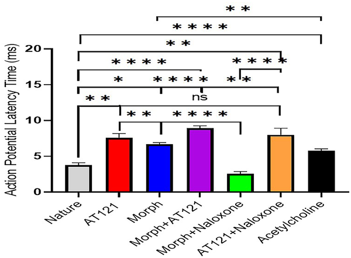
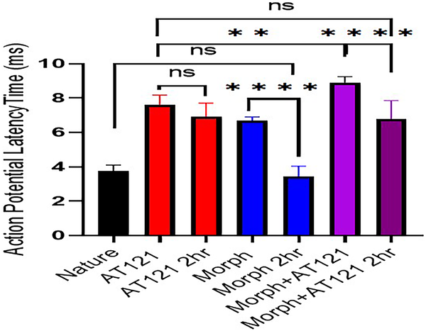

Pain relief is a cornerstone of medicine, but the most powerful drugs we have—opioids like morphine—come with serious risks, including addiction and tolerance. What if there was a painkiller that could ease suffering without these downsides? Scientists have been investigating AT121, a new compound designed to activate opioid receptors differently than morphine. Recent research sheds light on how AT121 affects brain cells and dopamine levels, offering clues about its potential as a safer pain medication.

> **TL;DR**
> - AT121, a bifunctional partial agonist targeting both Mu opioid and NOP receptors, alters neuron electrical activity in ways distinct from morphine, delaying action potentials and prolonging spike duration without inducing tolerance over two hours.
> - Unlike morphine, which increases dopamine release linked to addiction risk, AT121 reduces dopamine levels in hippocampal neurons, suggesting a lower potential for triggering reward pathways.

Opioids relieve pain primarily by binding to Mu opioid receptors in the nervous system, which dampens nerve signals that carry pain sensations. However, this same mechanism often leads to tolerance—where higher doses are needed over time—and addiction, partly due to increased dopamine release in brain reward circuits. AT121 is a novel compound designed to activate both Mu opioid and nociceptin/orphanin FQ peptide (NOP) receptors. This dual action is thought to provide pain relief while minimizing side effects associated with traditional opioids. Understanding how AT121 affects neuronal activity and dopamine release is crucial to evaluating its promise as a safer analgesic.

In this study, researchers isolated cortical neurons and hippocampal cells from newborn BALB/c mice to analyze the effects of AT121 compared to morphine. Using whole-cell patch-clamp electrophysiology, they recorded how these compounds influenced electrical properties of cortical neurons, including the timing and duration of action potentials—electrical impulses critical for neuron communication. Additionally, they measured dopamine concentrations in the culture media of hippocampal cells using an enzyme-linked immunosorbent assay (ELISA) to assess potential impacts on reward-related neurotransmission. The drugs were applied at equal concentrations, and effects were observed both shortly after application and after two hours to evaluate tolerance development.

The results showed that both morphine and AT121 delayed the onset of action potentials in cortical neurons, but AT121 caused a longer delay and prolonged spike duration more significantly. Importantly, while morphine’s effects diminished after two hours—indicating tolerance—AT121’s influence on neuronal activity persisted. When combined, AT121 and morphine further extended action potential delays. Naloxone, an opioid receptor antagonist, reversed morphine’s effects but did not reverse AT121’s, suggesting AT121 interacts with receptors differently. Regarding dopamine, morphine increased extracellular dopamine levels in hippocampal cultures, consistent with its known addictive potential. In contrast, AT121 alone lowered dopamine levels compared to controls, indicating a reduced likelihood of activating reward pathways linked to addiction.

These findings highlight AT121 as a promising candidate for pain management that could provide effective analgesia while reducing risks of tolerance and addiction. By modulating neuronal electrical activity differently and lowering dopamine release, AT121 may avoid some of the pitfalls of traditional opioids like morphine. This research offers mechanistic insights that support further development and testing of AT121 for both acute and chronic pain treatment, potentially addressing a critical public health issue amid the ongoing opioid crisis.

It is important to note that this study was conducted in vitro using isolated mouse neurons and hippocampal cells, which may not fully replicate the complexity of living organisms. The observations were limited to a short two-hour window, so longer-term effects and clinical efficacy remain unknown. Further research, including in vivo studies and human clinical trials, is necessary to confirm whether AT121’s promising properties translate into safer and effective pain relief for patients.

## Figures

*Morphine, AT121, acetylcholine, and naloxone affect nerve signal delay in newborn mouse brain cells after 5 minutes at 10 µg/ml.*

*Morphine and AT121 affect nerve signal timing in newborn mouse brain cells, measured 2 hours after treatment.*

## Sources

- [Evaluation of AT121 versus morphine on cortical neurons electrophysiology and dopamine concentrations in hippocampal cells](https://journals.plos.org/plosone/article?id=10.1371/journal.pone.0347529)
- DOI: [10.1371/journal.pone.0347529](https://doi.org/10.1371/journal.pone.0347529)
