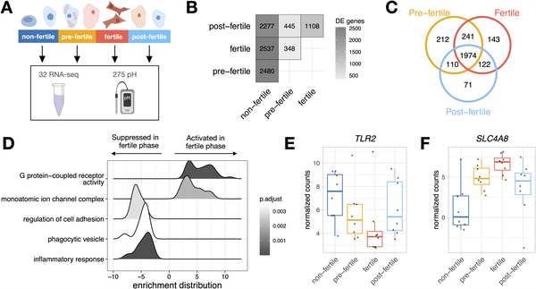
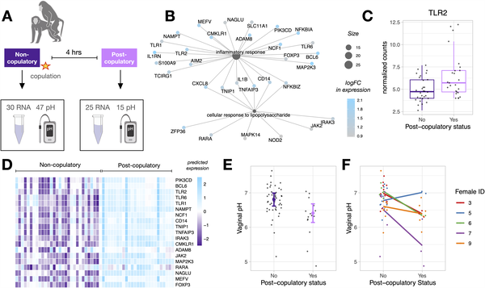
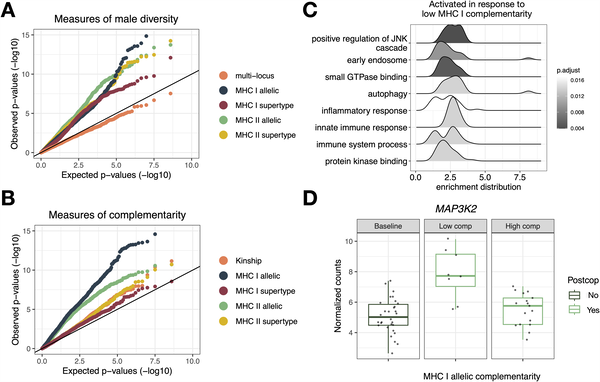
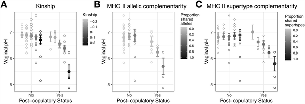

Did you know that female primates might have a hidden way of ‘choosing’ which male’s sperm fertilizes their eggs — even after mating has occurred? Recent research on olive baboons suggests that females can subtly influence sperm survival inside their vaginal tract by adjusting immune defenses and acidity based on the genetic makeup of their mates. This discovery sheds light on a fascinating layer of reproductive biology that could help explain how mate choice operates beyond behavior alone.

> **TL;DR**
> - Female olive baboons modulate vaginal immune responses and pH after mating, affecting sperm survival.
> - These physiological changes are stronger when females mate with genetically similar males, potentially reducing chances of inbreeding.

Mate choice in animals is often thought of as a behavioral process—females choosing males before copulation based on traits like appearance or dominance. But scientists have long suspected that females might also influence which sperm fertilizes their eggs after mating, a phenomenon called cryptic female choice. While evidence for this exists in small mammals like rodents, it has been harder to demonstrate in large-bodied mammals, especially primates. Understanding these mechanisms is important, not only for evolutionary biology but also for insights into fertility and reproductive health in species closely related to humans.

In this study, researchers observed nine female and four male olive baboons, a species known for complex social and mating behaviors. They collected vaginal samples across different phases of the females’ ovarian cycles, both before and after mating. Using RNA sequencing, they measured gene expression changes in the vaginal tract, focusing on immune-related genes. They also measured vaginal pH, since acidity can influence sperm survival. To understand genetic relationships, the team genotyped males and females for genome-wide markers and specifically for the major histocompatibility complex (MHC), a key immune gene region. By comparing gene expression and pH changes with the genetic similarity between mating pairs, they tested whether females respond differently to sperm from genetically similar versus dissimilar males.

The researchers found that after mating, female baboons’ vaginal tracts ramp up immune activity and lower vaginal pH, both of which can be harmful to sperm. Importantly, these responses were strongest when females mated with males genetically similar to themselves, particularly at immune-related genes in the MHC region. This suggests that females may be ‘discriminating’ against sperm from genetically similar males to avoid inbreeding and promote offspring genetic diversity. The study also showed that vaginal gene expression naturally varies across the ovarian cycle, but mating triggers distinct immune and chemical changes that depend on the male’s genetic makeup.

This study provides some of the first in vivo evidence in a large primate species that females can influence fertilization outcomes through physiological mechanisms after mating. By altering immune responses and vaginal acidity based on male genetics, female baboons may increase the chances that sperm from genetically compatible males succeed. These findings deepen our understanding of reproductive biology and sexual selection, highlighting that mate choice extends beyond behavior to molecular interactions within the female reproductive tract. While direct implications for humans remain to be explored, the research opens new avenues for studying fertility and mate compatibility in primates.

While the study’s design is robust and provides compelling evidence, it involved a relatively small number of individuals and focused on a single primate species. The complexity of reproductive biology means that many factors influence fertilization, and the exact mechanisms by which vaginal immune responses and pH affect sperm survival require further investigation. Additionally, how these findings translate to wild populations or other species, including humans, is not yet clear. Future research with larger sample sizes and diverse species will be important to confirm and extend these insights.

## Figures

*Gene activity changes across ovarian cycle phases, with unique and shared genes active during fertility, affecting inflammation and ion transport.*

*After mating, immune genes increase and vaginal pH drops, showing the body's response to copulation with changes in gene activity and acidity.*

*Gene activity in female reproductive tracts changes after mating, influenced by male immune gene diversity and compatibility.*

*Vaginal pH after mating is lowest when females mate with genetically similar males, shown by model predictions and raw data.*

## Sources

- [Evidence for genetically-based sperm discrimination in the vaginal tract of a primate species](https://journals.plos.org/plosbiology/article?id=10.1371/journal.pbio.3003699)
- DOI: [10.1371/journal.pbio.3003699](https://doi.org/10.1371/journal.pbio.3003699)
