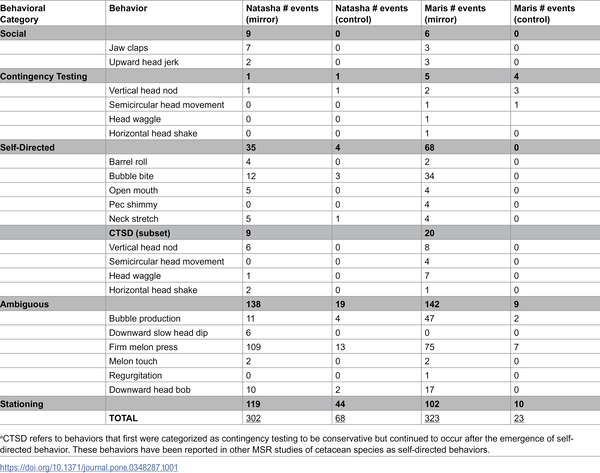
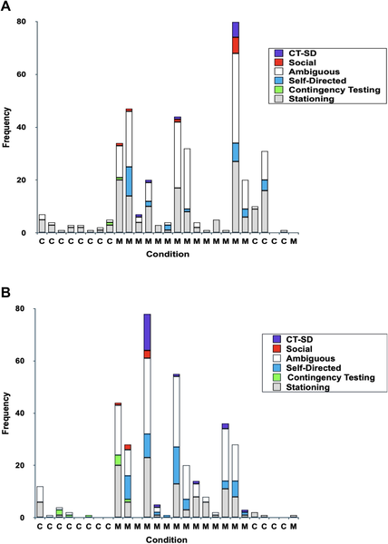
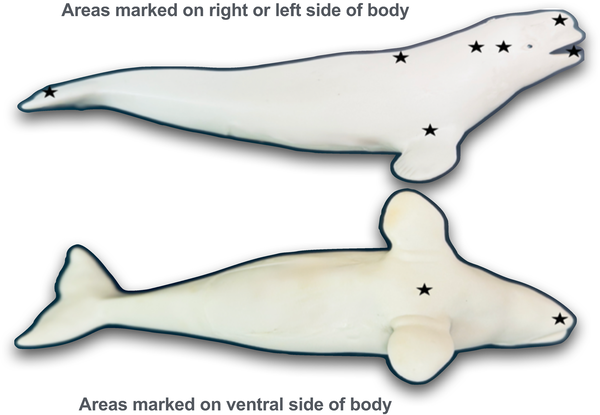
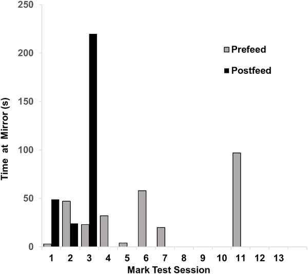

Did you know beluga whales might recognize themselves in mirrors, just like humans and chimpanzees? Imagine watching a beluga whale approach a mirror and seemingly examine its own reflection with curiosity and intent. This intriguing behavior, known as mirror self-recognition (MSR), is considered a sign of self-awareness—a cognitive trait once thought to be uniquely human. Now, new research conducted at the New York Aquarium provides compelling evidence that beluga whales, the “canaries of the sea,” may share this remarkable ability.

> **TL;DR**
> - Beluga whales demonstrated behaviors in front of mirrors that suggest they recognize their own reflections, a sign of self-awareness.
> - Mark tests, where whales were marked with invisible spots only visible via the mirror, confirmed that at least one adult female beluga used the mirror to inspect these marks on her body.

Mirror self-recognition has been documented in only a select group of animals, including great apes, bottlenose dolphins, Asian elephants, and even some birds like magpies. This ability involves more than just reacting to a reflection; it requires an individual to understand that the image in the mirror is actually itself. Beluga whales, known for their complex social structures and advanced cognitive skills, had not previously been tested with the standard mirror test. Given their large brains and social intelligence, they were promising candidates to explore this capacity for self-awareness.

Researchers tested a social group of four beluga whales—three adult females and one subadult female—housed together at the New York Aquarium. The whales were exposed to a two-way plexiglass mirror and a transparent control surface during different sessions. Their behaviors were recorded and analyzed for signs of social responses, contingency testing (checking if movements in the mirror correspond to their own), and self-directed behaviors such as inspecting parts of their bodies using the mirror. For the whales that showed promising behaviors, the team conducted mark tests: applying non-toxic, temporary marks on parts of the whales’ bodies that they could not see without a mirror. If the whales used the mirror to investigate these marks, it would provide strong evidence of MSR.

Two whales—the subadult female and her mother—displayed a rich range of self-directed behaviors in front of the mirror, including unusual movements that appeared to test the mirror’s reflection. Notably, the adult female passed one of the mark tests by orienting her marked body part toward the mirror, indicating she recognized the reflection as herself rather than another whale. These behaviors were not observed during control sessions without the mirror, reinforcing the conclusion that the whales were responding specifically to their own reflections.

This study adds beluga whales to the exclusive list of species that demonstrate mirror self-recognition, a hallmark of advanced cognitive abilities and self-awareness. Understanding which animals possess this trait helps scientists explore the evolution of consciousness and cognition across species. For belugas, known for their vocal learning and social complexity, these findings deepen our appreciation of their intelligence and social awareness. Such insights can inform conservation efforts by emphasizing the cognitive richness of these marine mammals.

While the evidence is strong, the study involved a small sample size of four whales, with only two showing clear signs of MSR. The reflective control surface was not perfectly non-reflective, which could influence behavior. Additionally, individual differences in vision or health (such as cataracts in one whale) may affect results. Further research with larger groups and varied conditions would help confirm and expand upon these findings.

## Figures

*Table 1 shows how often different behaviors occurred with and without a mirror in Phase I.*

*Fig 1 shows how often Natasha and Maris displayed different behaviors with and without a mirror during testing sessions.*

*Shows where marks and fake marks were placed on Natasha and Maris during mirror and control tests.*

*Natasha spent more time looking at her marked body in the mirror after feeding, showing she recognized herself in the test.*

## Sources

- [Evidence for mirror self-recognition in beluga whales (Delphinapterus leucas)](https://journals.plos.org/plosone/article?id=10.1371/journal.pone.0348287)
- DOI: [10.1371/journal.pone.0348287](https://doi.org/10.1371/journal.pone.0348287)
