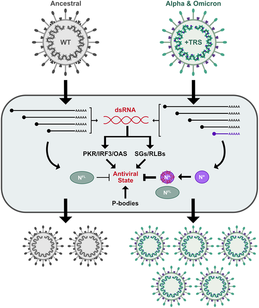
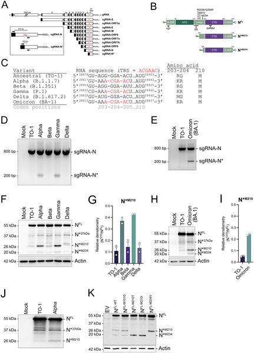
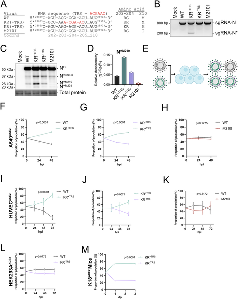

Viruses are masters of survival, constantly adapting to overcome the defenses of their hosts. SARS-CoV-2, the virus behind COVID-19, has evolved many tricks since it first emerged in humans. Among its latest adaptations is a surprising one: producing a shorter version of a key protein that helps it hide from our immune system’s antiviral alarms. This tiny change in the virus’s genetic code gives it a powerful edge in the ongoing battle inside our cells.

> **TL;DR**
> - Certain SARS-CoV-2 variants produce a truncated nucleocapsid protein called N*M210 by using a newly acquired RNA signal within the N gene.
> - This truncated protein binds double-stranded RNA and suppresses multiple antiviral responses, boosting viral fitness in human cells and mice.

When a virus infects a cell, our body’s defenses quickly spring into action. Cells detect viral double-stranded RNA (dsRNA), a hallmark of viral replication, and respond by activating antiviral programs such as interferon production and the assembly of antiviral granules like stress granules and RNase L-dependent bodies. These responses help limit viral replication and spread. However, viruses like SARS-CoV-2 have evolved strategies to counter these defenses. While much attention has focused on mutations in the spike protein, changes in other viral proteins also play crucial roles in the virus’s ability to thrive. The nucleocapsid (N) protein, which packages the viral RNA and influences replication, is one such protein subject to evolutionary change.

Researchers studied a panel of SARS-CoV-2 variants, including Omicron, that carry a mutation creating a new transcription regulatory sequence (TRS) inside the N gene. This new TRS leads to the production of a novel subgenomic RNA (sgRNA-N*), which encodes a truncated nucleocapsid protein starting at amino acid 210, called N*M210. Using molecular biology techniques, including RT-PCR to detect viral RNAs, immunoblotting to identify protein forms, and recombinant virus engineering, they compared viral fitness and antiviral responses in human lung cells and mouse models. They also investigated how N*M210 interacts with dsRNA and affects cellular antiviral structures such as stress granules.

The study found that variants with the internal TRS produce significantly more N*M210 protein. This truncated protein binds double-stranded RNA more effectively than the full-length nucleocapsid, allowing it to suppress key antiviral responses. Specifically, N*M210 inhibits interferon signaling, triggers disassembly of processing bodies, and blocks the formation of G3BP1-containing foci, including stress granules and RNase L-dependent bodies. These antiviral granules normally help the cell restrict viral replication. Using recombinant viruses, the researchers showed that increased N*M210 production enhances viral replication and fitness both in primary human cells and in mice. The ability of N*M210 to block antiviral granules contributes substantially to this fitness advantage.

This work uncovers a novel viral adaptation mechanism where SARS-CoV-2 produces a truncated nucleocapsid protein that acts as a molecular shield against the host’s antiviral defenses. By limiting the activation of dsRNA-induced antiviral pathways, the virus gains a replication advantage, which likely contributed to the dominance of variants like Omicron. Understanding this mechanism expands our knowledge of how SARS-CoV-2 evolves beyond spike protein mutations and highlights potential new targets for antiviral strategies aimed at restoring or enhancing cellular antiviral responses.

While the study provides compelling evidence of the role of N*M210 in suppressing antiviral responses and enhancing viral fitness, it primarily focuses on laboratory and animal models. The direct impact of this truncated protein on disease severity or transmission in humans remains to be fully explored. Additionally, antiviral granules and dsRNA sensing are complex processes, and further research is needed to detail the precise molecular interactions and to assess how this knowledge might translate into clinical interventions.

## Figures

*SARS-CoV-2 evolved a new RNA to produce a shorter protein that blocks antiviral defenses, helping the virus survive and spread.*

*Certain SARS-CoV-2 variants create shorter nucleocapsid proteins by using new RNA signals, shown by genetic maps and infected cell tests.*

*Mutations in the SARS-CoV-2 N gene boost virus fitness, shown by genetic changes, RNA profiles, protein levels, and competition in infected cells.*

## Sources

- [Evolution of a truncated nucleocapsid protein enhances SARS-CoV-2 fitness by suppressing antiviral responses](https://journals.plos.org/plosbiology/article?id=10.1371/journal.pbio.3003646)
- DOI: [10.1371/journal.pbio.3003646](https://doi.org/10.1371/journal.pbio.3003646)
