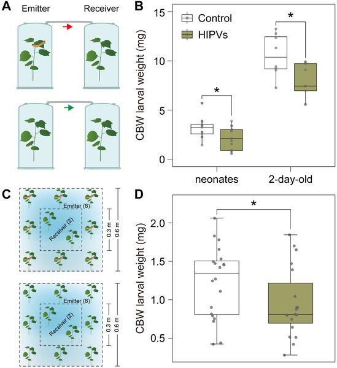
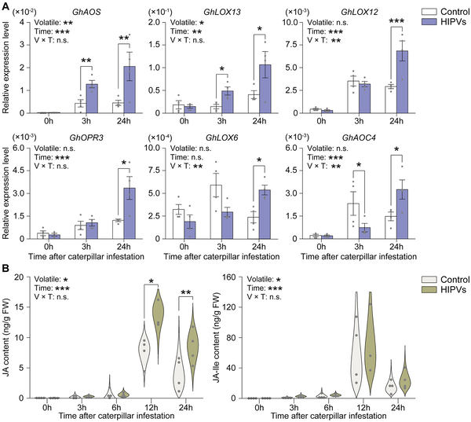
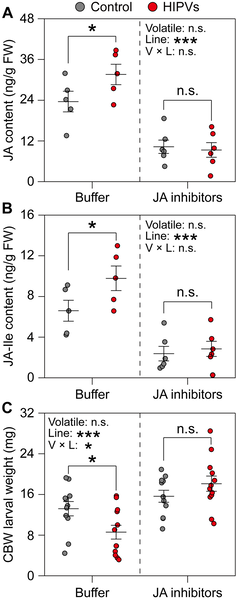
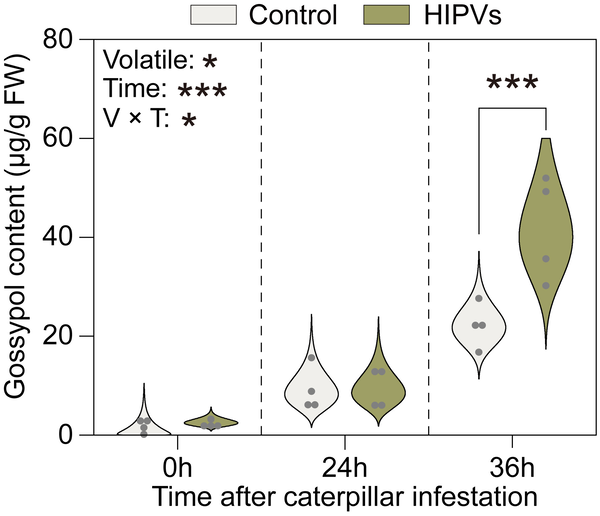

Did you know cotton plants can 'warn' their neighbors about pests using airborne chemical signals? When a caterpillar munches on one plant, that plant releases a distinctive scent that nearby cotton plants can detect. This chemical 'heads-up' doesn't trigger an immediate defense but primes the neighbors to react faster and stronger if they too come under attack. Understanding this natural form of plant communication could pave the way for more sustainable, pesticide-free farming.

> **TL;DR**
> - Cotton plants exposed to volatiles from caterpillar-infested neighbors show enhanced resistance against the same pest, the cotton bollworm.
> - This primed resistance depends on activation of the jasmonic acid signaling pathway and increased production of the defensive compound gossypol upon herbivore attack.

Plants may seem passive, but they have evolved sophisticated ways to defend themselves against threats like insect herbivores. One intriguing strategy involves releasing volatile organic compounds—essentially chemical scents—when under attack. These herbivore-induced plant volatiles (HIPVs) can serve as airborne messages to neighboring plants, alerting them to impending danger. While this phenomenon has been observed in various species, the precise molecular mechanisms, especially in cotton, have remained unclear. Cotton is particularly important globally, not only for its fiber but also because it faces significant pest pressures, including from the cotton bollworm, a caterpillar that damages cotton bolls and reduces yield.

Researchers exposed healthy cotton plants to volatiles emitted by cotton plants infested with cotton bollworm caterpillars. They then measured how well caterpillars grew when feeding on these 'primed' plants compared to controls exposed to volatiles from uninfested plants. The team combined laboratory bioassays with semi-field trials to confirm their findings. They also analyzed gene expression related to the jasmonic acid (JA) signaling pathway—a key plant defense hormone—and measured levels of JA and its active form JA-isoleucine. To probe the role of JA, they used chemical inhibitors that block JA biosynthesis. Furthermore, they examined the accumulation of gossypol, a toxic compound stored in pigment glands that defends cotton against pests, including in a mutant cotton variety lacking these glands.

The study found that cotton plants exposed to volatiles from caterpillar-infested neighbors did not immediately activate defenses but were primed to respond more rapidly and robustly once attacked. Specifically, these plants showed faster and stronger expression of genes involved in JA biosynthesis and accumulated higher JA levels after herbivore feeding. Blocking JA production eliminated this priming effect, confirming its essential role. Importantly, primed plants also produced significantly more gossypol following caterpillar attack, which correlated with reduced caterpillar growth. In contrast, the glandless mutant cotton plants, which cannot produce gossypol, did not benefit from volatile exposure, despite showing JA pathway activation. This demonstrates that gossypol is a critical downstream defense component in this priming mechanism.

This research sheds light on the molecular basis of how cotton plants communicate danger through airborne chemical signals and prepare their defenses accordingly. By revealing the key role of jasmonic acid signaling and gossypol production in this process, it opens avenues for developing eco-friendly pest management strategies that harness plants' innate defenses. Such approaches could reduce reliance on synthetic pesticides, benefiting both agriculture and the environment. Moreover, understanding plant-plant communication enriches our appreciation of the complex interactions within ecosystems and how plants actively participate in their own defense.

While these findings are promising, the priming effect was studied under controlled laboratory and semi-field conditions; how this mechanism operates in diverse, real-world agricultural settings with multiple stressors remains to be fully explored. Additionally, the volatile blends emitted by infested plants can vary with environmental factors and pest species, potentially influencing the priming response. Further research is needed to identify the specific volatile compounds responsible and to determine how best to apply this knowledge in sustainable cotton farming.

## Figures

*Cotton bollworm larvae weighed less after feeding on plants exposed to scents from infested plants, showing natural plant defense effects.*

*Plants exposed to caterpillar-damaged neighbors show increased defense gene activity and hormone levels linked to jasmonic acid after 48 hours.*

*JA signaling helps plants resist pests by boosting defense chemicals and reducing caterpillar growth after exposure to infested plant scents.*

*Gossypol levels in plants exposed to volatiles from healthy or caterpillar-infested plants show significant changes after caterpillar attack.*

## Sources

- [Exposure to herbivore-induced plant volatiles primes JA-dependent gossypol defenses in cotton](https://journals.plos.org/plospathogens/article?id=10.1371/journal.ppat.1014338)
- DOI: [10.1371/journal.ppat.1014338](https://doi.org/10.1371/journal.ppat.1014338)
