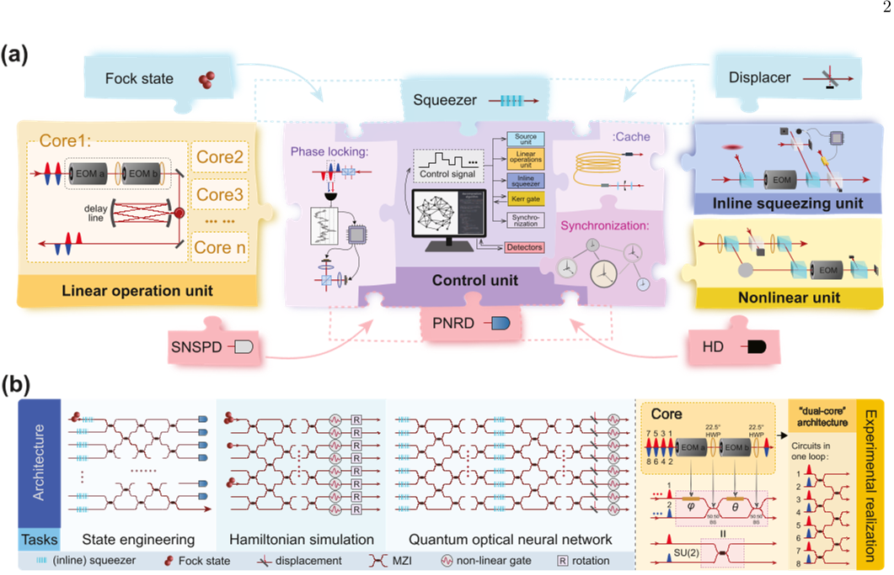
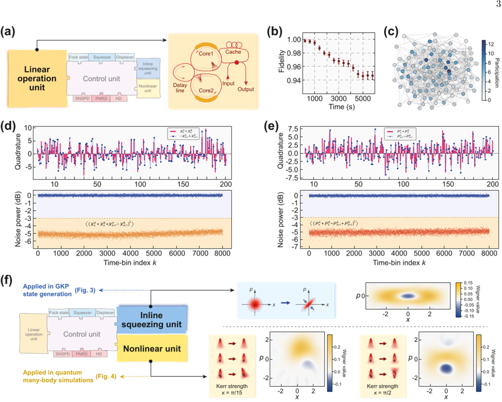
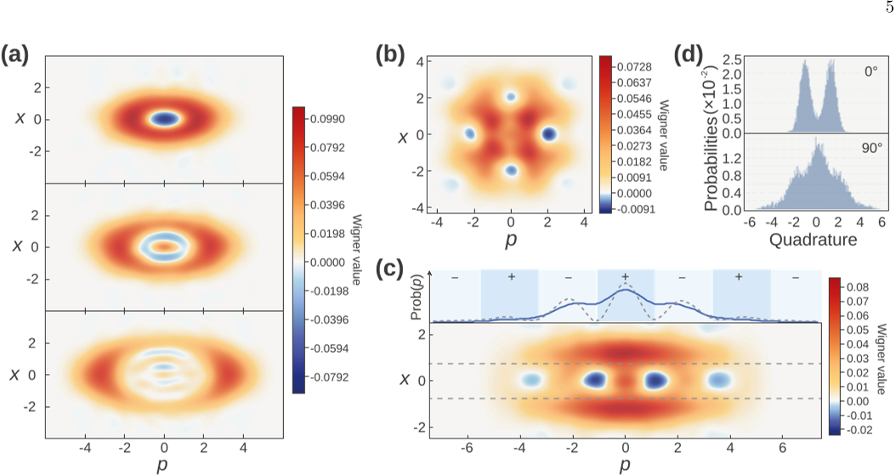
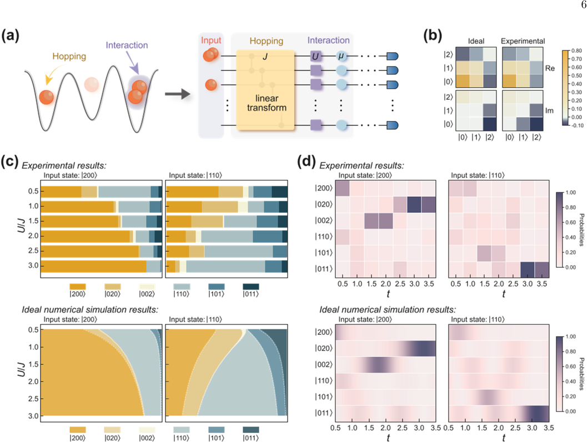

Quantum computers promise to revolutionize computing by harnessing the strange rules of quantum mechanics. Among various hardware approaches, photonic quantum computing—using particles of light—offers unique advantages like room-temperature operation and easy connectivity. Yet, a major hurdle has been the difficulty of implementing nonlinear quantum operations with photons, which are essential for universal quantum computing. Now, scientists have developed an extensible photonic quantum computer that combines scalable linear optical circuits with integrated nonlinear modules, achieving universal quantum gates and opening new possibilities for error correction and quantum simulations.

> **TL;DR**
> - The researchers created a modular photonic quantum computing platform called Clavina that integrates programmable linear optical networks with plug-and-play nonlinear units, overcoming a longstanding bottleneck in photonic quantum computing.
> - This platform enables quasi-deterministic generation of optical Gottesman-Kitaev-Preskill (GKP) states for quantum error correction and simulates complex many-body quantum dynamics, tasks previously inaccessible to photonic systems limited to linear optics.

*Note: this summary is based on a preprint — research shared ahead of formal peer review.*

Photonic quantum computing relies on manipulating photons through linear optical elements like beam splitters and phase shifters. While these linear operations are highly controllable and scalable, they alone cannot realize universal quantum computation. Nonlinear interactions, which allow photons to influence each other’s quantum states, are crucial for implementing a complete set of quantum gates and for generating the non-Gaussian states needed for error correction. However, achieving strong nonlinearities at the single-photon level and integrating them into large-scale photonic circuits has been a major challenge. Existing photonic experiments have either been limited to probabilistic nonlinear effects or have lacked scalability, preventing universal quantum computing with light.

The team developed an extensible photonic architecture named Clavina, which uses a central quantum photonic control unit to orchestrate a large-scale, programmable linear optical network combined with plug-and-play nonlinear modules. Time-bin encoding within a loop-based design allows the reuse of physical hardware across many temporal modes, enhancing scalability. Nonlinear modules include an inline squeezing unit and a Kerr gate that imparts photon-number-dependent phase shifts, both of which can be independently enabled or disabled. The system also integrates near-deterministic photon-number-state sources and various detectors, enabling flexible state preparation and measurement. This modular design supports universal gate sets by combining Gaussian and non-Gaussian operations, a requirement for universal continuous-variable quantum computing.

Using Clavina, the researchers demonstrated several key advances. They generated and expanded Schrödinger cat states—superpositions of coherent light states—through a two-round breeding process, confirmed by Wigner tomography. Leveraging these cat states, they quasi-deterministically produced optical Gottesman-Kitaev-Preskill (GKP) states, which are essential for bosonic quantum error correction and had previously been realized only probabilistically. The quality of these GKP states was validated by characteristic grid-like phase-space structures and stabilizer measurements indicating strong quantum coherence. Additionally, by incorporating the Kerr nonlinear module, Clavina simulated complex many-body quantum dynamics exemplified by the Bose-Hubbard model, demonstrating interactions and particle movements in a lattice that align well with theoretical predictions. These results showcase the platform’s capability to perform universal quantum operations and complex simulations previously out of reach for photonic systems.

This work represents a significant step toward practical, universal photonic quantum computing. By overcoming the nonlinear bottleneck with an extensible, modular architecture, Clavina enables fault-tolerant quantum error correction and complex quantum simulations using photons. The ability to quasi-deterministically generate GKP states is particularly important, as these states form the backbone of bosonic error correction codes that protect quantum information from noise. Moreover, the platform’s scalability and programmability open avenues for exploring quantum algorithms, simulations of many-body physics, and quantum machine learning with light. This advance brings photonic quantum computers closer to realizing their long-promised potential as versatile, reliable quantum machines.

While the results are promising, the current implementation operates with limitations such as finite squeezing levels and system losses that constrain the fidelity and rate of generated states. The reported GKP state generation is quasi-deterministic rather than fully deterministic, and improvements in hardware efficiency and noise reduction will be necessary to scale up for practical fault-tolerant quantum computing. Additionally, as this work is reported in a preprint on arXiv without peer review, further validation and replication will be important to confirm the robustness of the approach. Nonetheless, the modular extensible architecture provides a flexible foundation for ongoing improvements and integration of advanced photonic components.

## Figures

*A modular quantum photonic system called Clavina can be expanded with different units and light sources to perform tasks like sampling, error correction, and simulations. — Figure from Shang Yu et al., [CC BY 4.0](http://creativecommons.org/licenses/by/4.0/), caption edited.*

*This figure shows stable large-scale quantum transformations, strong multi-mode entanglement, and tools enabling advanced quantum computing features. — Figure from Shang Yu et al., [CC BY 4.0](http://creativecommons.org/licenses/by/4.0/), caption edited.*

*Scientists created and expanded special light states called cat and grid states, showing their unique patterns and properties in experiments. — Figure from Shang Yu et al., [CC BY 4.0](http://creativecommons.org/licenses/by/4.0/), caption edited.*

*This figure shows how a photonic quantum circuit simulates particle interactions and movements in a lattice, matching well with ideal models. — Figure from Shang Yu et al., [CC BY 4.0](http://creativecommons.org/licenses/by/4.0/), caption edited.*

## Sources

- [Extensible universal photonic quantum computing with nonlinearity](https://arxiv.org/abs/2602.06544)
- DOI: [10.1038/s41566-026-01962-8](https://doi.org/10.1038/s41566-026-01962-8)

*This article reuses and adapts text and figures from the original research by Shang Yu et al., available via arXiv Quantum Physics, under the [CC BY 4.0](http://creativecommons.org/licenses/by/4.0/) license.*
