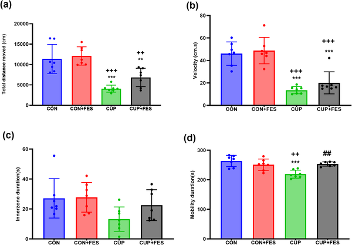
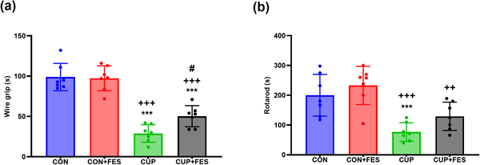
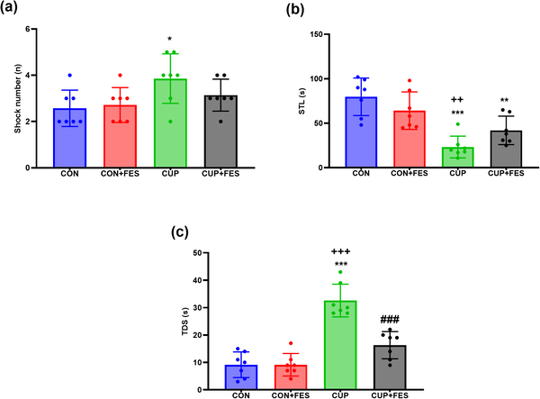
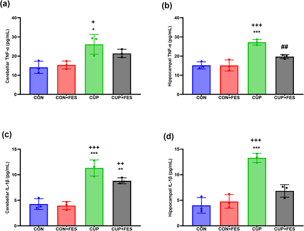

Multiple sclerosis (MS) is a complex neurological disease where the immune system attacks the protective myelin sheath around nerve fibers, leading to inflammation and impaired nerve signaling. While current treatments focus on suppressing immune activity, they often fall short in repairing the damaged myelin. What if molecules secreted by a parasite, specifically the liver fluke Fasciola hepatica, could help both reduce brain inflammation and promote myelin repair? Recent research using a mouse model of MS suggests this intriguing possibility.

> **TL;DR**
> - Excretory-secretory products from Fasciola hepatica reduce neuroinflammation and partially restore myelin integrity in a mouse model of MS.
> - Treatment with these parasite-derived molecules improves motor and cognitive functions impaired by demyelination, though full recovery was not achieved.

Multiple sclerosis is an autoimmune disorder characterized by chronic inflammation and progressive loss of myelin, the insulating layer around nerve fibers critical for efficient neural communication. Damage to myelin disrupts brain-body signaling, causing symptoms like muscle weakness, balance problems, and cognitive difficulties. Current therapies mainly target immune suppression but do not fully address myelin repair. The cuprizone model, a widely used mouse model, induces demyelination by causing oligodendrocyte cell death, mimicking aspects of MS pathology without involving adaptive immunity. This model allows researchers to study both inflammation and remyelination processes. Fasciola hepatica, a parasitic liver fluke, secretes a variety of molecules known to modulate immune responses, often dampening inflammation. Scientists have begun investigating whether these excretory-secretory products (ESPs) can create a brain environment conducive to myelin repair.

In this study, male C57BL/6 mice were divided into four groups: healthy controls, controls treated with Fasciola hepatica ESPs (FES), cuprizone-fed mice to induce demyelination, and cuprizone-fed mice treated with FES. The cuprizone diet was administered for four weeks to cause oligodendrocyte loss and demyelination, particularly in the hippocampus and cerebellum—brain regions linked to cognition and motor control. FES was given via intraperitoneal injections during the demyelination phase. Researchers assessed motor coordination, muscle strength, locomotion, and learning/memory through behavioral tests including open field, rotarod, wire grip, and shuttle box assays. After behavioral assessments, brain tissues were analyzed for inflammatory markers (TNF and IL-1β), myelin protein levels (MBP), and oligodendrocyte lineage marker Olig2 using ELISA, qPCR, and histological staining with Luxol Fast Blue to visualize myelin integrity.

The cuprizone diet caused expected motor deficits, cognitive impairments, increased pro-inflammatory cytokines, and marked myelin loss. Treatment with Fasciola hepatica ESPs significantly reduced levels of inflammatory cytokines TNF and IL-1β in the hippocampus and cerebellum. Correspondingly, expression of myelin basic protein (MBP) and Olig2 increased, indicating enhanced oligodendrocyte presence and myelin repair. Histological staining showed improved myelin integrity in treated mice compared to untreated cuprizone mice. Behaviorally, FES-treated mice demonstrated better motor coordination, muscle strength, and learning/memory performance, though these measures did not fully return to control levels. Notably, FES had no adverse effects in healthy control mice, suggesting safety in the absence of demyelination.

These findings provide promising evidence that molecules secreted by Fasciola hepatica can modulate neuroinflammation and support partial remyelination in a preclinical MS model. By reducing harmful inflammation and promoting oligodendrocyte survival and function, helminth-derived products may represent a novel therapeutic avenue that addresses both immune dysregulation and myelin repair—two critical aspects of MS pathology. This approach could complement existing immunomodulatory treatments and potentially improve outcomes for patients living with MS.

While the results are encouraging, this study was conducted in a mouse model that mimics some but not all features of human MS, particularly lacking the adaptive immune component. The improvements observed were partial, and full recovery was not achieved. Further research is needed to identify the specific active molecules within the excretory-secretory products, understand their mechanisms, and evaluate safety and efficacy in more complex models and eventually in human trials. Nonetheless, this work highlights the potential of parasite-derived molecules as innovative tools in neuroimmunology and MS therapy development.

## Figures

*CUP lowered activity, while FES boosted movement in an open field test, showing clear differences between groups.*

*Different treatments affect muscle strength and coordination, shown by wire grip and rotarod tests with significant differences marked by symbols.*

*Fig 3 shows how various treatments affect learning and memory in a shuttle box test, highlighting significant differences between groups.*

*Levels of inflammation markers TNF and IL-1β were measured in brain regions, showing significant differences between treatment groups.*

## Sources

- [Fasciola hepatica excretory-secretory products attenuate demyelination and reduce neuroinflammation in the Cuprizone –induced multiple sclerosis model](https://journals.plos.org/plosone/article?id=10.1371/journal.pone.0349675)
- DOI: [10.1371/journal.pone.0349675](https://doi.org/10.1371/journal.pone.0349675)
