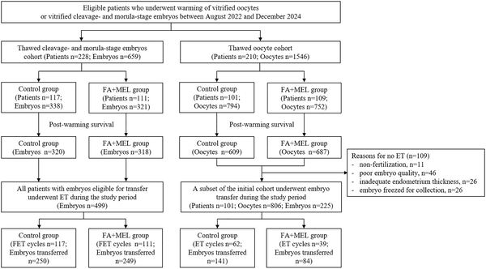
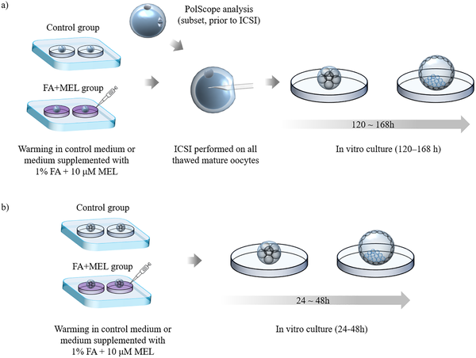

For many couples facing fertility challenges, in vitro fertilization (IVF) offers hope—but success isn’t guaranteed, especially for women with poor embryo quality or advanced maternal age. A key step in IVF involves freezing and later warming eggs or early-stage embryos, a process that can stress these delicate cells and reduce their viability. Could a simple tweak during the warming phase improve outcomes? Recent research suggests that supplementing warming solutions with fatty acids and melatonin may help fragile eggs and embryos better survive thawing, leading to higher pregnancy rates.

> **TL;DR**
> - Adding fatty acids and melatonin to the warming media improved survival, spindle alignment, and embryo development of vitrified oocytes and early-stage embryos.
> - This co-supplementation led to significantly higher clinical pregnancy rates in women with poor prognosis undergoing IVF.

Cryopreservation—freezing eggs or embryos—is a cornerstone of modern assisted reproductive technology. Vitrification, an ultra-rapid freezing method, has largely replaced slower freezing techniques due to better preservation of cellular structures. Yet, even vitrification can induce cellular stress, disrupting the cytoskeleton and causing oxidative damage. These effects are especially pronounced in women over 35 or those with a history of poor embryo quality, who often face lower success rates. Researchers have long sought ways to protect cells during freezing and thawing, and both fatty acids and melatonin have shown promise individually. Fatty acids support cellular energy metabolism and membrane fluidity, while melatonin acts as a potent antioxidant. However, their combined use during the warming phase had not been tested—until now.

In this retrospective cohort study conducted at a single fertility center in Seoul between 2022 and 2024, researchers examined two groups of women aged 35 or older: those thawing vitrified oocytes and those thawing early-stage embryos. The embryo group had a history of poor embryo quality, defined by failure to reach blastocyst stage in prior IVF cycles. During warming, some samples were treated with a solution supplemented with 1% fatty acids and 10 µM melatonin, while others underwent standard warming without supplements. After warming, oocytes were fertilized via intracytoplasmic sperm injection (ICSI), and embryos were cultured further to assess development. Outcomes measured included survival rates, spindle alignment (a marker of oocyte quality), embryo development to cleavage and blastocyst stages, implantation, and clinical pregnancy rates.

The addition of fatty acids and melatonin during warming yielded notable improvements. In the oocyte-thawed group, survival rates increased from 76.7% to 91.4%, and the percentage of oocytes with normal spindle alignment rose from 55.1% to 71.2%. Embryo development also improved, with good-quality cleavage rates more than doubling (24.1% to 51.0%) and blastocyst formation rates more than doubling as well (10.3% to 24.6%). Clinical pregnancy rates nearly doubled, increasing from 16.1% to 38.5%. Similarly, in the embryo-thawed cohort, blastocyst formation increased from 29.3% to 41.4%, high-quality blastocyst rates nearly doubled (27.3% to 51.1%), implantation rates rose from 14.4% to 26.1%, and clinical pregnancy rates improved from 29.1% to 51.4%. These differences were statistically significant even after adjusting for age.

This study introduces a straightforward, clinically applicable method to enhance the viability of thawed oocytes and embryos, particularly benefiting women with poor prognosis in IVF. By reducing oxidative stress and supporting cellular energy metabolism during the warming process, fatty acids and melatonin help preserve critical cellular structures and functions. Improving embryo quality and increasing pregnancy rates could reduce the emotional and financial burdens of repeated IVF cycles. While promising, these findings represent an important step toward optimizing fertility treatments and highlight the potential of biochemical interventions during embryo handling.

It’s important to note that this research was retrospective and conducted at a single center, which may limit the generalizability of the results. Larger, prospective randomized controlled trials are needed to confirm these benefits and establish standardized protocols. Additionally, while the biochemical rationale for fatty acid and melatonin supplementation is strong, the precise mechanisms by which they improve embryo outcomes require further investigation. Patients should consult their fertility specialists before considering new treatment modifications.

## Figures

*Flowchart showing participant groups in the thawed-embryo and thawed-oocyte study, including treatments like fatty acids and melatonin.*

*Oocytes and embryos were warmed with or without fatty acids and melatonin, then fertilized and cultured to study development stages.*

## Sources

- [Fatty acid and melatonin-enriched warming: A novel approach using vitrified oocytes and early-stage embryos for patients with poor prognosis](https://journals.plos.org/plosone/article?id=10.1371/journal.pone.0346886)
- DOI: [10.1371/journal.pone.0346886](https://doi.org/10.1371/journal.pone.0346886)
