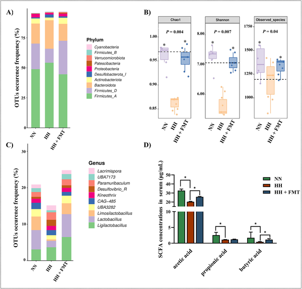
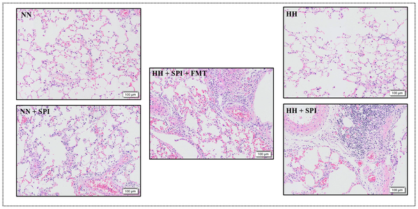
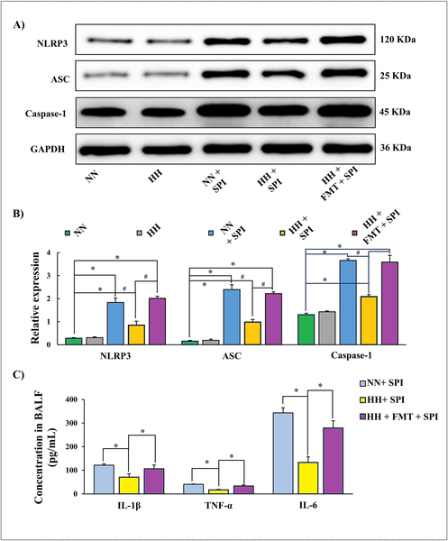
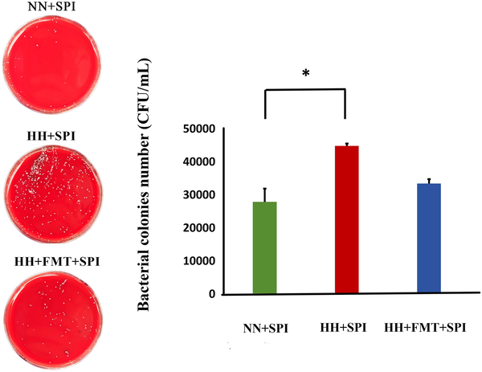

Could a gut bacteria transplant protect your lungs from infection at high altitudes? It might sound surprising, but recent research shows that the microbes living in our intestines can influence how well our lungs fight infections, especially when oxygen levels are low. This gut-lung connection opens new possibilities for treating respiratory illnesses worsened by conditions like high altitude or lung disease.

> **TL;DR**
> - Low oxygen conditions, like those at high altitude, disrupt gut bacteria balance and reduce beneficial compounds, worsening lung infections.
> - Transplanting healthy gut microbes into rats restores gut balance, boosts immune defenses in the lungs, and reduces bacterial lung infections under low oxygen stress.

When people or animals ascend to high altitudes, the drop in atmospheric pressure means less oxygen is available to breathe. This hypobaric hypoxia can impair lung function and increase susceptibility to respiratory infections such as pneumonia. Meanwhile, the gut microbiota—the vast community of bacteria living in the intestines—plays a crucial role in regulating immune responses throughout the body, including in the lungs. However, how low oxygen environments affect this gut-lung axis and whether manipulating gut microbes can improve lung health under such stress has remained unclear.

To investigate this, researchers exposed rats to simulated high-altitude conditions equivalent to 5,000 meters for two weeks, inducing hypobaric hypoxia. They analyzed changes in the gut microbiota using 16S rRNA gene sequencing and measured levels of short-chain fatty acids (SCFAs), important microbial metabolites, in the blood. The rats were then infected with Streptococcus pneumoniae, a common cause of pneumonia, and some received fecal microbiota transplantation (FMT) from healthy donor rats to restore their gut bacteria. The team assessed lung inflammation, bacterial load, immune signaling proteins related to the NLRP3 inflammasome (a key innate immune complex), and levels of secretory IgA, an antibody critical for mucosal defense.

The study found that hypobaric hypoxia disrupted the gut microbiota, decreasing beneficial bacteria like Lactobacillus and Firmicutes while increasing others such as Bacteroidota. This imbalance led to reduced SCFA levels, compounds known to support immune function. Rats exposed to low oxygen showed worsened lung inflammation and higher bacterial counts after infection. However, FMT restored a healthier gut microbial composition, increased SCFA levels (notably acetic and butyric acids), and significantly reduced lung inflammation and bacterial burden. Importantly, FMT enhanced activation of the NLRP3 inflammasome and raised levels of inflammatory cytokines (IL-1β, IL-6, TNF-α) in the lungs, as well as increased secretory IgA, collectively boosting mucosal immunity against infection.

These findings highlight the gut-lung axis as a critical mediator of respiratory health under hypoxic stress and suggest that modulating gut bacteria through fecal microbiota transplantation could be a promising strategy to mitigate lung infections aggravated by low oxygen environments. This has potential implications not only for people living or traveling at high altitudes but also for patients with lung diseases where oxygen levels are compromised. By restoring gut microbial balance and enhancing immune defenses, therapies targeting the microbiome might complement traditional treatments for respiratory infections.

It is important to note that this study was conducted in rats under controlled laboratory conditions, and human physiology may respond differently. The exact mechanisms by which gut microbes influence lung immunity require further exploration, and the safety and efficacy of fecal microbiota transplantation in humans for respiratory infections need rigorous clinical testing. Moreover, the study focused on a specific bacterial infection and high-altitude simulation; whether these findings extend to other pathogens or hypoxic conditions remains to be seen.

## Figures

*FMT changed gut bacteria types, diversity, and beneficial compounds in rats after low-oxygen stress.*

*FMT treatment reduced lung inflammation in rats infected with pneumonia under low oxygen conditions.*

*FMT treatment restored key immune proteins and reduced inflammation in rats infected with pneumonia under low oxygen conditions.*

*FMT treatment lowered bacterial colonies in rats infected with Streptococcus pneumoniae under low oxygen conditions.*

## Sources

- [Fecal microbiota transplantation mitigates respiratory infection in rats exposed to hypobaric hypoxia by modulating the NLRP3 inflammasome and mucosal immunity](https://journals.plos.org/plosone/article?id=10.1371/journal.pone.0347857)
- DOI: [10.1371/journal.pone.0347857](https://doi.org/10.1371/journal.pone.0347857)
