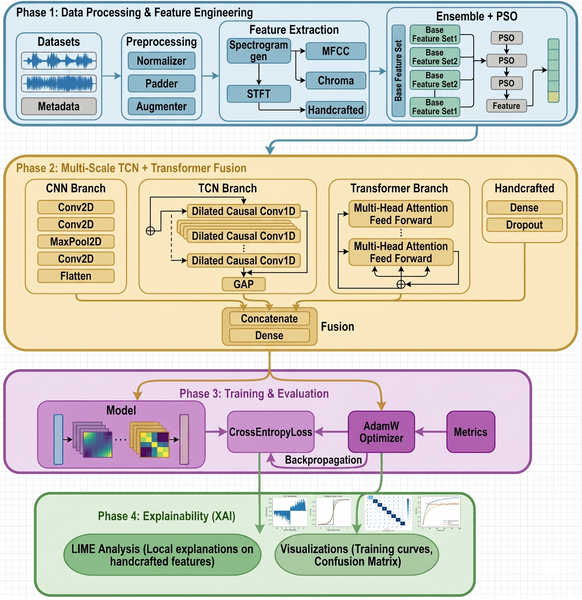
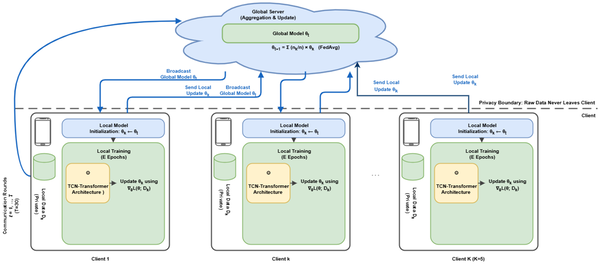
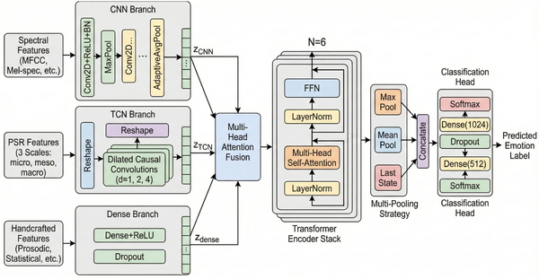

How can artificial intelligence understand the emotions behind your voice without ever hearing your actual speech? Imagine a system that learns from many people speaking different languages, yet keeps each person's voice data private and secure. This is the challenge that FedEmoNet, a new AI framework, aims to solve—combining cutting-edge machine learning with strong privacy protections to decode emotions from speech across diverse datasets.

> **TL;DR**
> - FedEmoNet uses federated learning to train emotion recognition models on distributed speech datasets without sharing raw audio, preserving user privacy.
> - By fusing Temporal Convolutional Networks and Transformer architectures and applying feature optimization, FedEmoNet achieves high accuracy across languages and datasets, with explainable insights into which speech features signal emotions.

Speech Emotion Recognition (SER) is an important technology for creating emotionally intelligent systems that can interact naturally with humans. However, current systems often struggle when applied to new datasets or languages, with accuracy dropping significantly due to differences in recording conditions, speaker characteristics, and cultural expression. Additionally, privacy concerns arise when speech data is shared or centralized for training. Federated learning offers a promising solution by enabling AI models to learn collaboratively from decentralized data without exposing raw audio. Yet, existing federated SER approaches have limitations: they typically focus on single datasets, lack formal privacy guarantees, and provide little interpretability about how emotions are detected.

FedEmoNet addresses these challenges by integrating several advanced techniques. It employs a federated learning protocol called FedProx that allows five distributed clients—two with German speech data, two with English, and one mixed—to collaboratively train a shared model without exchanging raw audio. Each client extracts a rich set of multi-scale features capturing speech dynamics at micro (25 ms), meso (250 ms), and macro (2.5 s) temporal scales, including spectral and handcrafted prosodic features. These features are optimized using Particle Swarm Optimization (PSO) to select the most informative ones. The model architecture fuses Temporal Convolutional Networks (TCN), which capture local temporal patterns, with Transformer blocks that model long-range dependencies and global context. To protect privacy, the training incorporates calibrated differential privacy noise, ensuring that individual speech samples cannot be reconstructed or identified from the model updates. Finally, explainability techniques (SHAP and LIME) analyze which speech features most influence emotion predictions.

When tested on held-out, speaker-independent data, FedEmoNet achieved remarkable accuracy: over 99% on the German EmoDB dataset and nearly 99% on the English RAVDESS dataset. Importantly, in zero-shot cross-corpus evaluation on the CREMA-D dataset—completely unseen during training—the model maintained a respectable 68% accuracy overall. The model performed better on high-arousal emotions like anger and happiness (around 72%) compared to low-arousal emotions such as neutral or fear (around 62%). Ablation studies confirmed that each component—PSO feature selection, Transformer blocks, and the FedProx protocol—significantly improved performance. Privacy analysis showed that the model resisted membership inference attacks, dropping attack success to near chance levels while retaining high accuracy. Explainability analyses revealed that prosodic features, especially statistics of fundamental frequency (pitch), consistently served as language-invariant indicators of emotion across datasets.

FedEmoNet represents a significant step forward in building privacy-preserving, accurate, and interpretable speech emotion recognition systems that generalize across languages and recording conditions. Its federated learning approach enables collaborative model training without exposing sensitive voice data, addressing growing privacy concerns in AI. The hybrid TCN-Transformer architecture combined with multi-scale temporal feature extraction captures the complex dynamics of emotional speech better than previous models. Moreover, the explainability framework provides valuable insights into which speech characteristics convey emotions universally, which can inform future research and applications. This framework has potential uses in healthcare, security, and human-computer interaction where understanding emotions from speech is valuable but privacy must be maintained.

While FedEmoNet shows strong performance, cross-corpus accuracy still lags behind single-dataset results, reflecting the inherent difficulty of generalizing emotion recognition across diverse speakers, languages, and recording environments. The zero-shot transfer accuracy of around 68% indicates room for improvement, especially for low-arousal emotions. The system was tested on a limited set of datasets and languages, so further validation on more diverse and real-world speech data is needed. Additionally, the technical complexity of federated learning and differential privacy may pose challenges for deployment in resource-constrained settings. Finally, while explainability methods highlight important speech features, interpreting these in the context of human emotional expression remains an ongoing research area.

## Figures

*Overview of FedEmoNet: data processing, feature extraction, model training, and explainability steps for emotion recognition.*

*FedProx federated learning lets clients train models locally and share updates without sharing raw data, keeping information private.*

*FedEmoNet uses three parallel branches to process different features, combining them with attention and transformers for accurate classification.*

## Sources

- [FedEmoNet: Privacy-preserving federated learning with TCN-Transformer fusion for cross-corpus speech emotion recognition](https://journals.plos.org/plosone/article?id=10.1371/journal.pone.0342953)
- DOI: [10.1371/journal.pone.0342953](https://doi.org/10.1371/journal.pone.0342953)
